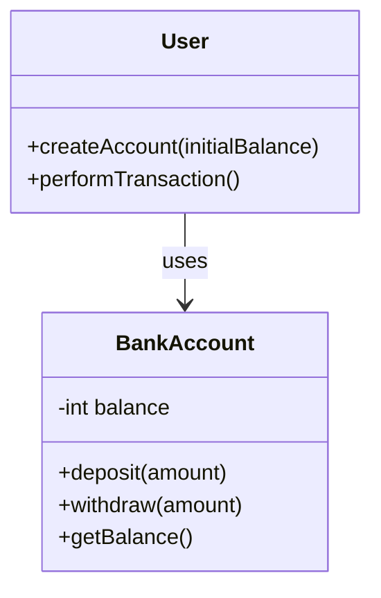

## 6.1 Understanding Encapsulation

Welcome to the fascinating world of encapsulation, a fundamental concept in object-oriented programming (OOP) that allows us to bundle data and methods that operate on the data within a single unit, known as an object. Encapsulation is not just about grouping related functionalities; it's about protecting the integrity of the data and ensuring that objects interact with each other in a controlled manner.

### What is Encapsulation?

Encapsulation is the process of wrapping data (variables) and the code (methods) that manipulates the data into a single unit, or object. In JavaScript, this means creating objects that contain both properties and methods, which can be accessed and modified through a well-defined interface.

Think of encapsulation as a protective shield that prevents the data from being accessed by code outside this shield. This is akin to a capsule that contains medicine; the capsule protects the medicine from external factors and ensures that it is delivered safely to the body.

#### Purpose of Encapsulation

The primary purpose of encapsulation is to **hide the internal state** of an object from the outside world. This is known as data hiding. By restricting direct access to some of the object's components, encapsulation helps to prevent accidental interference and misuse of the methods and data.

Encapsulation allows us to:

1. **Control Access**: By exposing only necessary parts of an object, we can control how the data is accessed and modified.
2. **Improve Security**: Encapsulation helps to protect the internal state of an object from unintended interference.
3. **Enhance Flexibility and Maintainability**: By hiding the implementation details, we can change the internal workings of an object without affecting the code that uses it.
4. **Reduce Complexity**: Encapsulation simplifies the interaction with an object by providing a clear and simple interface.

### Benefits of Hiding Internal Object Details

Encapsulation offers several advantages that contribute to the robustness and maintainability of code:

- **Data Integrity**: By controlling how data is accessed and modified, encapsulation ensures that the data remains valid and consistent.
- **Reduced Complexity**: Encapsulation allows developers to focus on the interface of an object rather than its implementation details, making it easier to understand and use.
- **Ease of Maintenance**: Since the internal implementation of an object is hidden, changes can be made without affecting other parts of the program.
- **Improved Security**: Encapsulation protects sensitive data from being accessed or modified by unauthorized parts of the program.

### Analogies to Make Encapsulation Relatable

To better understand encapsulation, let's consider some everyday analogies:

1. **Remote Control**: Think of a television remote control. The remote provides a simple interface (buttons) to interact with the TV. You don't need to know how the remote or the TV works internally; you just press the buttons to change channels or adjust the volume. The complexity is hidden, and you interact with the TV through the remote's interface.

2. **Car Dashboard**: When you drive a car, you interact with it through the dashboard controls. You don't need to understand the intricate details of the engine or the transmission system. The dashboard provides a simplified interface to control the car's functions, such as speed, fuel level, and temperature.

3. **Bank ATM**: An ATM machine provides a user-friendly interface to perform banking transactions. You don't need to know how the ATM processes your request internally. The machine encapsulates the complex banking operations and exposes a simple interface for users to deposit or withdraw money.

### Implementing Encapsulation in JavaScript

In JavaScript, encapsulation can be achieved through various techniques, such as using functions, closures, and ES6 classes. Let's explore these methods with examples.

#### Using Functions and Closures

One way to achieve encapsulation in JavaScript is by using functions and closures. A closure is a function that retains access to its lexical scope, even when the function is executed outside that scope. This allows us to create private variables and methods.

```javascript
function createCounter() {
  let count = 0; // Private variable

  return {
    increment: function() {
      count++;
      console.log(`Count: ${count}`);
    },
    decrement: function() {
      count--;
      console.log(`Count: ${count}`);
    },
    getCount: function() {
      return count;
    }
  };
}

const counter = createCounter();
counter.increment(); // Count: 1
counter.increment(); // Count: 2
console.log(counter.getCount()); // 2
counter.decrement(); // Count: 1
```

In this example, the `count` variable is private to the `createCounter` function. It cannot be accessed directly from outside the function. The `increment`, `decrement`, and `getCount` methods form the public interface that allows controlled access to the `count` variable.

#### Using ES6 Classes

With the introduction of ES6, JavaScript provides a more structured way to implement encapsulation using classes. Classes allow us to define objects with properties and methods, and encapsulate data more effectively.

```javascript
class BankAccount {
  #balance; // Private field

  constructor(initialBalance) {
    this.#balance = initialBalance; // Initialize private field
  }

  deposit(amount) {
    if (amount > 0) {
      this.#balance += amount;
      console.log(`Deposited: $${amount}`);
    }
  }

  withdraw(amount) {
    if (amount > 0 && amount <= this.#balance) {
      this.#balance -= amount;
      console.log(`Withdrew: $${amount}`);
    } else {
      console.log('Insufficient funds');
    }
  }

  getBalance() {
    return this.#balance;
  }
}

const account = new BankAccount(100);
account.deposit(50); // Deposited: $50
account.withdraw(30); // Withdrew: $30
console.log(account.getBalance()); // 120
```

In this example, the `#balance` field is private to the `BankAccount` class. It is not accessible from outside the class, ensuring that the balance can only be modified through the `deposit` and `withdraw` methods.

### Visualizing Encapsulation in JavaScript

To better understand how encapsulation works in JavaScript, let's visualize the interaction between different components using a Mermaid.js diagram.



**Diagram Description**: This diagram illustrates a simple interaction between a `User` class and a `BankAccount` class. The `User` class uses the `BankAccount` class to perform transactions. The `balance` field in the `BankAccount` class is private, ensuring that it can only be accessed and modified through the public methods `deposit`, `withdraw`, and `getBalance`.

### Try It Yourself

Now that we've explored encapsulation in JavaScript, let's encourage you to experiment with the concepts. Try modifying the `BankAccount` class to include a method that transfers funds between two accounts. This exercise will help reinforce your understanding of encapsulation and how it can be used to manage data securely.

### Knowledge Check

Before we wrap up, let's review some key points about encapsulation:

- **Encapsulation** is the process of bundling data and methods within a single unit, or object, and controlling access to the data.
- **Data hiding** is a key aspect of encapsulation, which helps protect the internal state of an object.
- Encapsulation improves **security**, **maintainability**, and **flexibility** of code by hiding implementation details.
- JavaScript supports encapsulation through **functions**, **closures**, and **ES6 classes**.

### References and Further Reading

For more information on encapsulation and object-oriented programming in JavaScript, consider exploring the following resources:

- [MDN Web Docs: Object-Oriented Programming](https://developer.mozilla.org/en-US/docs/Learn/JavaScript/Objects/Object-oriented_JS)
- [W3Schools: JavaScript Classes](https://www.w3schools.com/js/js_classes.asp)
- [JavaScript.info: Object-Oriented Programming](https://javascript.info/object-oriented-programming)

### Embrace the Journey

Remember, understanding encapsulation is just one step in your journey to mastering object-oriented programming in JavaScript. As you continue to learn, you'll discover more advanced concepts and techniques that will enhance your ability to write efficient and maintainable code. Keep experimenting, stay curious, and enjoy the journey!

## Quiz Time!



### What is encapsulation in object-oriented programming?

- [x] The process of bundling data and methods within a single unit
- [ ] The process of writing functions
- [ ] The process of creating variables
- [ ] The process of debugging code

> **Explanation:** Encapsulation involves bundling data and methods that operate on the data within a single unit, typically an object.

### What is the primary purpose of encapsulation?

- [x] To hide the internal state of an object
- [ ] To make code run faster
- [ ] To increase the number of methods in a class
- [ ] To reduce the number of variables in a program

> **Explanation:** The primary purpose of encapsulation is to hide the internal state of an object and protect it from external interference.

### Which of the following is a benefit of encapsulation?

- [x] Improved security
- [x] Reduced complexity
- [ ] Increased code length
- [ ] More global variables

> **Explanation:** Encapsulation improves security by protecting data and reduces complexity by providing a clear interface.

### How can encapsulation be achieved in JavaScript?

- [x] Using functions and closures
- [x] Using ES6 classes
- [ ] Using only global variables
- [ ] Using only arrays

> **Explanation:** Encapsulation in JavaScript can be achieved using functions, closures, and ES6 classes.

### What is a closure in JavaScript?

- [x] A function that retains access to its lexical scope
- [ ] A type of loop
- [ ] A variable declaration
- [ ] A syntax error

> **Explanation:** A closure is a function that retains access to its lexical scope, even when executed outside that scope.

### What is the role of private fields in ES6 classes?

- [x] To restrict access to class properties
- [ ] To make classes run faster
- [ ] To increase the number of methods
- [ ] To create global variables

> **Explanation:** Private fields in ES6 classes restrict access to class properties, ensuring data encapsulation.

### Which keyword is used to define a private field in an ES6 class?

- [x] #
- [ ] $
- [ ] @
- [ ] %

> **Explanation:** The `#` symbol is used to define private fields in ES6 classes.

### What is data hiding?

- [x] Protecting the internal state of an object
- [ ] Making data invisible
- [ ] Deleting unused variables
- [ ] Encrypting data

> **Explanation:** Data hiding involves protecting the internal state of an object from external access.

### Which of the following is an example of encapsulation in everyday life?

- [x] A television remote control
- [ ] A piece of paper
- [ ] A book
- [ ] A light bulb

> **Explanation:** A television remote control provides a simple interface to interact with the TV, hiding its internal complexity.

### True or False: Encapsulation can only be achieved using ES6 classes.

- [ ] True
- [x] False

> **Explanation:** Encapsulation can be achieved using functions, closures, and ES6 classes in JavaScript.


