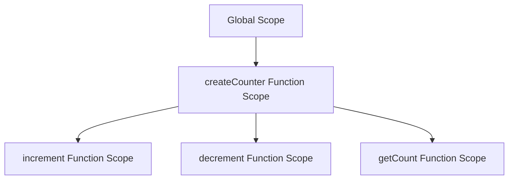

## 6.2 Implementing Encapsulation with Closures

In this section, we'll delve into the concept of encapsulation in JavaScript using closures. Encapsulation is a fundamental principle of object-oriented programming (OOP) that involves bundling data and methods that operate on that data within a single unit, or object. This principle is crucial for protecting the internal state of an object from outside interference and misuse. In JavaScript, closures provide a powerful mechanism to achieve encapsulation, allowing us to hide data and methods from the global scope.

### Understanding Closures

Before we dive into encapsulation, let's first understand what closures are. A closure is a feature in JavaScript where an inner function has access to its outer enclosing function's variables. This is possible even after the outer function has finished executing. Closures are created every time a function is created, at function creation time.

#### Key Characteristics of Closures

- **Access to Outer Variables**: A closure gives you access to an outer function’s scope from an inner function.
- **Persistence of Scope**: The variables in the outer function remain available to the inner function even after the outer function has returned.
- **Data Privacy**: Closures can be used to create private variables or functions.

#### Example of a Closure

```javascript
function outerFunction(outerVariable) {
    return function innerFunction(innerVariable) {
        console.log('Outer Variable: ' + outerVariable);
        console.log('Inner Variable: ' + innerVariable);
    }
}

const newFunction = outerFunction('outside');
newFunction('inside');
```

In this example, `innerFunction` is a closure that captures the variable `outerVariable` from its enclosing `outerFunction`. Even after `outerFunction` has executed, `innerFunction` retains access to `outerVariable`.

### Encapsulation Using Closures

Encapsulation is about restricting access to certain components of an object and only exposing what is necessary. In JavaScript, closures can be used to achieve encapsulation by keeping variables and functions private within a function scope.

#### Creating Private Variables with Closures

Let's see how we can use closures to create private variables.

```javascript
function createCounter() {
    let count = 0; // Private variable

    return {
        increment: function() {
            count++;
            console.log(count);
        },
        decrement: function() {
            count--;
            console.log(count);
        },
        getCount: function() {
            return count;
        }
    };
}

const counter = createCounter();
counter.increment(); // 1
counter.increment(); // 2
console.log(counter.getCount()); // 2
counter.decrement(); // 1
```

In this example, `count` is a private variable that cannot be accessed directly from outside the `createCounter` function. The only way to interact with `count` is through the methods `increment`, `decrement`, and `getCount`, which are returned as part of an object.

### Using IIFEs for Encapsulation

An Immediately Invoked Function Expression (IIFE) is a function that runs as soon as it is defined. IIFEs are useful for encapsulating code and creating private scopes.

#### Example of an IIFE

```javascript
const counterModule = (function() {
    let count = 0; // Private variable

    return {
        increment: function() {
            count++;
            console.log(count);
        },
        decrement: function() {
            count--;
            console.log(count);
        },
        getCount: function() {
            return count;
        }
    };
})();

counterModule.increment(); // 1
counterModule.increment(); // 2
console.log(counterModule.getCount()); // 2
counterModule.decrement(); // 1
```

In this example, the IIFE creates a private scope for the `count` variable, which is not accessible from the global scope. The returned object exposes methods to interact with `count`.

### Limitations of Using Closures for Encapsulation

While closures are a powerful tool for encapsulation in JavaScript, they come with some limitations:

- **Memory Consumption**: Closures can lead to increased memory usage because they maintain references to the outer scope variables.
- **Complexity**: Overusing closures can make the code harder to read and maintain, especially for those unfamiliar with the concept.
- **Debugging**: Debugging closures can be challenging because of the way they capture and retain variables.

### When to Use Closures for Encapsulation

Closures are particularly useful in the following scenarios:

- **Module Pattern**: When you want to create modules with private data and methods.
- **Event Handlers**: When you need to maintain state across event handler executions.
- **Asynchronous Code**: When dealing with asynchronous operations where you need to preserve state.

### Visualizing Closures and Encapsulation

To better understand how closures work with encapsulation, let's visualize the scope chain using a diagram.



In this diagram, the `createCounter` function creates a new scope that contains the `count` variable. The `increment`, `decrement`, and `getCount` functions are closures that have access to the `createCounter` function's scope, allowing them to manipulate the `count` variable.

### Try It Yourself

Now that you have a basic understanding of how closures can be used for encapsulation, try modifying the code examples to further solidify your understanding:

1. **Add a Reset Method**: Modify the `createCounter` function to include a `reset` method that sets `count` back to zero.
2. **Create a New Module**: Use an IIFE to create a new module that manages a list of items, with methods to add, remove, and list items.
3. **Experiment with Scope**: Try creating nested closures and see how they interact with each other's scopes.

### References and Further Reading

- [MDN Web Docs on Closures](https://developer.mozilla.org/en-US/docs/Web/JavaScript/Closures)
- [JavaScript.info on Closures](https://javascript.info/closure)
- [W3Schools JavaScript Closures](https://www.w3schools.com/js/js_function_closures.asp)

### Knowledge Check

Before we wrap up, let's do a quick knowledge check to reinforce what we've learned:

- **What is a Closure?**: A closure is a function that retains access to its outer scope variables even after the outer function has executed.
- **How do Closures Help with Encapsulation?**: Closures allow us to create private variables and methods that are not accessible from the global scope.
- **What is an IIFE?**: An IIFE is a function that is executed immediately after it is defined, often used to create private scopes.

### Embrace the Journey

Remember, mastering closures and encapsulation is a journey. As you continue to explore JavaScript, you'll find more opportunities to apply these concepts in creative ways. Keep experimenting, stay curious, and enjoy the process of learning!

## Quiz Time!



### What is a closure in JavaScript?

- [x] A function that retains access to its outer scope variables
- [ ] A function that executes immediately after it is defined
- [ ] A function that is used to create private variables
- [ ] A function that is only accessible within a module

> **Explanation:** A closure is a function that retains access to its outer scope variables even after the outer function has executed.

### How can closures be used for encapsulation?

- [x] By creating private variables and methods
- [ ] By exposing all variables to the global scope
- [ ] By making functions execute immediately
- [ ] By removing all functions from the global scope

> **Explanation:** Closures can be used to create private variables and methods that are not accessible from the global scope, thus achieving encapsulation.

### What is an IIFE?

- [x] A function that executes immediately after it is defined
- [ ] A function that retains access to its outer scope variables
- [ ] A function that creates private variables
- [ ] A function that is used for asynchronous operations

> **Explanation:** An IIFE (Immediately Invoked Function Expression) is a function that runs as soon as it is defined, often used to create private scopes.

### What is a limitation of using closures for encapsulation?

- [x] Increased memory usage
- [ ] Reduced code readability
- [ ] Limited access to global variables
- [ ] Inability to create private variables

> **Explanation:** Closures can lead to increased memory usage because they maintain references to the outer scope variables.

### When is it beneficial to use closures?

- [x] When creating modules with private data
- [x] When maintaining state across event handler executions
- [ ] When exposing all variables to the global scope
- [ ] When making functions execute immediately

> **Explanation:** Closures are beneficial for creating modules with private data and maintaining state across event handler executions.

### How does an IIFE help with encapsulation?

- [x] By creating a private scope
- [ ] By exposing variables to the global scope
- [ ] By making functions execute immediately
- [ ] By removing all functions from the global scope

> **Explanation:** An IIFE creates a private scope, which helps encapsulate variables and methods from the global scope.

### What is a common use case for closures?

- [x] Event handlers
- [ ] Global variables
- [ ] Synchronous operations
- [ ] Inline scripts

> **Explanation:** Closures are commonly used in event handlers to maintain state across executions.

### What is the purpose of the `return` statement in the `createCounter` function?

- [x] To expose methods for interacting with the private variable
- [ ] To execute the function immediately
- [ ] To create a new scope
- [ ] To remove the private variable

> **Explanation:** The `return` statement in the `createCounter` function exposes methods for interacting with the private variable `count`.

### Can closures be used to create private methods?

- [x] Yes
- [ ] No

> **Explanation:** Closures can be used to create private methods that are not accessible from the global scope.

### True or False: Closures can only be used in JavaScript.

- [ ] True
- [x] False

> **Explanation:** Closures are not unique to JavaScript; they exist in many programming languages that support first-class functions.


