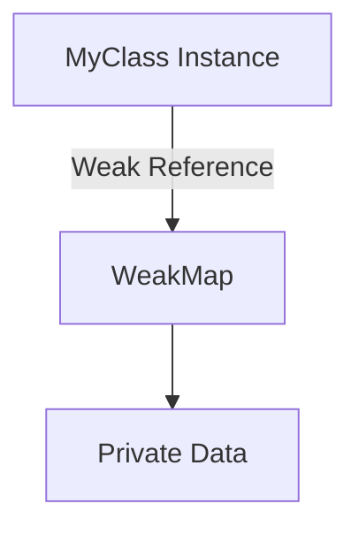

## 6.3 Private Data with WeakMaps

In the world of JavaScript, encapsulation and data privacy are crucial concepts, especially when dealing with object-oriented programming (OOP). One of the modern tools available to developers for achieving data privacy is the `WeakMap`. In this section, we will delve into how `WeakMaps` can be leveraged to store private data, ensuring that sensitive information remains hidden from the outside world.

### Understanding WeakMaps

Before we dive into using `WeakMaps` for private data, let's first understand what a `WeakMap` is and how it differs from a regular `Map`.

#### What is a WeakMap?

A `WeakMap` is a collection of key/value pairs where the keys are objects and the values can be arbitrary data. Unlike a `Map`, a `WeakMap` holds "weak" references to its keys. This means that if there are no other references to a key object, it can be garbage collected, freeing up memory. This characteristic makes `WeakMaps` particularly useful for associating private data with objects without preventing those objects from being garbage collected when they are no longer needed.

#### Characteristics of WeakMaps

- **Weak References**: Keys in a `WeakMap` are held weakly, meaning they do not prevent garbage collection if there are no other references to the object.
- **Non-Enumerable**: `WeakMaps` do not provide a way to iterate over their keys or values. This ensures that the data stored in a `WeakMap` remains truly private.
- **Object Keys Only**: The keys in a `WeakMap` must be objects, not primitive values.
- **No Size Property**: Unlike `Maps`, `WeakMaps` do not have a `size` property or a method to retrieve all keys or values.

### Using WeakMaps for Private Data

Now that we have a basic understanding of what `WeakMaps` are, let's explore how they can be used to store private data in JavaScript.

#### Associating Private Data with Objects

One of the primary uses of `WeakMaps` is to associate private data with object instances. This is particularly useful in OOP, where you may want to hide certain properties from being accessed or modified directly.

Here's a simple example of how you can use a `WeakMap` to store private data:

```javascript
// Create a WeakMap to hold private data
const privateData = new WeakMap();

class MyClass {
  constructor(name) {
    // Use the instance as the key and an object to store private data
    privateData.set(this, { name });
  }

  // Public method to get the name
  getName() {
    return privateData.get(this).name;
  }

  // Public method to set a new name
  setName(newName) {
    privateData.get(this).name = newName;
  }
}

const myInstance = new MyClass('John Doe');
console.log(myInstance.getName()); // Output: John Doe
myInstance.setName('Jane Doe');
console.log(myInstance.getName()); // Output: Jane Doe
```

In this example, the `privateData` `WeakMap` is used to store the `name` property privately. The `getName` and `setName` methods provide controlled access to this private data.

#### Advantages of Using WeakMaps

Using `WeakMaps` for encapsulation offers several advantages:

1. **True Privacy**: Since `WeakMaps` are not enumerable, the data stored within them is not accessible through iteration or reflection. This ensures that private data remains hidden from outside access.

2. **Garbage Collection**: Because `WeakMaps` hold weak references to their keys, they do not prevent the garbage collection of objects that are no longer in use. This can lead to more efficient memory management.

3. **Avoiding Name Collisions**: Using `WeakMaps` avoids the risk of property name collisions, which can occur when using symbols or other techniques for private data.

### Limitations and Considerations

While `WeakMaps` offer many benefits, there are some limitations and considerations to keep in mind:

- **Browser Compatibility**: `WeakMaps` are supported in all modern browsers, but if you need to support older environments, you may need to use polyfills or alternative techniques.

- **Performance**: Although `WeakMaps` provide efficient garbage collection, they may have performance implications in certain scenarios. It's important to profile and test your application to ensure that `WeakMaps` are the right choice for your use case.

- **Complexity**: Using `WeakMaps` can add complexity to your code, especially for beginners. It's important to weigh the benefits of privacy against the added complexity.

### Comparing WeakMap-based Privacy with Other Techniques

Let's compare `WeakMap`-based privacy with other encapsulation techniques, such as closures and private fields.

#### Closures

Closures are a common way to achieve data privacy in JavaScript. By defining variables within a function scope, you can create private data that is not accessible from outside the function.

```javascript
function createPerson(name) {
  // Private variable
  let _name = name;

  return {
    getName() {
      return _name;
    },
    setName(newName) {
      _name = newName;
    }
  };
}

const person = createPerson('Alice');
console.log(person.getName()); // Output: Alice
person.setName('Bob');
console.log(person.getName()); // Output: Bob
```

While closures provide privacy, they can lead to memory leaks if not used carefully, as the closure retains references to all variables in its scope.

#### Private Fields (ES2021)

With the introduction of private fields in ES2021, JavaScript now has a built-in way to define truly private properties within classes.

```javascript
class Person {
  // Private field
  #name;

  constructor(name) {
    this.#name = name;
  }

  getName() {
    return this.#name;
  }

  setName(newName) {
    this.#name = newName;
  }
}

const person = new Person('Charlie');
console.log(person.getName()); // Output: Charlie
person.setName('Dave');
console.log(person.getName()); // Output: Dave
```

Private fields are a great addition to JavaScript, providing true privacy without the need for external structures like `WeakMaps`.

#### Comparing Techniques

- **WeakMaps**: Offer true privacy and efficient garbage collection but can be more complex to implement.
- **Closures**: Provide privacy through function scope but can lead to memory leaks if not managed properly.
- **Private Fields**: Offer true privacy with simpler syntax, but require ES2021 support.

### Try It Yourself

To solidify your understanding, try modifying the code examples above:

1. **Add More Private Properties**: Extend the `MyClass` example to include additional private properties, such as age or email, and create methods to access and modify them.

2. **Experiment with Closures**: Modify the closure example to include additional methods or properties, and observe how the closure retains access to the private variables.

3. **Use Private Fields**: If your environment supports ES2021, try using private fields in a new class and compare the syntax and behavior with `WeakMaps` and closures.

### Visualizing WeakMap Usage

To better understand how `WeakMaps` work, let's visualize the relationship between objects and their associated private data.



In this diagram, the `MyClass` instance is associated with private data through a weak reference in the `WeakMap`. This ensures that the private data is only accessible through the instance and can be garbage collected when the instance is no longer in use.

### References and Further Reading

For more information on `WeakMaps` and related topics, check out the following resources:

- [MDN Web Docs: WeakMap](https://developer.mozilla.org/en-US/docs/Web/JavaScript/Reference/Global_Objects/WeakMap)
- [JavaScript Info: WeakMap and WeakSet](https://javascript.info/weakmap-weakset)
- [W3Schools: JavaScript WeakMap](https://www.w3schools.com/js/js_maps.asp)

### Knowledge Check

To ensure you've grasped the concepts covered in this section, consider the following questions:

1. What are the key characteristics of a `WeakMap`?
2. How does a `WeakMap` provide privacy for object data?
3. What are the advantages of using `WeakMaps` for encapsulation?
4. How do `WeakMaps` compare to closures and private fields for data privacy?

### Embrace the Journey

Remember, mastering JavaScript and its features is a journey. As you continue to explore and experiment with different techniques, you'll gain a deeper understanding of how to write secure and efficient code. Keep experimenting, stay curious, and enjoy the journey!

---

## Quiz Time!



### What is a key characteristic of a WeakMap?

- [x] It holds weak references to its keys.
- [ ] It allows primitive values as keys.
- [ ] It has a size property.
- [ ] It can be iterated over.

> **Explanation:** A WeakMap holds weak references to its keys, meaning they can be garbage collected if there are no other references to them.

### How does a WeakMap provide privacy for object data?

- [x] By associating private data with object instances without exposing it publicly.
- [ ] By allowing iteration over its keys and values.
- [ ] By storing data in a global variable.
- [ ] By using primitive values as keys.

> **Explanation:** WeakMaps associate private data with object instances, ensuring that the data is not publicly accessible and is not enumerable.

### What is an advantage of using WeakMaps for encapsulation?

- [x] They allow for efficient garbage collection.
- [ ] They prevent all forms of data access.
- [ ] They provide a size property for data management.
- [ ] They are supported in all JavaScript environments.

> **Explanation:** WeakMaps allow for efficient garbage collection because they hold weak references to their keys, which can be collected when no longer in use.

### What is a limitation of WeakMaps?

- [x] They do not support primitive values as keys.
- [ ] They prevent garbage collection of keys.
- [ ] They have a size property.
- [ ] They are enumerable.

> **Explanation:** WeakMaps do not support primitive values as keys; they require object keys.

### How do WeakMaps compare to closures for data privacy?

- [x] WeakMaps offer true privacy and efficient garbage collection.
- [ ] Closures provide more efficient memory management.
- [x] WeakMaps avoid memory leaks associated with closures.
- [ ] Closures are simpler to implement than WeakMaps.

> **Explanation:** WeakMaps offer true privacy and efficient garbage collection, avoiding the memory leaks that can occur with closures.

### What is a benefit of using private fields over WeakMaps?

- [x] Simpler syntax for defining private properties.
- [ ] They allow primitive values as keys.
- [ ] They are supported in all JavaScript environments.
- [ ] They provide a size property.

> **Explanation:** Private fields offer a simpler syntax for defining private properties within classes, making them easier to use.

### What is a common use case for WeakMaps?

- [x] Associating private data with object instances.
- [ ] Storing global application data.
- [x] Avoiding property name collisions.
- [ ] Iterating over key/value pairs.

> **Explanation:** WeakMaps are commonly used to associate private data with object instances and avoid property name collisions.

### Which of the following is true about WeakMaps?

- [x] They are not enumerable.
- [ ] They allow iteration over keys and values.
- [ ] They support primitive values as keys.
- [ ] They have a size property.

> **Explanation:** WeakMaps are not enumerable, meaning their keys and values cannot be iterated over.

### What is a visual representation of WeakMap usage?

- [x] A graph showing weak references between objects and private data.
- [ ] A table listing all keys and values.
- [ ] A sequence diagram of method calls.
- [ ] A flowchart of program execution.

> **Explanation:** A graph showing weak references between objects and private data is a visual representation of WeakMap usage.

### True or False: WeakMaps prevent garbage collection of their keys.

- [ ] True
- [x] False

> **Explanation:** False. WeakMaps allow for the garbage collection of their keys if there are no other references to them.


