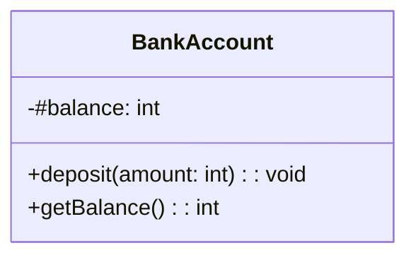

## 6.4 Private Class Fields Syntax

In the ever-evolving landscape of JavaScript, the introduction of private class fields in ES2021 marks a significant milestone in enhancing encapsulation and data privacy. This feature allows developers to define truly private fields within a class, using the `#` syntax. In this section, we will delve into the mechanics of private class fields, explore their benefits, and understand their limitations. We'll also provide practical examples to demonstrate how to implement this feature effectively in your JavaScript classes.

### Understanding Private Class Fields

Private class fields are a way to define properties within a class that cannot be accessed or modified from outside the class. This is achieved by prefixing the field name with a `#`. This syntax ensures that the field is truly private and inaccessible from outside the class, even if someone tries to access it using bracket notation or any other method.

#### Why Private Fields?

Before the introduction of private class fields, JavaScript developers often used naming conventions (such as prefixing property names with an underscore) to indicate that a property should be treated as private. However, this was merely a convention and did not enforce privacy. With private class fields, JavaScript now provides a built-in mechanism to enforce encapsulation, ensuring that private fields are only accessible within the class they are defined.

### Declaring Private Fields

To declare a private field in a JavaScript class, simply prefix the field name with a `#`. Here's a basic example:

```javascript
class BankAccount {
  // Private field
  #balance = 0;

  constructor(initialBalance) {
    this.#balance = initialBalance;
  }

  // Public method to deposit money
  deposit(amount) {
    if (amount > 0) {
      this.#balance += amount;
    }
  }

  // Public method to get the current balance
  getBalance() {
    return this.#balance;
  }
}

const myAccount = new BankAccount(100);
myAccount.deposit(50);
console.log(myAccount.getBalance()); // Outputs: 150

// Attempting to access the private field directly will result in an error
console.log(myAccount.#balance); // SyntaxError: Private field '#balance' must be declared in an enclosing class
```

In this example, the `#balance` field is private and can only be accessed within the `BankAccount` class. Any attempt to access it directly from an instance of the class will result in a syntax error.

### Benefits of Using Private Class Fields

1. **Improved Encapsulation**: By using private fields, you can ensure that sensitive data is not exposed outside the class. This helps in maintaining the integrity of the data and prevents unintended modifications.

2. **Code Clarity**: Private fields make it clear which parts of a class are intended for internal use only. This can help other developers understand the intended use of the class and its API.

3. **Avoid Naming Conflicts**: Since private fields are not accessible outside the class, there is no risk of naming conflicts with properties or methods in subclasses or other parts of the code.

4. **Security**: By keeping fields private, you reduce the risk of accidental data exposure or manipulation, which can be crucial in applications dealing with sensitive information.

### Private Methods

In addition to private fields, JavaScript also supports private methods, which are defined using the same `#` syntax. Private methods can be used to encapsulate functionality that should not be exposed as part of the public API of the class.

```javascript
class Counter {
  #count = 0;

  constructor(startValue) {
    this.#count = startValue;
  }

  increment() {
    this.#incrementCount();
  }

  // Private method
  #incrementCount() {
    this.#count += 1;
  }

  getCount() {
    return this.#count;
  }
}

const counter = new Counter(5);
counter.increment();
console.log(counter.getCount()); // Outputs: 6

// Attempting to call the private method directly will result in an error
counter.#incrementCount(); // SyntaxError: Private field '#incrementCount' must be declared in an enclosing class
```

In this example, the `#incrementCount` method is private and can only be called from within the `Counter` class.

### Current State of Support

As of ES2021, private class fields are supported in most modern JavaScript environments, including recent versions of major browsers and Node.js. However, for environments that do not support this feature natively, you may need to use a transpiler like Babel to convert your code into a compatible format.

To use Babel for transpiling code with private fields, you can set up a Babel configuration that includes the necessary plugins:

```json
{
  "presets": ["@babel/preset-env"],
  "plugins": ["@babel/plugin-proposal-class-properties", "@babel/plugin-proposal-private-methods"]
}
```

### Limitations and Considerations

While private class fields offer many benefits, there are some limitations and considerations to keep in mind:

- **No Access via `this['#field']`**: Private fields cannot be accessed using bracket notation. They must be accessed directly using the `#` syntax within the class.

- **No Reflection**: Private fields are not accessible via reflection APIs like `Object.keys()`, `Object.getOwnPropertyNames()`, or `Object.getOwnPropertySymbols()`. This means they are truly hidden from any external inspection.

- **No Inheritance**: Private fields are not inherited by subclasses. Each class must define its own private fields.

- **Syntax Restrictions**: The `#` syntax is not compatible with older versions of JavaScript, so care must be taken when working in environments that do not support ES2021 features.

### Try It Yourself

To get a better understanding of private class fields, try modifying the examples above. For instance, you can:

- Add more private fields and methods to the `BankAccount` or `Counter` classes.
- Create a new class that uses private fields to manage a different type of data.
- Experiment with accessing private fields from outside the class to see the resulting errors.

### Visualizing Private Class Fields

To help you visualize how private class fields work, let's use a diagram to represent the encapsulation of data within a class:



In this diagram, the `#balance` field is marked as private, indicating that it is not accessible from outside the `BankAccount` class. The `deposit` and `getBalance` methods are public and can be called from outside the class.

### Conclusion

Private class fields in JavaScript provide a robust mechanism for encapsulating data and ensuring privacy within classes. By using the `#` syntax, developers can define fields and methods that are truly private, enhancing the security and clarity of their code. While there are some limitations to consider, the benefits of using private class fields make them a valuable addition to the JavaScript language.

As you continue your journey in learning JavaScript, remember that mastering these features will empower you to write more secure and maintainable code. Keep experimenting, stay curious, and enjoy the process of building your skills in object-oriented programming!

## Quiz Time!



### What is the syntax used to declare a private field in a JavaScript class?

- [x] `#fieldName`
- [ ] `_fieldName`
- [ ] `private fieldName`
- [ ] `fieldName`

> **Explanation:** Private fields in JavaScript classes are declared using the `#` syntax, such as `#fieldName`.

### Can private fields be accessed from outside the class?

- [ ] Yes
- [x] No

> **Explanation:** Private fields cannot be accessed from outside the class. They are only accessible within the class where they are defined.

### Which of the following is a benefit of using private class fields?

- [x] Improved encapsulation
- [ ] Increased performance
- [ ] Larger code size
- [ ] More complex syntax

> **Explanation:** Private class fields improve encapsulation by ensuring that certain fields are only accessible within the class, enhancing data privacy.

### What happens if you try to access a private field using bracket notation?

- [ ] It works as expected
- [x] It results in a syntax error
- [ ] It returns `undefined`
- [ ] It throws a runtime error

> **Explanation:** Private fields cannot be accessed using bracket notation, and attempting to do so will result in a syntax error.

### Are private fields inherited by subclasses in JavaScript?

- [ ] Yes
- [x] No

> **Explanation:** Private fields are not inherited by subclasses. Each class must define its own private fields.

### Which tool can be used to transpile JavaScript code with private fields for compatibility with older environments?

- [x] Babel
- [ ] Webpack
- [ ] ESLint
- [ ] Prettier

> **Explanation:** Babel can be used to transpile JavaScript code with private fields, making it compatible with older environments that do not support ES2021 features.

### Can private methods be defined in JavaScript classes using the same `#` syntax?

- [x] Yes
- [ ] No

> **Explanation:** Private methods can be defined using the `#` syntax, just like private fields, to encapsulate functionality within a class.

### What is the primary purpose of private class fields?

- [x] To enhance data privacy and encapsulation
- [ ] To improve code performance
- [ ] To increase code complexity
- [ ] To allow global access to class fields

> **Explanation:** The primary purpose of private class fields is to enhance data privacy and encapsulation, ensuring that certain fields are only accessible within the class.

### Which of the following is NOT a limitation of private class fields?

- [ ] No access via `this['#field']`
- [ ] No reflection
- [ ] No inheritance
- [x] No support in modern browsers

> **Explanation:** Private class fields are supported in modern browsers, but they have limitations such as no access via `this['#field']`, no reflection, and no inheritance.

### True or False: Private class fields can be accessed using reflection APIs like `Object.keys()`.

- [ ] True
- [x] False

> **Explanation:** Private class fields cannot be accessed using reflection APIs like `Object.keys()`, as they are truly hidden from external inspection.


