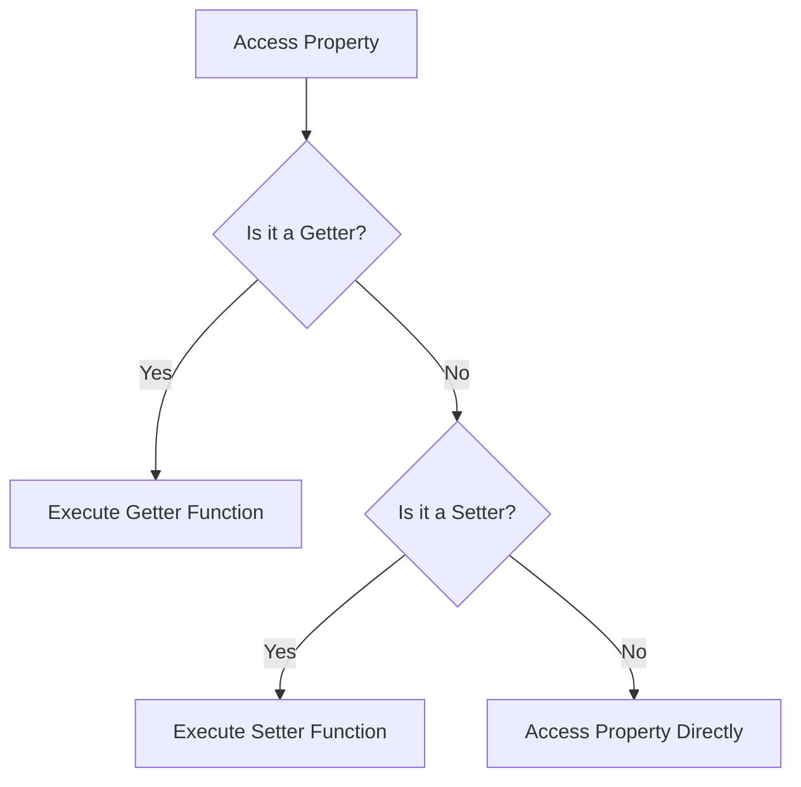

## 6.5 Getters and Setters for Encapsulation

In the world of object-oriented programming (OOP), **encapsulation** is a fundamental concept that allows us to bundle data and methods that operate on that data within a single unit, or object. This not only helps in organizing code but also in protecting the internal state of an object from unintended interference. One of the key tools in JavaScript for achieving encapsulation is the use of **getters** and **setters**. In this section, we will explore how these accessor properties work, their syntax, and how they contribute to safer and more maintainable code.

### Understanding Getters and Setters

Getters and setters are special methods in JavaScript that allow you to define how to access and modify the properties of an object. They provide a way to control the access to an object's properties, enabling you to add logic that runs when a property is accessed or modified.

- **Getters**: These are methods that get the value of a specific property. They allow you to execute code on the retrieval of a property value.
- **Setters**: These are methods that set the value of a specific property. They enable you to execute code on the assignment of a property value.

By using getters and setters, you can:
- Validate data before assigning it to a property.
- Compute a property value dynamically.
- Log property access or modification.
- Maintain control over how properties are accessed and modified.

### Syntax for Defining Getters and Setters

Getters and setters can be defined within object literals or classes. Let's go through the syntax for both.

#### Object Literals

In object literals, getters and setters are defined using the `get` and `set` keywords followed by a method name.

```javascript
const person = {
  firstName: 'John',
  lastName: 'Doe',
  
  // Getter for fullName
  get fullName() {
    return `${this.firstName} ${this.lastName}`;
  },
  
  // Setter for fullName
  set fullName(name) {
    const parts = name.split(' ');
    this.firstName = parts[0];
    this.lastName = parts[1];
  }
};

console.log(person.fullName); // Output: John Doe
person.fullName = 'Jane Smith';
console.log(person.firstName); // Output: Jane
console.log(person.lastName); // Output: Smith
```

#### Classes

In classes, getters and setters are defined similarly, but within the class body.

```javascript
class Person {
  constructor(firstName, lastName) {
    this._firstName = firstName;
    this._lastName = lastName;
  }
  
  // Getter for fullName
  get fullName() {
    return `${this._firstName} ${this._lastName}`;
  }
  
  // Setter for fullName
  set fullName(name) {
    const parts = name.split(' ');
    this._firstName = parts[0];
    this._lastName = parts[1];
  }
}

const person = new Person('John', 'Doe');
console.log(person.fullName); // Output: John Doe
person.fullName = 'Jane Smith';
console.log(person._firstName); // Output: Jane
console.log(person._lastName); // Output: Smith
```

### Using Getters and Setters for Data Validation

One of the primary uses of setters is to validate data before it is assigned to a property. This ensures that your object maintains a valid state.

```javascript
class BankAccount {
  constructor(balance) {
    this._balance = balance;
  }
  
  // Getter for balance
  get balance() {
    return this._balance;
  }
  
  // Setter for balance with validation
  set balance(amount) {
    if (amount < 0) {
      console.error('Balance cannot be negative.');
    } else {
      this._balance = amount;
    }
  }
}

const account = new BankAccount(100);
console.log(account.balance); // Output: 100
account.balance = 150;
console.log(account.balance); // Output: 150
account.balance = -50; // Output: Balance cannot be negative.
```

### Computed Properties with Getters

Getters can be used to create computed properties, which are properties whose values are calculated on the fly.

```javascript
class Rectangle {
  constructor(width, height) {
    this.width = width;
    this.height = height;
  }
  
  // Getter for area
  get area() {
    return this.width * this.height;
  }
}

const rect = new Rectangle(5, 10);
console.log(rect.area); // Output: 50
```

### Logging with Getters and Setters

Getters and setters can also be used to log access to properties, which can be useful for debugging or monitoring.

```javascript
class Product {
  constructor(name, price) {
    this._name = name;
    this._price = price;
  }
  
  // Getter for price with logging
  get price() {
    console.log(`Getting price: ${this._price}`);
    return this._price;
  }
  
  // Setter for price with logging
  set price(value) {
    console.log(`Setting price to: ${value}`);
    this._price = value;
  }
}

const product = new Product('Laptop', 1000);
console.log(product.price); // Output: Getting price: 1000
product.price = 1200; // Output: Setting price to: 1200
```

### Encapsulation with Getters and Setters

Encapsulation is about keeping the internal state of an object hidden from the outside world and only exposing a controlled interface. Getters and setters are a perfect fit for this purpose as they allow you to control how properties are accessed and modified.

#### Example: Encapsulating Private Data

```javascript
class User {
  constructor(username, password) {
    this._username = username;
    this._password = password; // Private data
  }
  
  // Getter for username
  get username() {
    return this._username;
  }
  
  // Setter for password with validation
  set password(newPassword) {
    if (newPassword.length < 6) {
      console.error('Password must be at least 6 characters long.');
    } else {
      this._password = newPassword;
    }
  }
}

const user = new User('john_doe', '123456');
console.log(user.username); // Output: john_doe
user.password = '123'; // Output: Password must be at least 6 characters long.
user.password = 'abcdef';
```

### Best Practices for Getters and Setters

To make the most of getters and setters, consider the following best practices:

- **Avoid Side Effects in Getters**: Getters should not modify the state of the object. They should only return a value.
- **Perform Necessary Checks in Setters**: Use setters to validate data and ensure the object remains in a valid state.
- **Use Meaningful Names**: Choose descriptive names for your getters and setters to make your code more readable.
- **Keep Getters and Setters Simple**: Avoid complex logic within getters and setters to maintain clarity and performance.

### Performance Considerations

While getters and setters are powerful tools, they can introduce performance overhead if not used carefully. Each time a getter or setter is called, it executes a function, which can add up if used excessively in performance-critical code.

To mitigate performance issues:
- **Minimize the Use of Getters and Setters**: Use them only when necessary, such as for validation or computed properties.
- **Profile Your Code**: Use JavaScript profiling tools to identify performance bottlenecks related to getters and setters.

### Try It Yourself

Now that we've covered the basics of getters and setters, let's encourage you to experiment with the code examples provided. Try modifying the examples to:
- Add additional validation logic in setters.
- Create a new class with computed properties using getters.
- Implement logging in both getters and setters for a different class.

### Visualizing Getters and Setters

Let's visualize how getters and setters interact with an object's properties using a simple flowchart.



This diagram illustrates the decision-making process when accessing or modifying a property. If a getter or setter is defined, the corresponding function is executed; otherwise, the property is accessed directly.

### References and Further Reading

- [MDN Web Docs: Working with Objects](https://developer.mozilla.org/en-US/docs/Web/JavaScript/Guide/Working_with_Objects)
- [JavaScript.info: Property Getters and Setters](https://javascript.info/property-accessors)

### Knowledge Check

Before we conclude, let's summarize the key takeaways:

- Getters and setters are special methods that control access to an object's properties.
- They enable data validation, computed properties, and logging.
- Getters and setters contribute to encapsulation by providing controlled interaction with private data.
- Best practices include avoiding side effects in getters and ensuring setters perform necessary checks.
- Be mindful of performance impacts and use getters and setters judiciously.

## Quiz Time!



### What is the primary purpose of getters in JavaScript?

- [x] To retrieve the value of a property
- [ ] To modify the value of a property
- [ ] To delete a property
- [ ] To create a new property

> **Explanation:** Getters are used to retrieve the value of a property, allowing you to execute code when accessing the property.

### What is the primary purpose of setters in JavaScript?

- [ ] To retrieve the value of a property
- [x] To modify the value of a property
- [ ] To delete a property
- [ ] To create a new property

> **Explanation:** Setters are used to modify the value of a property, allowing you to execute code when assigning a new value to the property.

### Which keyword is used to define a getter in an object literal?

- [x] get
- [ ] set
- [ ] function
- [ ] method

> **Explanation:** The `get` keyword is used to define a getter in an object literal.

### Which keyword is used to define a setter in a class?

- [ ] get
- [x] set
- [ ] function
- [ ] method

> **Explanation:** The `set` keyword is used to define a setter in a class.

### What should setters be used for?

- [x] Data validation
- [x] Logging
- [ ] Direct property access
- [ ] Deleting properties

> **Explanation:** Setters can be used for data validation and logging, among other tasks, to ensure the object remains in a valid state.

### What is a best practice for getters?

- [x] Avoid side effects
- [ ] Modify the object state
- [ ] Perform complex calculations
- [ ] Log access

> **Explanation:** Getters should avoid side effects and should not modify the state of the object.

### What is a computed property?

- [x] A property whose value is calculated on the fly
- [ ] A property that is always constant
- [ ] A property that can only be set once
- [ ] A property that is deleted after use

> **Explanation:** A computed property is one whose value is calculated on the fly, often using a getter.

### How can performance issues with getters and setters be mitigated?

- [x] Minimize their use
- [ ] Use them for all properties
- [ ] Avoid using classes
- [ ] Use only setters

> **Explanation:** To mitigate performance issues, minimize the use of getters and setters and use them only when necessary.

### What is encapsulation?

- [x] Bundling data and methods within a single unit
- [ ] Separating data and methods into different units
- [ ] Making all properties public
- [ ] Hiding all methods

> **Explanation:** Encapsulation involves bundling data and methods within a single unit, or object, to protect the internal state.

### True or False: Getters and setters can be used to log property access and modification.

- [x] True
- [ ] False

> **Explanation:** True. Getters and setters can be used to log property access and modification, which is useful for debugging and monitoring.



Remember, this is just the beginning. As you progress, you'll build more complex and interactive web pages. Keep experimenting, stay curious, and enjoy the journey!
