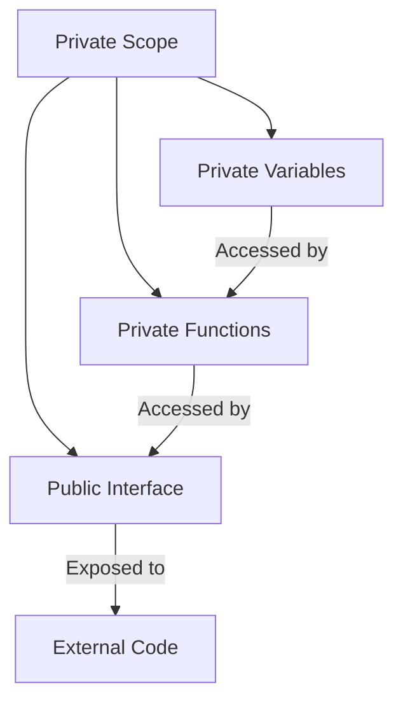

## 6.7 Revealing Module Pattern

In the world of JavaScript, organizing code in a way that is both readable and maintainable is crucial, especially as applications grow in complexity. One of the patterns that help achieve this is the **Revealing Module Pattern**. This pattern is an evolution of the traditional module pattern, providing a more structured way to expose public members while keeping the internal workings of the module private.

### Introduction to the Revealing Module Pattern

The revealing module pattern is a design pattern that focuses on encapsulating code within a module and exposing only the parts of the code that are necessary for external use. This pattern enhances code readability by clearly defining which functions and variables are public and which are private. By structuring the export of public members at the end of the module, it becomes easier to understand the module's public interface at a glance.

### How the Revealing Module Pattern Works

The revealing module pattern uses an immediately invoked function expression (IIFE) to create a private scope. Within this scope, you define your variables and functions. At the end of the module, you return an object that exposes only the functions and variables you want to make public. This approach ensures that all other functions and variables remain private and inaccessible from outside the module.

#### Basic Structure

Here's a basic structure of the revealing module pattern:

```javascript
const MyModule = (function() {
    // Private variables and functions
    let privateVar = "I am private";
    
    function privateFunction() {
        console.log("Accessed private function");
    }

    // Public variables and functions
    function publicFunction() {
        console.log("Accessed public function");
    }

    function anotherPublicFunction() {
        privateFunction();
        console.log("Accessed another public function");
    }

    // Reveal public pointers to private functions and variables
    return {
        publicFunction: publicFunction,
        anotherPublicFunction: anotherPublicFunction
    };
})();

// Usage
MyModule.publicFunction(); // Outputs: Accessed public function
MyModule.anotherPublicFunction(); // Outputs: Accessed private function
                                  //          Accessed another public function
```

### Advantages of the Revealing Module Pattern

1. **Improved Readability**: By structuring the export of public members at the end of the module, it becomes clear which parts of the module are intended for external use. This makes it easier for developers to understand the module's interface without digging through the entire code.

2. **Encapsulation**: The pattern effectively encapsulates private data and functions, preventing them from being accessed or modified from outside the module. This encapsulation promotes better data integrity and reduces the risk of unintended side effects.

3. **Maintainability**: Since the public interface is clearly defined, changes to the internal implementation of the module can be made without affecting the code that relies on the module. This separation of concerns makes the codebase easier to maintain and refactor.

4. **Ease of Use**: The pattern simplifies the process of using modules by providing a clear and consistent way to access public members.

### Potential Drawbacks

While the revealing module pattern offers several benefits, it may not be ideal in all situations:

1. **Performance Overhead**: The use of IIFE can introduce a slight performance overhead, especially if many modules are created in this way. However, this is usually negligible in most applications.

2. **Limited Flexibility**: Once a module's public interface is defined, it can be challenging to extend or modify it without altering the module's structure. This can be a limitation if the module needs to be highly extensible.

3. **Compatibility Issues**: In environments where ES6 modules are supported, the revealing module pattern may be less relevant, as ES6 modules offer a more modern and standardized approach to module management.

### Comparing the Revealing Module Pattern with Other Patterns

#### Standard Module Pattern

The standard module pattern also uses IIFE to create private scopes but does not emphasize the clear separation of public and private members. In the standard module pattern, public members are often intermixed with private ones, which can make the code harder to read and maintain.

#### ES6 Modules

ES6 modules provide a built-in module system in JavaScript, allowing developers to use `import` and `export` statements to manage dependencies and expose public members. While ES6 modules offer a more modern approach, the revealing module pattern can still be useful in environments where ES6 is not fully supported or when working with legacy code.

### Code Example: Building a Simple Calculator

Let's build a simple calculator using the revealing module pattern to demonstrate how to structure code with clear separation of private and public members.

```javascript
const Calculator = (function() {
    // Private variables and functions
    let result = 0;

    function add(x) {
        result += x;
    }

    function subtract(x) {
        result -= x;
    }

    function multiply(x) {
        result *= x;
    }

    function divide(x) {
        if (x !== 0) {
            result /= x;
        } else {
            console.error("Cannot divide by zero");
        }
    }

    function getResult() {
        return result;
    }

    // Reveal public pointers to private functions
    return {
        add: add,
        subtract: subtract,
        multiply: multiply,
        divide: divide,
        getResult: getResult
    };
})();

// Usage
Calculator.add(10);
Calculator.subtract(2);
Calculator.multiply(3);
Calculator.divide(2);
console.log(Calculator.getResult()); // Outputs: 12
```

In this example, the calculator module encapsulates its internal state (`result`) and provides a set of public methods to manipulate this state. The internal implementation details are hidden, and only the necessary methods are exposed.

### Try It Yourself

Experiment with the calculator module by adding new operations or modifying existing ones. For example, try adding a `reset` method to set the result back to zero, or implement a `power` function to raise the result to a given exponent.

### Visualizing the Revealing Module Pattern

To better understand how the revealing module pattern works, let's visualize the flow of data and function calls within a module.



**Diagram Description**: This flowchart illustrates the structure of a module using the revealing module pattern. Private variables and functions reside within a private scope, and only selected functions are exposed through the public interface. External code interacts with the module through this interface.

### Knowledge Check

Before we wrap up, let's review some key points about the revealing module pattern:

- The revealing module pattern uses an IIFE to create a private scope.
- Public members are defined at the end of the module, improving code readability.
- The pattern encapsulates private data and functions, promoting maintainability.

### Conclusion

The revealing module pattern is a powerful tool for organizing JavaScript code, providing a clear and structured way to expose public members while keeping the internal workings private. By improving code readability and maintainability, this pattern can be a valuable addition to your JavaScript toolkit.

Remember, this is just the beginning. As you progress in your JavaScript journey, you'll encounter more patterns and techniques that will help you write clean, efficient, and maintainable code. Keep experimenting, stay curious, and enjoy the journey!

## Quiz Time!



### What is the primary purpose of the revealing module pattern?

- [x] To encapsulate private data and expose only selected public methods
- [ ] To create global variables accessible throughout the application
- [ ] To improve the performance of JavaScript applications
- [ ] To replace all other module patterns

> **Explanation:** The revealing module pattern is designed to encapsulate private data and expose only selected public methods, enhancing code readability and maintainability.

### How does the revealing module pattern improve code readability?

- [x] By structuring the export of public members at the end of the module
- [ ] By mixing public and private members throughout the module
- [ ] By eliminating the need for comments in the code
- [ ] By using global variables

> **Explanation:** The revealing module pattern improves code readability by clearly structuring the export of public members at the end of the module, making it easy to identify the module's public interface.

### What is a potential drawback of the revealing module pattern?

- [x] Performance overhead due to the use of IIFE
- [ ] Inability to create private variables
- [ ] Lack of support for encapsulation
- [ ] Difficulty in defining public methods

> **Explanation:** The use of IIFE in the revealing module pattern can introduce a slight performance overhead, although it is usually negligible in most applications.

### Which of the following is a key feature of the revealing module pattern?

- [x] Use of IIFE to create a private scope
- [ ] Use of global variables for data storage
- [ ] Use of ES6 classes for module definition
- [ ] Use of synchronous code execution

> **Explanation:** The revealing module pattern uses an IIFE to create a private scope, encapsulating private data and functions.

### How does the revealing module pattern compare to ES6 modules?

- [x] It provides a similar encapsulation mechanism but is less modern
- [ ] It is more modern and preferred over ES6 modules
- [ ] It does not support encapsulation like ES6 modules
- [ ] It is identical to ES6 modules

> **Explanation:** The revealing module pattern provides a similar encapsulation mechanism but is less modern compared to ES6 modules, which offer a standardized approach to module management.

### What does the revealing module pattern return at the end of the module?

- [x] An object exposing public functions and variables
- [ ] A string representing the module's name
- [ ] A global variable containing all module data
- [ ] An array of private functions

> **Explanation:** The revealing module pattern returns an object that exposes the public functions and variables, defining the module's public interface.

### In the revealing module pattern, where are private variables and functions defined?

- [x] Inside the IIFE, not exposed to the outside
- [ ] Outside the IIFE, accessible globally
- [ ] Inside the public interface, exposed to the outside
- [ ] In a separate file, imported into the module

> **Explanation:** Private variables and functions are defined inside the IIFE and are not exposed to the outside, ensuring encapsulation.

### What is the role of the IIFE in the revealing module pattern?

- [x] To create a private scope for the module
- [ ] To define global variables for the module
- [ ] To improve the performance of the module
- [ ] To replace the need for ES6 modules

> **Explanation:** The IIFE creates a private scope for the module, encapsulating private data and functions.

### Which of the following is NOT an advantage of the revealing module pattern?

- [x] It eliminates the need for testing
- [ ] It improves code readability
- [ ] It enhances maintainability
- [ ] It provides encapsulation

> **Explanation:** The revealing module pattern does not eliminate the need for testing; it improves code readability, maintainability, and provides encapsulation.

### True or False: The revealing module pattern can be used in environments where ES6 modules are not supported.

- [x] True
- [ ] False

> **Explanation:** True. The revealing module pattern can be used in environments where ES6 modules are not supported, providing a way to encapsulate code and expose public members.


