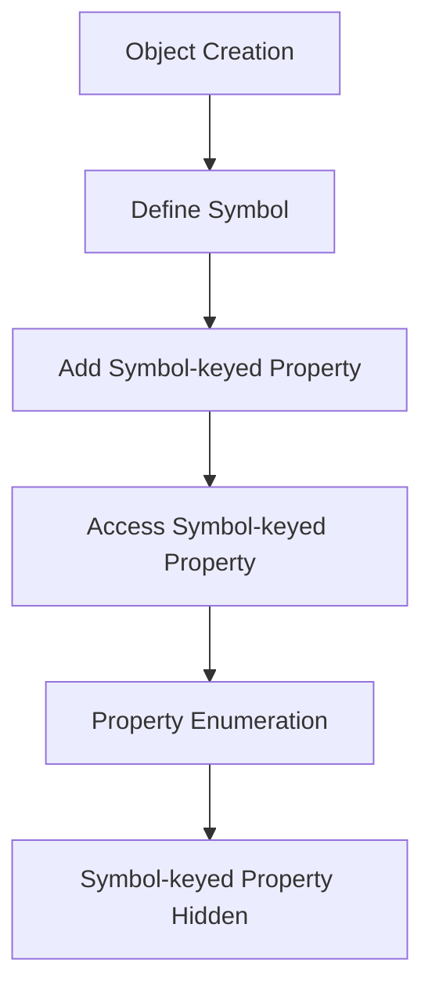

## 6.8 Symbol Properties for Privacy

In the world of JavaScript, managing data privacy and encapsulation is crucial for writing clean, maintainable, and secure code. One of the tools at our disposal for achieving this is the use of **Symbols**. In this section, we will explore how Symbols can be leveraged to create non-enumerable, pseudo-private properties in JavaScript objects, enhancing data encapsulation and reducing the risk of accidental property access or name collisions.

### Introduction to Symbols

Symbols are a primitive data type introduced in ECMAScript 2015 (ES6). They are unique and immutable identifiers that can be used as property keys in objects. Unlike strings or numbers, each Symbol is guaranteed to be unique, even if two Symbols are created with the same description.

#### Creating a Symbol

To create a Symbol, you use the `Symbol()` function. You can optionally provide a description, which is useful for debugging purposes but does not affect the uniqueness of the Symbol.

```javascript
// Creating a Symbol with a description
const mySymbol = Symbol('myUniqueSymbol');

console.log(mySymbol); // Output: Symbol(myUniqueSymbol)
```

### Using Symbols as Object Property Keys

Symbols can be used as keys for object properties. This feature allows you to create properties that are not accessible through standard property enumeration methods like `for...in` loops or `Object.keys()`.

#### Defining Symbol-keyed Properties

Let's see how to define and access properties using Symbols:

```javascript
// Define a Symbol
const secretSymbol = Symbol('secret');

// Create an object with a Symbol-keyed property
const myObject = {
  [secretSymbol]: 'This is a secret value',
  visibleProperty: 'This is a visible value'
};

// Accessing the Symbol-keyed property
console.log(myObject[secretSymbol]); // Output: This is a secret value
console.log(myObject.visibleProperty); // Output: This is a visible value
```

#### Non-enumerable Properties

One of the key advantages of using Symbols as property keys is that they are not included in standard property enumeration:

```javascript
// Enumerating properties
for (let key in myObject) {
  console.log(key); // Output: visibleProperty
}

console.log(Object.keys(myObject)); // Output: ['visibleProperty']
console.log(Object.getOwnPropertyNames(myObject)); // Output: ['visibleProperty']
```

As demonstrated, the Symbol-keyed property `secretSymbol` is not listed in the enumeration results. This characteristic makes Symbols useful for creating pseudo-private properties.

### Privacy with Symbols: Pseudo-Private Properties

While Symbols provide a level of privacy by hiding properties from enumeration, they do not offer true privacy. If the Symbol itself is known, the property can still be accessed. Therefore, Symbols are considered to provide "pseudo-private" properties.

#### Accessing Symbol-keyed Properties

To access a Symbol-keyed property, you need to have a reference to the Symbol:

```javascript
// Accessing the Symbol-keyed property
console.log(myObject[secretSymbol]); // Output: This is a secret value
```

If you do not have the Symbol, the property remains hidden, providing a layer of protection against accidental access.

### Benefits of Using Symbols

Symbols are particularly beneficial in scenarios where you want to avoid property name collisions, especially in library or framework development. By using Symbols, you can ensure that your properties do not interfere with those defined by users or other libraries.

#### Example: Library Development

Imagine you are developing a library that adds metadata to objects. Using Symbols can help prevent conflicts with user-defined properties:

```javascript
const metadataSymbol = Symbol('metadata');

function addMetadata(obj, metadata) {
  obj[metadataSymbol] = metadata;
}

const userObject = { name: 'Alice' };
addMetadata(userObject, { role: 'admin' });

console.log(userObject[metadataSymbol]); // Output: { role: 'admin' }
```

In this example, the `metadataSymbol` ensures that the metadata does not clash with any existing properties on `userObject`.

### Limitations of Symbols

While Symbols offer several advantages, they also come with limitations:

1. **Not True Privacy**: Symbols do not provide true privacy. If the Symbol is known, the property can be accessed.

2. **Complexity**: Overusing Symbols can make code harder to read and maintain, as it becomes less clear what properties an object contains.

3. **Lack of Serialization**: Symbols are not included in JSON serialization, which can be a limitation if you need to serialize and deserialize objects.

### Visualizing Symbol Usage

To better understand how Symbols work in JavaScript, let's visualize the interaction between objects and Symbol-keyed properties.



This diagram illustrates the process of creating an object, defining a Symbol, adding a Symbol-keyed property, accessing it, and observing its behavior during property enumeration.

### Try It Yourself

To get hands-on experience with Symbols, try modifying the following code examples:

- Create multiple Symbol-keyed properties on an object and experiment with property enumeration.
- Try accessing a Symbol-keyed property without knowing the Symbol and observe the behavior.
- Use Symbols in a small project to manage internal state without exposing it to the outside world.

### Knowledge Check

Before we wrap up, let's reinforce what we've learned:

- **What are Symbols in JavaScript?**
- **How do Symbols help in creating pseudo-private properties?**
- **What are the benefits and limitations of using Symbols?**

### Summary

Symbols in JavaScript provide a powerful way to create non-enumerable, pseudo-private properties. While they do not offer true privacy, they are useful for avoiding name collisions and managing internal state in libraries and frameworks. However, it's important to use them judiciously to avoid complicating your code.

Remember, this is just the beginning. As you progress, you'll discover more ways to leverage Symbols and other JavaScript features to write robust and maintainable code. Keep experimenting, stay curious, and enjoy the journey!

## Quiz Time!



### What is a Symbol in JavaScript?

- [x] A unique and immutable identifier
- [ ] A mutable string
- [ ] A number
- [ ] A boolean

> **Explanation:** Symbols are unique and immutable identifiers introduced in ES6.

### How can Symbols be used in JavaScript objects?

- [x] As property keys
- [ ] As property values
- [ ] As object methods
- [ ] As array elements

> **Explanation:** Symbols can be used as property keys in JavaScript objects.

### What is a key advantage of using Symbols as property keys?

- [x] They are not included in standard property enumeration
- [ ] They are faster to access
- [ ] They are automatically serialized
- [ ] They provide true privacy

> **Explanation:** Symbol-keyed properties are not included in standard property enumeration.

### Can Symbols provide true privacy for object properties?

- [ ] Yes
- [x] No

> **Explanation:** Symbols provide pseudo-privacy; they can be accessed if the Symbol is known.

### In which scenario are Symbols particularly beneficial?

- [x] Library development to avoid property name collisions
- [ ] Storing user data
- [ ] Creating arrays
- [ ] Defining functions

> **Explanation:** Symbols are beneficial in library development to avoid property name collisions.

### What happens if you try to serialize an object with Symbol-keyed properties?

- [ ] The Symbol-keyed properties are included
- [x] The Symbol-keyed properties are not included
- [ ] The object cannot be serialized
- [ ] The object is serialized as a string

> **Explanation:** Symbol-keyed properties are not included in JSON serialization.

### How can you access a Symbol-keyed property?

- [x] By having a reference to the Symbol
- [ ] By using `Object.keys()`
- [ ] By using `Object.values()`
- [ ] By using `for...in` loop

> **Explanation:** You need a reference to the Symbol to access a Symbol-keyed property.

### What is a limitation of using Symbols?

- [x] They can complicate code if overused
- [ ] They are slow to access
- [ ] They are not unique
- [ ] They are mutable

> **Explanation:** Overusing Symbols can make code harder to read and maintain.

### Are Symbols included in `Object.keys()` enumeration?

- [ ] Yes
- [x] No

> **Explanation:** Symbols are not included in `Object.keys()` enumeration.

### True or False: Symbols are included in JSON serialization.

- [ ] True
- [x] False

> **Explanation:** Symbols are not included in JSON serialization, which can be a limitation.


