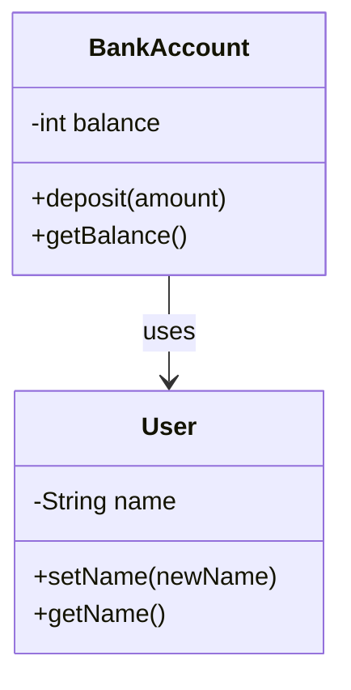

## 6.9 Best Practices in Data Encapsulation

In the world of object-oriented programming (OOP), encapsulation is a fundamental principle that helps in creating robust and maintainable code. Encapsulation involves bundling the data (variables) and the methods (functions) that operate on the data into a single unit, or class, and restricting access to some of the object's components. This section will guide you through the best practices for implementing data encapsulation in JavaScript, ensuring that your code remains secure, efficient, and easy to maintain.

### Understanding Data Encapsulation

Data encapsulation is the process of hiding the internal state of an object and requiring all interaction to occur through an object's methods. This concept is crucial in OOP as it helps to protect the integrity of the data and prevents unintended interference and misuse.

#### Key Principles of Data Encapsulation

1. **Data Hiding**: Protect the internal state of an object by making its attributes private and exposing only necessary parts through public methods.
2. **Controlled Access**: Provide controlled access to the data through getter and setter methods, ensuring that any changes to the data are validated and controlled.
3. **Modularity**: Encapsulation promotes modularity by allowing you to change the internal implementation without affecting other parts of the program that use the object.

### Selecting the Appropriate Encapsulation Technique

Choosing the right encapsulation technique depends on the project requirements and the environment in which your code will run. Here are some guidelines to help you decide:

#### Use of Closures for Encapsulation

Closures are a powerful feature in JavaScript that can be used to encapsulate data. By defining functions within other functions, you can create private variables that are accessible only within the inner function.

```javascript
function createCounter() {
  let count = 0; // Private variable

  return {
    increment: function() {
      count++;
    },
    getCount: function() {
      return count;
    }
  };
}

const counter = createCounter();
counter.increment();
console.log(counter.getCount()); // Outputs: 1
```

In this example, `count` is a private variable that cannot be accessed directly from outside the `createCounter` function. Instead, it can only be manipulated through the `increment` and `getCount` methods.

#### ES6 Classes and Private Fields

With the introduction of ES6, JavaScript now supports classes, which can be used to encapsulate data. ES2021 introduced private class fields, denoted by a `#` prefix, which provide true encapsulation.

```javascript
class BankAccount {
  #balance = 0; // Private field

  deposit(amount) {
    if (amount > 0) {
      this.#balance += amount;
    }
  }

  getBalance() {
    return this.#balance;
  }
}

const account = new BankAccount();
account.deposit(100);
console.log(account.getBalance()); // Outputs: 100
```

Here, `#balance` is a private field that cannot be accessed or modified directly from outside the `BankAccount` class.

### Importance of Consistent Code Conventions and Documentation

Maintaining consistent code conventions and thorough documentation is vital for preserving encapsulation. This practice ensures that anyone reading the code understands how to interact with objects correctly and safely.

- **Naming Conventions**: Use clear and consistent naming conventions to distinguish between public and private members. For example, prefix private methods with an underscore (e.g., `_privateMethod`).
- **Documentation**: Provide detailed documentation for each class and method, explaining the purpose, parameters, and return values. This documentation helps other developers understand how to use the encapsulated components without needing to access the internal implementation.

### Minimizing Exposure of Internal Object States

One of the key goals of encapsulation is to minimize the exposure of an object's internal state. Here are some strategies to achieve this:

#### Avoid Direct Property Manipulation

Avoid allowing direct manipulation of an object's properties from outside the object. Instead, provide methods that encapsulate the logic for modifying the object's state.

```javascript
class User {
  #name;

  constructor(name) {
    this.#name = name;
  }

  setName(newName) {
    if (newName) {
      this.#name = newName;
    }
  }

  getName() {
    return this.#name;
  }
}

const user = new User('Alice');
user.setName('Bob');
console.log(user.getName()); // Outputs: Bob
```

In this example, the `#name` property is private, and any changes to it must go through the `setName` method, which can include validation logic.

### Considerations for Performance, Maintainability, and Code Readability

When implementing encapsulation, it's essential to balance performance, maintainability, and readability. Here are some considerations:

- **Performance**: While encapsulation adds a layer of abstraction, it can sometimes introduce performance overhead. Evaluate the performance implications of your encapsulation strategy, especially in performance-critical applications.
- **Maintainability**: Encapsulation improves maintainability by isolating changes to a single class or module. Ensure that your encapsulation strategy supports easy updates and modifications.
- **Readability**: Keep your code readable by not over-complicating encapsulation. Use clear and concise methods and avoid unnecessary complexity.

### Practical Tips for Effective Encapsulation

1. **Avoid Over-Encapsulation**: While encapsulation is beneficial, over-encapsulation can lead to unnecessarily complex code. Only encapsulate what is necessary to protect the integrity of your data.
2. **Use Accessor Methods**: Implement getter and setter methods to provide controlled access to private data.
3. **Leverage JavaScript Features**: Use JavaScript's built-in features, such as closures and private fields, to implement encapsulation effectively.
4. **Adopt a Modular Approach**: Break down your code into smaller, self-contained modules that encapsulate specific functionality.
5. **Regularly Review and Refactor**: Periodically review your code to ensure that your encapsulation strategy is still appropriate and refactor as needed.

### Visualizing Encapsulation in JavaScript

To better understand how encapsulation works in JavaScript, let's visualize the interaction between objects and their encapsulated data.



In this diagram, we see two classes, `BankAccount` and `User`, each with private fields and public methods. The `BankAccount` class interacts with the `User` class, demonstrating encapsulation in action.

### Try It Yourself

Now that we've explored the best practices for data encapsulation, it's time to put them into practice. Try modifying the code examples provided in this section to add new features or improve the encapsulation strategy. For example, you could:

- Add validation logic to the `setName` method in the `User` class to ensure that the new name is not empty.
- Implement a withdrawal method in the `BankAccount` class that checks if the balance is sufficient before allowing a withdrawal.

### References and Further Reading

To deepen your understanding of data encapsulation and object-oriented programming in JavaScript, consider exploring these resources:

- [MDN Web Docs: Classes](https://developer.mozilla.org/en-US/docs/Web/JavaScript/Reference/Classes)
- [JavaScript Info: Object-oriented programming](https://javascript.info/object-oriented-programming)
- [W3Schools: JavaScript Classes](https://www.w3schools.com/js/js_classes.asp)

### Knowledge Check

Before we wrap up this section, let's test your understanding of data encapsulation with a few questions.

## Quiz Time!



### What is the primary purpose of data encapsulation?

- [x] To hide the internal state of an object and provide controlled access through methods
- [ ] To make all properties of an object publicly accessible
- [ ] To increase the complexity of the code
- [ ] To allow direct manipulation of object properties

> **Explanation:** Data encapsulation aims to hide the internal state of an object and provide controlled access through methods, ensuring data integrity and security.


### Which JavaScript feature can be used to create private variables?

- [x] Closures
- [ ] Global variables
- [ ] Public methods
- [ ] Loops

> **Explanation:** Closures in JavaScript can be used to create private variables by defining functions within other functions, restricting access to the inner function's scope.


### How can you implement private fields in ES6 classes?

- [x] By using a `#` prefix before the field name
- [ ] By using underscores before the field name
- [ ] By declaring the field as a constant
- [ ] By using the `let` keyword

> **Explanation:** In ES2021, private fields in classes are implemented using a `#` prefix before the field name, providing true encapsulation.


### Why is it important to maintain consistent code conventions and documentation?

- [x] To ensure that the code is understandable and maintainable by other developers
- [ ] To make the code more complex
- [ ] To increase the execution speed of the code
- [ ] To allow direct access to private fields

> **Explanation:** Consistent code conventions and documentation help ensure that the code is understandable and maintainable by other developers, preserving encapsulation.


### What is the risk of over-encapsulation?

- [x] It can lead to unnecessarily complex code
- [ ] It makes the code more readable
- [ ] It improves performance
- [ ] It increases the security of the code

> **Explanation:** Over-encapsulation can lead to unnecessarily complex code, making it harder to maintain and understand.


### Which method should be used to provide controlled access to private data?

- [x] Accessor methods (getters and setters)
- [ ] Direct property access
- [ ] Global variables
- [ ] Loops

> **Explanation:** Accessor methods, such as getters and setters, provide controlled access to private data, ensuring validation and encapsulation.


### What is the benefit of using closures for encapsulation?

- [x] They allow the creation of private variables accessible only within the inner function
- [ ] They make variables globally accessible
- [ ] They increase the execution speed of the code
- [ ] They allow direct manipulation of object properties

> **Explanation:** Closures allow the creation of private variables accessible only within the inner function, providing encapsulation.


### How can encapsulation improve maintainability?

- [x] By isolating changes to a single class or module
- [ ] By making all properties public
- [ ] By increasing the complexity of the code
- [ ] By allowing direct access to private fields

> **Explanation:** Encapsulation improves maintainability by isolating changes to a single class or module, reducing the impact on other parts of the code.


### What is a practical tip for effective encapsulation?

- [x] Avoid over-encapsulation to prevent unnecessarily complex code
- [ ] Make all properties public for easy access
- [ ] Use global variables for data sharing
- [ ] Avoid using accessor methods

> **Explanation:** Avoiding over-encapsulation prevents unnecessarily complex code, making it easier to maintain and understand.


### True or False: Encapsulation allows direct manipulation of an object's internal state from outside the object.

- [ ] True
- [x] False

> **Explanation:** False. Encapsulation restricts direct manipulation of an object's internal state from outside the object, ensuring controlled access through methods.



Remember, mastering data encapsulation is a journey. As you continue to practice and apply these concepts, you'll become more proficient in writing secure and maintainable JavaScript code. Keep experimenting, stay curious, and enjoy the process!
