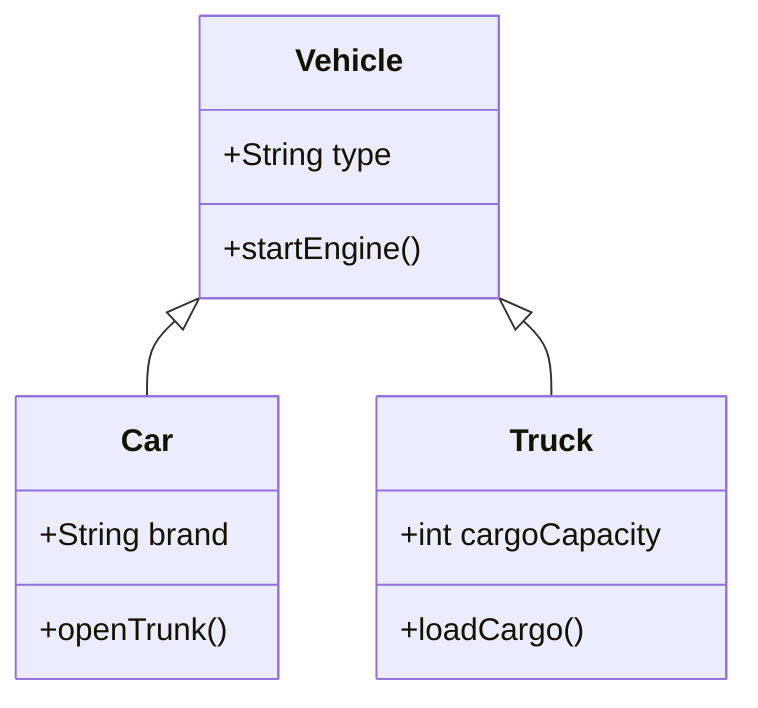

## 7.1 Concepts of Inheritance

In the world of programming, one of the most powerful concepts that object-oriented programming (OOP) offers is **inheritance**. Inheritance allows us to create a new class that is based on an existing class. This new class, known as a **child class** or **subclass**, inherits properties and methods from the existing class, which is referred to as the **parent class** or **superclass**. This mechanism not only promotes code reuse but also helps in establishing a natural hierarchy between classes, making the code more organized and easier to maintain.

### Understanding Inheritance

#### What is Inheritance?

Inheritance is a fundamental concept in OOP that enables a new class to inherit the properties and methods of an existing class. This means that the child class can use the functionality of the parent class without having to rewrite the code. It allows developers to create a hierarchy of classes that share a common structure and behavior.

For instance, consider a real-world analogy where we have a general category called "Vehicle." This category can have specific types like "Car" and "Truck." Both "Car" and "Truck" share common characteristics of a "Vehicle," such as having wheels and the ability to move. However, they also have their unique features. In programming terms, "Vehicle" would be the superclass, and "Car" and "Truck" would be subclasses.

#### Purpose of Inheritance

The primary purpose of inheritance is to promote code reuse. By inheriting from a parent class, a child class can avoid duplicating code that is common across multiple classes. This not only reduces the amount of code but also minimizes the chances of errors and inconsistencies. Additionally, inheritance helps in creating a logical structure for the code, making it easier to understand and maintain.

### Key Terms in Inheritance

- **Superclass (Parent Class):** The class whose properties and methods are inherited by another class. It represents a general concept or category.
- **Subclass (Child Class):** The class that inherits properties and methods from the superclass. It represents a more specific concept or category.
- **Inheritance Hierarchy:** The relationship between classes where subclasses inherit from superclasses, forming a tree-like structure.

### Real-World Analogy

To better understand inheritance, let's consider the analogy of a "Vehicle" superclass with "Car" and "Truck" subclasses:

- **Vehicle (Superclass):** This class includes properties like `numberOfWheels`, `engineType`, and methods like `startEngine()` and `stopEngine()`.
- **Car (Subclass):** Inherits all properties and methods from "Vehicle" and adds specific properties like `numberOfDoors` and methods like `openTrunk()`.
- **Truck (Subclass):** Also inherits from "Vehicle" and adds properties like `cargoCapacity` and methods like `loadCargo()`.

This hierarchy allows us to define common functionality in the "Vehicle" class, which can be reused by both "Car" and "Truck" classes, while still allowing each subclass to have its unique features.

### Inheritance in JavaScript

JavaScript, being a versatile language, supports inheritance through both prototype-based and class-based approaches. Let's explore both methods.

#### Prototype-Based Inheritance

JavaScript is a prototype-based language, meaning that inheritance is achieved through prototypes. Every JavaScript object has a prototype, which is another object from which it inherits properties and methods.

Here's a basic example of prototype-based inheritance:

```javascript
// Define a Vehicle constructor function
function Vehicle(type) {
  this.type = type;
}

// Add a method to the Vehicle prototype
Vehicle.prototype.startEngine = function() {
  console.log(`Starting the engine of the ${this.type}`);
};

// Define a Car constructor function
function Car(brand) {
  Vehicle.call(this, 'Car'); // Call the Vehicle constructor
  this.brand = brand;
}

// Set the prototype of Car to be an instance of Vehicle
Car.prototype = Object.create(Vehicle.prototype);

// Add a method specific to Car
Car.prototype.openTrunk = function() {
  console.log(`Opening the trunk of the ${this.brand} car`);
};

// Create an instance of Car
const myCar = new Car('Toyota');
myCar.startEngine(); // Output: Starting the engine of the Car
myCar.openTrunk();   // Output: Opening the trunk of the Toyota car
```

In this example, the `Car` constructor function inherits from the `Vehicle` constructor function. The `Car` prototype is set to an instance of `Vehicle`, allowing it to inherit the `startEngine` method.

#### Class-Based Inheritance (ES6)

With the introduction of ES6, JavaScript now supports class-based inheritance, which provides a more intuitive and cleaner syntax for defining classes and inheritance.

Here's how you can achieve inheritance using ES6 classes:

```javascript
// Define a Vehicle class
class Vehicle {
  constructor(type) {
    this.type = type;
  }

  startEngine() {
    console.log(`Starting the engine of the ${this.type}`);
  }
}

// Define a Car class that extends Vehicle
class Car extends Vehicle {
  constructor(brand) {
    super('Car'); // Call the parent class constructor
    this.brand = brand;
  }

  openTrunk() {
    console.log(`Opening the trunk of the ${this.brand} car`);
  }
}

// Create an instance of Car
const myCar = new Car('Toyota');
myCar.startEngine(); // Output: Starting the engine of the Car
myCar.openTrunk();   // Output: Opening the trunk of the Toyota car
```

In this example, the `Car` class extends the `Vehicle` class, inheriting its properties and methods. The `super` keyword is used to call the constructor of the parent class.

### Benefits of Inheritance

- **Code Reuse:** Inheritance allows us to reuse code across multiple classes, reducing redundancy and improving maintainability.
- **Logical Structure:** It helps in organizing code into a logical hierarchy, making it easier to understand and manage.
- **Extensibility:** New functionality can be added to the existing codebase by creating new subclasses without modifying the existing classes.

### Potential Drawbacks of Inheritance

- **Tight Coupling:** Inheritance can lead to tight coupling between classes, making it difficult to change one class without affecting others.
- **Complexity:** Deep inheritance hierarchies can become complex and difficult to manage, leading to increased maintenance overhead.
- **Limited Flexibility:** Inheritance is a rigid structure, and changes to the superclass can have unintended consequences on subclasses.

### Visualizing Inheritance

To better understand how inheritance works, let's visualize the relationship between the "Vehicle," "Car," and "Truck" classes using a class diagram.



In this diagram, the `Vehicle` class is the superclass, and `Car` and `Truck` are subclasses that inherit from `Vehicle`.

### Try It Yourself

To solidify your understanding of inheritance, try modifying the code examples above:

- Add a new subclass called `Motorcycle` that inherits from `Vehicle` and includes a method `popWheelie()`.
- Experiment with adding new properties to the `Vehicle` class and observe how they are inherited by the subclasses.
- Create instances of `Car`, `Truck`, and `Motorcycle` and call their methods to see inheritance in action.

### References and Further Reading

- [MDN Web Docs: Inheritance](https://developer.mozilla.org/en-US/docs/Web/JavaScript/Inheritance_and_the_prototype_chain)
- [W3Schools: JavaScript Inheritance](https://www.w3schools.com/js/js_inheritance.asp)

### Knowledge Check

- What is the primary purpose of inheritance in OOP?
- How does prototype-based inheritance differ from class-based inheritance in JavaScript?
- What are some potential drawbacks of using inheritance?

### Embrace the Journey

Remember, inheritance is a powerful tool in your programming toolkit, but like any tool, it should be used wisely. As you continue your journey in learning JavaScript, keep experimenting and exploring different ways to organize and structure your code. Inheritance is just one of the many concepts that will help you write more efficient and maintainable code. Stay curious, and enjoy the journey!

## Quiz Time!



### What is inheritance in object-oriented programming?

- [x] A mechanism that allows a class to inherit properties and methods from another class.
- [ ] A process of creating new objects from existing objects.
- [ ] A way to encapsulate data within a class.
- [ ] A method for handling errors in a program.

> **Explanation:** Inheritance is a mechanism in object-oriented programming that allows a class (subclass) to inherit properties and methods from another class (superclass), promoting code reuse and establishing class hierarchies.

### What is the main advantage of using inheritance?

- [x] Code reuse
- [ ] Increased complexity
- [ ] Tight coupling
- [ ] Limited flexibility

> **Explanation:** The main advantage of using inheritance is code reuse, as it allows subclasses to inherit and use the properties and methods of a superclass, reducing redundancy.

### Which keyword is used in ES6 to create a subclass?

- [x] extends
- [ ] inherit
- [ ] subclass
- [ ] super

> **Explanation:** The `extends` keyword is used in ES6 to create a subclass that inherits from a superclass.

### What is a potential drawback of using inheritance?

- [x] Tight coupling between classes
- [ ] Improved code readability
- [ ] Increased code reuse
- [ ] Simplified class hierarchies

> **Explanation:** A potential drawback of using inheritance is tight coupling between classes, which can make it difficult to change one class without affecting others.

### In JavaScript, how is prototype-based inheritance achieved?

- [x] By setting the prototype of a constructor function to an instance of another constructor function.
- [ ] By using the `extends` keyword.
- [ ] By creating a new class with the `class` keyword.
- [ ] By using the `super` keyword.

> **Explanation:** Prototype-based inheritance in JavaScript is achieved by setting the prototype of a constructor function to an instance of another constructor function, allowing the child to inherit properties and methods.

### What does the `super` keyword do in ES6 classes?

- [x] Calls the constructor of the parent class
- [ ] Creates a new instance of the class
- [ ] Defines a new method in the class
- [ ] Sets the prototype of the class

> **Explanation:** The `super` keyword in ES6 classes is used to call the constructor of the parent class, allowing the child class to inherit properties and methods.

### Which of the following is a subclass in the given example?

- [x] Car
- [ ] Vehicle
- [ ] Engine
- [ ] Wheel

> **Explanation:** In the given example, `Car` is a subclass that inherits from the `Vehicle` superclass.

### What is the role of the prototype in JavaScript inheritance?

- [x] It allows objects to inherit properties and methods from other objects.
- [ ] It defines the structure of a class.
- [ ] It encapsulates data within a class.
- [ ] It handles errors in a program.

> **Explanation:** The prototype in JavaScript inheritance allows objects to inherit properties and methods from other objects, forming a prototype chain.

### Which method is specific to the `Car` class in the example?

- [x] openTrunk()
- [ ] startEngine()
- [ ] loadCargo()
- [ ] popWheelie()

> **Explanation:** In the example, `openTrunk()` is a method specific to the `Car` class, while `startEngine()` is inherited from the `Vehicle` class.

### True or False: Inheritance can lead to increased complexity and maintenance overhead.

- [x] True
- [ ] False

> **Explanation:** True. Inheritance can lead to increased complexity and maintenance overhead, especially with deep inheritance hierarchies, making it challenging to manage and modify the code.


