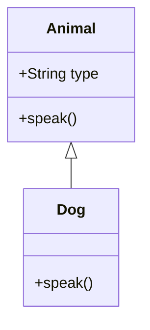

## 7.10 Best Practices in Implementing Inheritance

Inheritance is a cornerstone of object-oriented programming (OOP), allowing developers to create a hierarchy of classes that share common behavior and attributes. In JavaScript, inheritance can be implemented using both prototypal and class-based approaches. However, using inheritance effectively requires understanding key principles and avoiding common pitfalls. In this section, we will explore best practices for implementing inheritance in JavaScript, focusing on encapsulation, abstraction, and thoughtful class design.

### Understanding Inheritance in JavaScript

Before diving into best practices, let's briefly review how inheritance works in JavaScript. JavaScript supports prototypal inheritance, where objects can inherit properties and methods from other objects. With the introduction of ES6, JavaScript also supports class-based inheritance, which provides a more familiar syntax for developers coming from other OOP languages.

#### Prototypal Inheritance

In prototypal inheritance, each object has a prototype, which is another object from which it inherits properties. This chain of prototypes is known as the prototype chain. Here's a simple example:

```javascript
// Base object
const animal = {
  type: 'Animal',
  speak() {
    console.log(`I am a ${this.type}`);
  }
};

// Derived object
const dog = Object.create(animal);
dog.type = 'Dog';
dog.speak(); // Output: I am a Dog
```

#### Class-Based Inheritance

With ES6, JavaScript introduced the `class` syntax, making it easier to define classes and implement inheritance:

```javascript
class Animal {
  constructor(type) {
    this.type = type;
  }

  speak() {
    console.log(`I am a ${this.type}`);
  }
}

class Dog extends Animal {
  constructor() {
    super('Dog');
  }
}

const dog = new Dog();
dog.speak(); // Output: I am a Dog
```

### Key Principles for Effective Use of Inheritance

To use inheritance effectively, it's essential to adhere to certain principles that promote code reuse, maintainability, and scalability.

#### 1. Emphasize Encapsulation and Abstraction

Encapsulation and abstraction are fundamental OOP principles that help manage complexity by hiding implementation details and exposing only necessary functionalities.

- **Encapsulation**: Ensure that each class or object manages its state and behavior. Use private fields and methods to hide internal details and expose public methods for interaction.

- **Abstraction**: Define clear interfaces for your classes. Use abstract classes or interfaces (conceptually, as JavaScript doesn't have built-in interfaces) to outline expected behaviors without specifying how they should be implemented.

#### 2. Adhere to the Liskov Substitution Principle

The Liskov Substitution Principle (LSP) is a key tenet of OOP, stating that objects of a superclass should be replaceable with objects of a subclass without affecting the correctness of the program. This principle ensures that subclasses can stand in for their parent classes without introducing errors.

- **Implementation**: Ensure that subclasses extend the functionality of the superclass without altering expected behaviors. Avoid overriding methods in a way that changes their intended use.

#### 3. Avoid Deep Inheritance Hierarchies

Deep inheritance hierarchies can lead to complex and brittle code. Instead, favor shallow hierarchies that are easier to understand and maintain.

- **Guidelines**: Limit inheritance depth to two or three levels. Use composition over inheritance when possible to combine behaviors from multiple sources.

#### 4. Encourage Thoughtful Class Design

Design classes with a clear purpose and responsibility. Each class should represent a single concept or entity.

- **Single Responsibility Principle**: Ensure that each class has one reason to change, focusing on a single responsibility or functionality.

- **Cohesion**: Group related properties and methods within a class to maintain high cohesion.

#### 5. Regularly Refactor and Review Code

Regular refactoring helps maintain clean and efficient code. Review your class hierarchies and refactor them to improve design and performance.

- **Refactoring**: Identify and eliminate redundant code. Simplify complex hierarchies by extracting common behaviors into shared components.

- **Code Reviews**: Conduct regular code reviews to ensure adherence to best practices and identify potential improvements.

### Balancing Reuse and Complexity

Inheritance is a powerful tool for code reuse, but it can also introduce complexity if not used judiciously. Striking a balance between reuse and complexity is crucial for effective software design.

#### 1. Use Inheritance for "Is-a" Relationships

Inheritance is best suited for "is-a" relationships, where a subclass is a specialized version of a superclass.

- **Example**: A `Dog` is a type of `Animal`, so it makes sense to use inheritance to represent this relationship.

#### 2. Favor Composition Over Inheritance

Composition involves building classes by combining behaviors from multiple sources, offering greater flexibility and reducing dependency on a single hierarchy.

- **Example**: Instead of creating a deep hierarchy of classes, use composition to add behaviors dynamically. For instance, a `Car` class can have an `Engine` and `Wheels` as components, rather than inheriting from a `Vehicle` class.

### Common Pitfalls and How to Avoid Them

Understanding common pitfalls in inheritance can help you avoid them and create more robust designs.

#### 1. Overusing Inheritance

Overusing inheritance can lead to rigid and fragile code. Use inheritance only when it makes sense and provides clear benefits.

- **Solution**: Evaluate whether inheritance is the best approach for your design. Consider alternatives like composition or interfaces.

#### 2. Ignoring Encapsulation

Failing to encapsulate internal details can lead to tightly coupled code that is difficult to modify and maintain.

- **Solution**: Use private fields and methods to hide implementation details. Provide public methods for interacting with the class.

#### 3. Violating the Liskov Substitution Principle

Violating LSP can lead to unexpected behaviors and errors when substituting subclasses for their parent classes.

- **Solution**: Ensure that subclasses extend, rather than alter, the behavior of their parent classes. Avoid overriding methods in a way that changes their intended use.

### Try It Yourself

To reinforce your understanding of inheritance, try modifying the following code example. Add a new subclass that inherits from `Animal` and implements its own `speak` method.

```javascript
class Animal {
  constructor(type) {
    this.type = type;
  }

  speak() {
    console.log(`I am a ${this.type}`);
  }
}

class Dog extends Animal {
  constructor() {
    super('Dog');
  }
}

// Add your new subclass here
```

### Visualizing Inheritance

To help visualize how inheritance works in JavaScript, let's use a diagram to represent the relationship between classes and objects.



In this diagram, `Animal` is the superclass, and `Dog` is the subclass that inherits from `Animal`. The arrow indicates the inheritance relationship.

### References and Further Reading

For more information on inheritance and object-oriented programming in JavaScript, consider exploring the following resources:

- [MDN Web Docs: Inheritance and the prototype chain](https://developer.mozilla.org/en-US/docs/Web/JavaScript/Inheritance_and_the_prototype_chain)
- [JavaScript.info: Prototypal inheritance](https://javascript.info/prototype-inheritance)
- [W3Schools: JavaScript Classes](https://www.w3schools.com/js/js_classes.asp)

### Knowledge Check

To test your understanding of inheritance in JavaScript, try answering the following questions:

1. What is the primary purpose of inheritance in object-oriented programming?
2. How does the Liskov Substitution Principle relate to inheritance?
3. Why is it important to avoid deep inheritance hierarchies?
4. What is the difference between inheritance and composition?
5. How can encapsulation improve the design of your classes?

### Embrace the Journey

Remember, mastering inheritance is just one step on your journey to becoming proficient in object-oriented programming. As you continue to learn and experiment, you'll discover new ways to apply these concepts in your projects. Keep exploring, stay curious, and enjoy the journey!

---

## Quiz Time!



### What is the primary purpose of inheritance in object-oriented programming?

- [x] To promote code reuse and establish hierarchical relationships
- [ ] To create complex algorithms
- [ ] To improve performance
- [ ] To simplify syntax

> **Explanation:** Inheritance allows for code reuse and the establishment of hierarchical relationships between classes, promoting maintainability and scalability.

### How does the Liskov Substitution Principle relate to inheritance?

- [x] It ensures that subclasses can replace parent classes without altering the program's correctness
- [ ] It dictates the syntax of class definitions
- [ ] It requires all classes to have the same methods
- [ ] It limits the number of subclasses

> **Explanation:** The Liskov Substitution Principle ensures that objects of a superclass can be replaced with objects of a subclass without affecting the correctness of the program.

### Why is it important to avoid deep inheritance hierarchies?

- [x] They can lead to complex and brittle code
- [ ] They improve performance
- [ ] They simplify debugging
- [ ] They enhance encapsulation

> **Explanation:** Deep inheritance hierarchies can make code difficult to understand and maintain, leading to increased complexity and potential errors.

### What is the difference between inheritance and composition?

- [x] Inheritance is for "is-a" relationships, while composition is for "has-a" relationships
- [ ] Inheritance is faster than composition
- [ ] Composition is a type of inheritance
- [ ] Inheritance requires more memory

> **Explanation:** Inheritance is used for "is-a" relationships, where a subclass is a specialized version of a superclass, while composition is used for "has-a" relationships, where a class is composed of multiple components.

### How can encapsulation improve the design of your classes?

- [x] By hiding implementation details and exposing only necessary functionalities
- [ ] By making all methods public
- [ ] By reducing the number of classes
- [ ] By increasing inheritance depth

> **Explanation:** Encapsulation hides the internal details of a class, exposing only the necessary functionalities, which helps manage complexity and maintainability.

### What is a common pitfall when using inheritance?

- [x] Overusing inheritance, leading to rigid and fragile code
- [ ] Using too many interfaces
- [ ] Avoiding encapsulation
- [ ] Implementing too many methods

> **Explanation:** Overusing inheritance can lead to rigid and fragile code, making it difficult to modify and maintain.

### What is the benefit of using composition over inheritance?

- [x] Greater flexibility and reduced dependency on a single hierarchy
- [ ] Faster execution
- [ ] Simpler syntax
- [ ] Improved encapsulation

> **Explanation:** Composition offers greater flexibility by allowing classes to combine behaviors from multiple sources, reducing dependency on a single hierarchy.

### How can you ensure adherence to the Liskov Substitution Principle?

- [x] By ensuring that subclasses extend the functionality of the superclass without altering expected behaviors
- [ ] By using deep inheritance hierarchies
- [ ] By making all methods private
- [ ] By avoiding the use of interfaces

> **Explanation:** Adhering to the Liskov Substitution Principle involves ensuring that subclasses extend the functionality of the superclass without altering expected behaviors.

### What is the role of the `super` keyword in JavaScript inheritance?

- [x] It is used to call the constructor of the parent class
- [ ] It defines a new class
- [ ] It creates a new object
- [ ] It deletes a method

> **Explanation:** The `super` keyword is used in JavaScript to call the constructor of the parent class, allowing the subclass to inherit properties and methods.

### True or False: Encapsulation and abstraction are unrelated to inheritance.

- [ ] True
- [x] False

> **Explanation:** False. Encapsulation and abstraction are fundamental principles of object-oriented programming that are closely related to inheritance, as they help manage complexity and promote maintainability.



---
