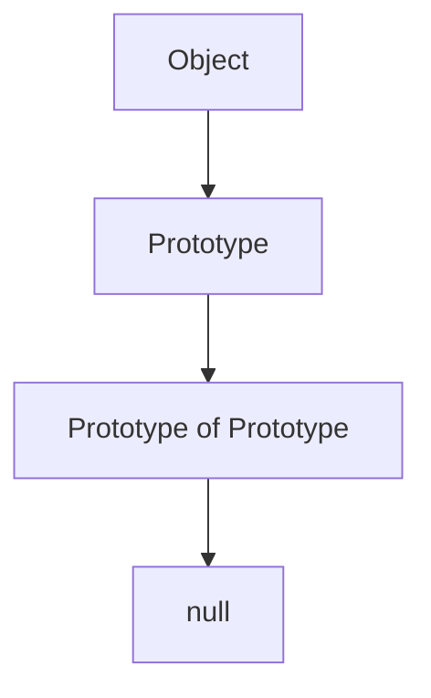
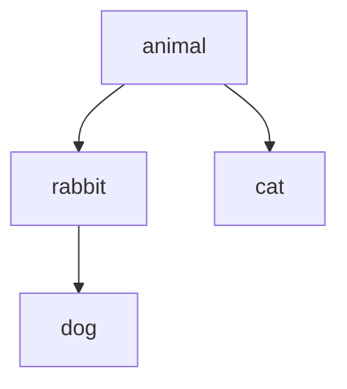

## 7.2 Prototypal Inheritance in Depth

Welcome to the fascinating world of prototypal inheritance in JavaScript! In this section, we'll dive deep into the concept of prototypal inheritance, exploring how it differs from classical inheritance, understanding the prototype chain, and learning how to effectively use JavaScript's unique features to create robust and reusable code. Whether you're new to programming or looking to deepen your understanding, this guide will provide you with the knowledge and tools to master prototypal inheritance.

### Understanding Prototypal Inheritance

**Prototypal inheritance** is a core concept in JavaScript, allowing objects to inherit properties and methods from other objects. Unlike classical inheritance, which involves classes and instances, prototypal inheritance is based on the idea that objects can directly inherit from other objects. This approach provides a flexible and dynamic way to share behavior across objects.

#### Key Differences from Classical Inheritance

- **Classical Inheritance**: Typically found in languages like Java or C++, classical inheritance involves defining classes and creating instances of those classes. Inheritance is achieved through class hierarchies.
- **Prototypal Inheritance**: In JavaScript, objects can inherit directly from other objects. There are no classes in the traditional sense; instead, objects serve as prototypes for other objects.

### The Prototype Chain

The **prototype chain** is a mechanism that allows JavaScript objects to inherit properties and methods from other objects. Every object in JavaScript has a prototype, which is another object from which it can inherit properties.

#### How the Prototype Chain Works

When you try to access a property or method on an object, JavaScript first looks for it on the object itself. If it doesn't find it, JavaScript then looks at the object's prototype, and then the prototype's prototype, and so on, until it either finds the property or reaches the end of the chain (null).

Here's a simple diagram to visualize the prototype chain:



### Example: Inheriting Properties and Methods

Let's explore how objects inherit properties and methods through prototypes with a practical example.

```javascript
// Define a prototype object
const animal = {
    eats: true,
    walk() {
        console.log("Animal walks");
    }
};

// Create a new object that inherits from animal
const rabbit = Object.create(animal);
rabbit.jumps = true;

// Access properties and methods
console.log(rabbit.eats); // true, inherited from animal
console.log(rabbit.jumps); // true, own property
rabbit.walk(); // "Animal walks", method inherited from animal
```

In this example, `rabbit` inherits the `eats` property and `walk` method from the `animal` prototype. The `jumps` property is specific to `rabbit`.

### Using `Object.create()`

The `Object.create()` method is a powerful tool for setting up prototypes. It allows you to create a new object with a specified prototype, giving you precise control over inheritance.

#### How `Object.create()` Works

`Object.create(proto, [propertiesObject])` creates a new object with the specified prototype object and optional properties.

```javascript
const cat = Object.create(animal, {
    meows: {
        value: true,
        writable: true,
        enumerable: true,
        configurable: true
    }
});

console.log(cat.eats); // true, inherited from animal
console.log(cat.meows); // true, own property
```

### Setting and Modifying Prototypes

JavaScript provides several ways to set and modify the prototype of an object.

#### Using `Object.setPrototypeOf()`

`Object.setPrototypeOf(obj, prototype)` sets the prototype of a specified object.

```javascript
const dog = {};
Object.setPrototypeOf(dog, animal);

console.log(dog.eats); // true, inherited from animal
```

#### Modifying Prototypes

You can add or modify properties and methods on a prototype, affecting all objects that inherit from it.

```javascript
animal.run = function() {
    console.log("Animal runs");
};

rabbit.run(); // "Animal runs", method added to animal prototype
```

### Nuances of Prototypal Inheritance

Prototypal inheritance comes with its own set of nuances, including delegation and property shadowing.

#### Delegation

Delegation is the process by which an object delegates property access to its prototype. This allows for shared behavior across objects.

#### Property Shadowing

Property shadowing occurs when an object has its own property with the same name as a property in its prototype. The object's own property takes precedence.

```javascript
rabbit.eats = false; // Shadowing the eats property
console.log(rabbit.eats); // false, own property
console.log(animal.eats); // true, prototype property
```

### Try It Yourself

Experiment with the code examples provided. Try modifying properties, adding new methods, and observing how changes affect inherited objects. This hands-on approach will deepen your understanding of prototypal inheritance.

### Visualizing Prototypal Inheritance

To further enhance your understanding, let's visualize the relationship between objects and their prototypes using a diagram:



This diagram illustrates how `rabbit`, `cat`, and `dog` all inherit from the `animal` prototype, sharing properties and methods.

### References and Further Reading

For more information on prototypal inheritance, consider exploring the following resources:

- [MDN Web Docs: Inheritance and the prototype chain](https://developer.mozilla.org/en-US/docs/Web/JavaScript/Inheritance_and_the_prototype_chain)
- [JavaScript.info: Prototypal Inheritance](https://javascript.info/prototype-inheritance)

### Knowledge Check

Before moving on, take a moment to reflect on what you've learned. Consider how prototypal inheritance can be used in your own projects to create flexible and reusable code.

### Embrace the Journey

Remember, mastering prototypal inheritance is a journey. As you continue to explore JavaScript, you'll discover new ways to leverage this powerful feature. Stay curious, keep experimenting, and enjoy the process!

## Quiz Time!



### What is prototypal inheritance?

- [x] A way for objects to inherit properties and methods from other objects
- [ ] A method for creating classes in JavaScript
- [ ] A feature exclusive to ES6
- [ ] A process of copying properties from one object to another

> **Explanation:** Prototypal inheritance allows objects to inherit properties and methods directly from other objects, rather than through classes.

### How does the prototype chain work?

- [x] JavaScript looks for properties on the object, then its prototype, and continues up the chain
- [ ] JavaScript copies properties from the prototype to the object
- [ ] JavaScript only looks at the object's own properties
- [ ] JavaScript creates a new prototype for each object

> **Explanation:** The prototype chain is a series of links between objects, where JavaScript looks for properties and methods up the chain until it finds them or reaches null.

### What does `Object.create()` do?

- [x] Creates a new object with a specified prototype
- [ ] Copies properties from one object to another
- [ ] Deletes properties from an object
- [ ] Modifies the prototype of an existing object

> **Explanation:** `Object.create()` creates a new object with the specified prototype, allowing for precise control over inheritance.

### What is property shadowing?

- [x] When an object has its own property with the same name as a property in its prototype
- [ ] When a property is hidden from the prototype
- [ ] When a property is deleted from an object
- [ ] When a property is copied from one object to another

> **Explanation:** Property shadowing occurs when an object has its own property that overrides a property with the same name in its prototype.

### How can you modify the prototype of an object?

- [x] Using `Object.setPrototypeOf()`
- [ ] Using `Object.defineProperty()`
- [ ] Using `Object.freeze()`
- [ ] Using `Object.assign()`

> **Explanation:** `Object.setPrototypeOf()` is used to set or modify the prototype of an object.

### What happens when you add a method to a prototype?

- [x] All objects inheriting from that prototype can use the method
- [ ] Only the prototype itself can use the method
- [ ] The method is copied to each object
- [ ] The method is hidden from all objects

> **Explanation:** Adding a method to a prototype allows all objects inheriting from that prototype to use the method.

### What is delegation in prototypal inheritance?

- [x] The process by which an object delegates property access to its prototype
- [ ] The process of copying properties from one object to another
- [ ] The process of deleting properties from an object
- [ ] The process of creating a new prototype

> **Explanation:** Delegation is the process by which an object delegates property access to its prototype, allowing for shared behavior.

### How does JavaScript handle property access in the prototype chain?

- [x] It looks for the property on the object, then its prototype, and continues up the chain
- [ ] It copies the property to the object
- [ ] It deletes the property from the prototype
- [ ] It creates a new property on the object

> **Explanation:** JavaScript handles property access by looking for the property on the object, then its prototype, and continuing up the chain until it finds it or reaches null.

### What is the result of modifying a prototype?

- [x] All objects inheriting from that prototype are affected
- [ ] Only the prototype itself is affected
- [ ] The modification is copied to each object
- [ ] The modification is hidden from all objects

> **Explanation:** Modifying a prototype affects all objects inheriting from that prototype, as they share the prototype's properties and methods.

### True or False: Prototypal inheritance is based on classes.

- [ ] True
- [x] False

> **Explanation:** False. Prototypal inheritance is based on objects inheriting directly from other objects, not classes.



By understanding and applying these concepts, you'll be well-equipped to harness the power of prototypal inheritance in your JavaScript projects. Keep exploring, and remember that practice makes perfect!
