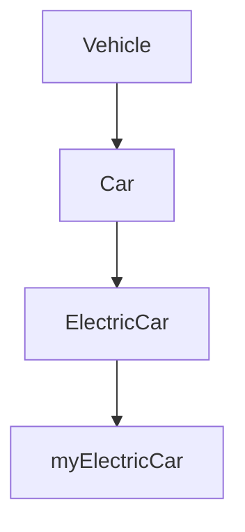

## 7.3 Class-Based Inheritance

Welcome to the exciting world of class-based inheritance in JavaScript! In this section, we'll delve into how ES6 classes enable inheritance, allowing you to create more structured and reusable code. We'll explore the `extends` keyword, the role of the `super` keyword, and how these concepts are built upon JavaScript's prototype mechanism. By the end of this section, you'll have a solid understanding of how to implement inheritance using ES6 classes, and you'll be ready to apply these concepts to your own projects.

### Understanding Inheritance

Inheritance is a fundamental concept in object-oriented programming (OOP) that allows a class (known as a subclass or derived class) to inherit properties and methods from another class (known as a superclass or base class). This promotes code reuse and can lead to more organized and maintainable codebases.

### The `extends` Keyword

The `extends` keyword in JavaScript is used to create a class that is a child of another class. This establishes a parent-child relationship between the two classes, where the child class inherits the properties and methods of the parent class.

#### Creating a Subclass with `extends`

Let's start by creating a simple example to illustrate how the `extends` keyword works. We'll define a `Vehicle` class and then create a `Car` class that inherits from `Vehicle`.

```javascript
// Define the parent class
class Vehicle {
    constructor(make, model) {
        this.make = make;
        this.model = model;
    }

    displayInfo() {
        console.log(`Vehicle: ${this.make} ${this.model}`);
    }
}

// Define the child class
class Car extends Vehicle {
    constructor(make, model, doors) {
        // Call the parent class constructor
        super(make, model);
        this.doors = doors;
    }

    displayInfo() {
        // Override the parent class method
        console.log(`Car: ${this.make} ${this.model}, Doors: ${this.doors}`);
    }
}

// Create an instance of Car
const myCar = new Car('Toyota', 'Corolla', 4);
myCar.displayInfo(); // Output: Car: Toyota Corolla, Doors: 4
```

In this example, the `Car` class extends the `Vehicle` class, inheriting its properties and methods. The `Car` class also introduces a new property, `doors`, and overrides the `displayInfo` method to provide more specific information.

### The Role of the `super` Keyword

The `super` keyword is used to call the constructor of the parent class and access its properties and methods. This is particularly useful when you want to extend the functionality of the parent class without rewriting its code.

#### Using `super` in Constructors

In the `Car` class example above, we used `super(make, model);` to call the constructor of the `Vehicle` class. This ensures that the `make` and `model` properties are initialized correctly in the `Car` class.

#### Using `super` in Methods

The `super` keyword can also be used to call methods from the parent class. This allows you to build upon existing functionality.

```javascript
class ElectricCar extends Car {
    constructor(make, model, doors, batteryCapacity) {
        super(make, model, doors);
        this.batteryCapacity = batteryCapacity;
    }

    displayInfo() {
        // Call the parent class method
        super.displayInfo();
        console.log(`Battery Capacity: ${this.batteryCapacity} kWh`);
    }
}

// Create an instance of ElectricCar
const myElectricCar = new ElectricCar('Tesla', 'Model S', 4, 100);
myElectricCar.displayInfo();
// Output:
// Car: Tesla Model S, Doors: 4
// Battery Capacity: 100 kWh
```

In this example, the `ElectricCar` class extends the `Car` class and adds a new property, `batteryCapacity`. The `displayInfo` method in `ElectricCar` calls the `displayInfo` method of the `Car` class using `super.displayInfo();` before adding additional information.

### The Prototype Mechanism

Under the hood, JavaScript's class-based inheritance is built upon its prototypal inheritance mechanism. When you use the `extends` keyword, JavaScript sets up the prototype chain so that instances of the subclass have access to the properties and methods of the superclass.

#### Visualizing the Prototype Chain

To better understand how this works, let's visualize the prototype chain for our `ElectricCar` example:



In this diagram, `myElectricCar` is an instance of `ElectricCar`, which inherits from `Car`, which in turn inherits from `Vehicle`. This chain allows `myElectricCar` to access properties and methods defined in both `Car` and `Vehicle`.

### Differences Between Class-Based and Prototypal Inheritance

While class-based inheritance in JavaScript provides a familiar syntax for developers coming from other OOP languages, it's important to understand how it differs from prototypal inheritance:

- **Syntax**: Class-based inheritance uses the `class` and `extends` keywords, providing a more traditional OOP syntax. Prototypal inheritance relies on prototypes and the `Object.create()` method.
- **Flexibility**: Prototypal inheritance offers more flexibility, allowing objects to inherit directly from other objects without the need for classes.
- **Performance**: Both inheritance models have similar performance characteristics, as class-based inheritance is essentially syntactic sugar over prototypal inheritance.

### Overriding Methods

Overriding methods is a common use case in inheritance, allowing subclasses to provide specific implementations for methods defined in the superclass.

#### Example of Method Overriding

Let's revisit our `Car` and `ElectricCar` example to see method overriding in action:

```javascript
class Car {
    constructor(make, model, doors) {
        this.make = make;
        this.model = model;
        this.doors = doors;
    }

    displayInfo() {
        console.log(`Car: ${this.make} ${this.model}, Doors: ${this.doors}`);
    }
}

class ElectricCar extends Car {
    constructor(make, model, doors, batteryCapacity) {
        super(make, model, doors);
        this.batteryCapacity = batteryCapacity;
    }

    // Override the displayInfo method
    displayInfo() {
        console.log(`Electric Car: ${this.make} ${this.model}, Doors: ${this.doors}, Battery Capacity: ${this.batteryCapacity} kWh`);
    }
}

// Create an instance of ElectricCar
const myElectricCar = new ElectricCar('Tesla', 'Model S', 4, 100);
myElectricCar.displayInfo();
// Output: Electric Car: Tesla Model S, Doors: 4, Battery Capacity: 100 kWh
```

In this example, the `ElectricCar` class overrides the `displayInfo` method to provide more detailed information specific to electric cars.

### Try It Yourself

Now it's your turn! Try modifying the `Car` and `ElectricCar` classes to add new properties or methods. For example, you could add a `range` property to `ElectricCar` and update the `displayInfo` method to include it. Experiment with calling the parent class methods using `super` and see how the prototype chain affects your objects.

### Knowledge Check

Before we wrap up, let's review some key points:

- **Inheritance** allows a class to inherit properties and methods from another class, promoting code reuse.
- The `extends` keyword is used to create a subclass that inherits from a parent class.
- The `super` keyword is used to call the constructor and methods of the parent class.
- Class-based inheritance in JavaScript is built upon its prototypal inheritance mechanism.
- Method overriding allows subclasses to provide specific implementations for methods defined in the superclass.

### Additional Resources

For further reading on class-based inheritance in JavaScript, check out the following resources:

- [MDN Web Docs: Classes](https://developer.mozilla.org/en-US/docs/Web/JavaScript/Reference/Classes)
- [MDN Web Docs: Inheritance](https://developer.mozilla.org/en-US/docs/Web/JavaScript/Inheritance_and_the_prototype_chain)
- [W3Schools: JavaScript Classes](https://www.w3schools.com/js/js_classes.asp)

Remember, this is just the beginning. As you continue your journey in JavaScript, you'll encounter more complex scenarios where inheritance can help you write cleaner and more efficient code. Keep experimenting, stay curious, and enjoy the journey!

## Quiz Time!



### What keyword is used to create a subclass in JavaScript?

- [x] extends
- [ ] super
- [ ] class
- [ ] this

> **Explanation:** The `extends` keyword is used to create a subclass that inherits from a parent class in JavaScript.

### What does the `super` keyword do in a constructor?

- [x] Calls the parent class constructor
- [ ] Initializes a new property
- [ ] Creates a new method
- [ ] Defines a new class

> **Explanation:** The `super` keyword is used to call the constructor of the parent class, allowing the subclass to inherit properties and methods.

### How can you override a method in a subclass?

- [x] Define a method with the same name in the subclass
- [ ] Use the `super` keyword
- [ ] Use the `extends` keyword
- [ ] Use the `this` keyword

> **Explanation:** To override a method in a subclass, define a method with the same name in the subclass. This will replace the method from the parent class.

### What is the purpose of the prototype chain in JavaScript?

- [x] To enable inheritance between objects
- [ ] To define new classes
- [ ] To create new instances
- [ ] To initialize properties

> **Explanation:** The prototype chain in JavaScript allows objects to inherit properties and methods from other objects, enabling inheritance.

### Which of the following is true about class-based inheritance in JavaScript?

- [x] It is syntactic sugar over prototypal inheritance
- [ ] It is more flexible than prototypal inheritance
- [ ] It is faster than prototypal inheritance
- [ ] It does not support method overriding

> **Explanation:** Class-based inheritance in JavaScript is syntactic sugar over prototypal inheritance, providing a more familiar syntax for developers.

### What does the `extends` keyword do?

- [x] Establishes a parent-child relationship between classes
- [ ] Calls a method from the parent class
- [ ] Initializes a new property
- [ ] Defines a new class

> **Explanation:** The `extends` keyword establishes a parent-child relationship between classes, allowing the child class to inherit from the parent class.

### How can you call a method from the parent class in a subclass?

- [x] Use the `super` keyword
- [ ] Use the `extends` keyword
- [ ] Use the `this` keyword
- [ ] Use the `new` keyword

> **Explanation:** You can call a method from the parent class in a subclass using the `super` keyword.

### What is the main advantage of using inheritance?

- [x] Code reuse and organization
- [ ] Faster execution
- [ ] Easier debugging
- [ ] More complex code

> **Explanation:** The main advantage of using inheritance is code reuse and organization, allowing you to build upon existing code without rewriting it.

### Which keyword is used to define a class in JavaScript?

- [x] class
- [ ] extends
- [ ] super
- [ ] this

> **Explanation:** The `class` keyword is used to define a class in JavaScript.

### True or False: Class-based inheritance in JavaScript is fundamentally different from prototypal inheritance.

- [ ] True
- [x] False

> **Explanation:** False. Class-based inheritance in JavaScript is not fundamentally different from prototypal inheritance; it is syntactic sugar over the prototypal inheritance mechanism.


