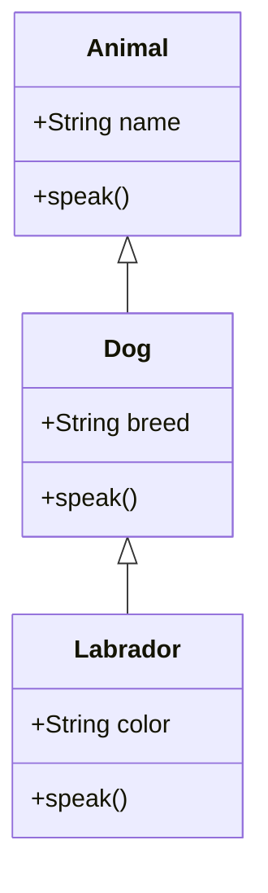

## 7.4 Using the `super` Keyword

In the world of object-oriented programming (OOP), inheritance is a fundamental concept that allows us to create a new class based on an existing class. This not only promotes code reuse but also helps in creating a hierarchical class structure. In JavaScript, the `super` keyword plays a crucial role in inheritance by allowing us to access and call functions on an object's parent class. In this section, we'll explore the purpose of the `super` keyword, how it is used in JavaScript classes, and best practices for its use.

### Understanding the Purpose of the `super` Keyword

The `super` keyword is used in JavaScript to call functions on an object's parent class. It is primarily used in two scenarios:

1. **Calling Parent Class Constructors**: When a subclass constructor needs to initialize the properties of its superclass, `super()` is used to call the parent class's constructor.

2. **Invoking Parent Class Methods**: When a method in a subclass overrides a method in its superclass, `super.methodName()` can be used to call the overridden method from the parent class.

By using `super`, we ensure that the inheritance chain is maintained, and the parent class's constructor and methods are properly utilized.

### Calling the Parent Class Constructor

When creating a subclass, it's often necessary to call the constructor of the parent class to ensure that the parent class's properties are initialized correctly. This is where `super()` comes into play.

#### Example: Basic Usage of `super()`

Let's consider a simple example where we have a `Person` class and a `Student` class that extends `Person`.

```javascript
class Person {
  constructor(name, age) {
    this.name = name;
    this.age = age;
  }

  greet() {
    console.log(`Hello, my name is ${this.name} and I am ${this.age} years old.`);
  }
}

class Student extends Person {
  constructor(name, age, studentId) {
    super(name, age); // Call the parent class constructor
    this.studentId = studentId;
  }

  displayStudentInfo() {
    console.log(`Student ID: ${this.studentId}`);
  }
}

const student = new Student('Alice', 20, 'S12345');
student.greet(); // Outputs: Hello, my name is Alice and I am 20 years old.
student.displayStudentInfo(); // Outputs: Student ID: S12345
```

In this example, the `Student` class extends the `Person` class. Inside the `Student` constructor, we use `super(name, age)` to call the `Person` constructor, ensuring that the `name` and `age` properties are initialized correctly.

#### Common Mistake: Forgetting to Call `super()`

A common mistake when working with subclasses is forgetting to call `super()` before using `this`. In JavaScript, you must call `super()` before accessing `this` in the constructor of a subclass. Failing to do so will result in a ReferenceError.

```javascript
class Student extends Person {
  constructor(name, age, studentId) {
    // Incorrect: Trying to access 'this' before calling 'super()'
    this.studentId = studentId;
    super(name, age); // This should come first
  }
}
```

To avoid this error, always ensure that `super()` is called before any reference to `this` in the constructor of a subclass.

### Invoking Parent Class Methods

In addition to constructors, the `super` keyword can also be used to call methods from the parent class. This is particularly useful when you want to extend or modify the behavior of a method in a subclass while still retaining the functionality of the parent class's method.

#### Example: Overriding Methods and Using `super`

Consider the following example where we override the `greet` method in the `Student` class but still want to include the behavior from the `Person` class.

```javascript
class Student extends Person {
  constructor(name, age, studentId) {
    super(name, age);
    this.studentId = studentId;
  }

  greet() {
    super.greet(); // Call the parent class method
    console.log(`I am a student with ID: ${this.studentId}`);
  }
}

const student = new Student('Bob', 22, 'S67890');
student.greet();
// Outputs:
// Hello, my name is Bob and I am 22 years old.
// I am a student with ID: S67890
```

In this example, we override the `greet` method in the `Student` class. By using `super.greet()`, we call the `greet` method from the `Person` class, allowing us to extend its functionality with additional behavior specific to the `Student` class.

### Importance of `super` in Maintaining Inheritance Chains

The `super` keyword is essential for maintaining the integrity of inheritance chains in JavaScript. By ensuring that parent class constructors and methods are properly called, we can build robust and flexible class hierarchies.

#### Example: Complex Inheritance Hierarchy

Let's explore a more complex example with multiple levels of inheritance.

```javascript
class Animal {
  constructor(name) {
    this.name = name;
  }

  speak() {
    console.log(`${this.name} makes a noise.`);
  }
}

class Dog extends Animal {
  constructor(name, breed) {
    super(name);
    this.breed = breed;
  }

  speak() {
    super.speak();
    console.log(`${this.name} barks.`);
  }
}

class Labrador extends Dog {
  constructor(name, breed, color) {
    super(name, breed);
    this.color = color;
  }

  speak() {
    super.speak();
    console.log(`${this.name} is a ${this.color} Labrador.`);
  }
}

const labrador = new Labrador('Max', 'Labrador', 'yellow');
labrador.speak();
// Outputs:
// Max makes a noise.
// Max barks.
// Max is a yellow Labrador.
```

In this example, we have three levels of inheritance: `Animal`, `Dog`, and `Labrador`. Each class overrides the `speak` method, and by using `super.speak()`, we ensure that the method from each level of the hierarchy is called, maintaining the inheritance chain.

### Best Practices for Using `super`

When working with the `super` keyword, it's important to follow best practices to ensure that your code is maintainable and error-free.

1. **Always Call `super()` First**: In subclass constructors, always call `super()` before accessing `this`. This ensures that the parent class's properties are initialized correctly.

2. **Use `super` to Extend Methods**: When overriding methods, use `super.methodName()` to call the parent class's method and extend its functionality. This allows you to build upon existing behavior rather than replacing it entirely.

3. **Maintain Clear Hierarchies**: Keep your class hierarchies clear and logical. Avoid overly complex inheritance chains that can make your code difficult to understand and maintain.

4. **Document Your Code**: Use comments to document when and why you are using `super`. This can help other developers (and your future self) understand the purpose of the `super` calls in your code.

5. **Test Thoroughly**: Test your classes and inheritance hierarchies thoroughly to ensure that all methods and constructors are working as expected. This can help catch any issues related to incorrect use of `super`.

### Common Mistakes and How to Avoid Them

While the `super` keyword is a powerful tool in JavaScript, it's important to be aware of common mistakes and how to avoid them.

- **Forgetting to Call `super()`**: As mentioned earlier, forgetting to call `super()` in a subclass constructor before accessing `this` will result in a ReferenceError. Always ensure that `super()` is called first.

- **Incorrect Method Calls**: When calling a parent class method using `super`, ensure that you are using the correct method name and passing the appropriate arguments.

- **Overusing Inheritance**: While inheritance is a powerful tool, overusing it can lead to complex and difficult-to-maintain code. Consider using composition over inheritance when appropriate.

### Visualizing the Inheritance Chain

To better understand how the `super` keyword works in maintaining inheritance chains, let's visualize the inheritance hierarchy using a diagram.



In this diagram, we see the inheritance hierarchy with `Animal` at the top, followed by `Dog`, and then `Labrador`. Each class inherits from its parent, and the `super` keyword is used to call methods up the chain.

### Try It Yourself

Now that we've explored the `super` keyword, try experimenting with the examples provided. Here are a few suggestions to get you started:

- Modify the `Student` class to include a new method that uses `super` to call a method from the `Person` class.
- Create a new subclass of `Labrador` and override the `speak` method. Use `super` to call the `speak` method from `Labrador`.
- Experiment with different class hierarchies and see how `super` can be used to maintain the inheritance chain.

### References and Further Reading

For more information on the `super` keyword and inheritance in JavaScript, check out the following resources:

- [MDN Web Docs: super](https://developer.mozilla.org/en-US/docs/Web/JavaScript/Reference/Operators/super)
- [JavaScript.info: Class Inheritance](https://javascript.info/class-inheritance)
- [W3Schools: JavaScript Classes](https://www.w3schools.com/js/js_classes.asp)

### Knowledge Check

Before we wrap up, let's reinforce what we've learned with a few key takeaways:

- The `super` keyword is used to call parent class constructors and methods.
- Always call `super()` before accessing `this` in a subclass constructor.
- Use `super.methodName()` to invoke parent class methods within overridden methods.
- Maintain clear and logical class hierarchies to ensure code readability and maintainability.

Remember, mastering the `super` keyword is an important step in understanding inheritance and polymorphism in JavaScript. Keep practicing, and you'll soon be able to create complex and efficient class hierarchies with ease.

## Quiz Time!



### What is the primary purpose of the `super` keyword in JavaScript?

- [x] To call functions on an object's parent class
- [ ] To create a new object instance
- [ ] To define a new class
- [ ] To access private properties

> **Explanation:** The `super` keyword is used to call functions on an object's parent class, such as constructors and methods.

### When should you call `super()` in a subclass constructor?

- [x] Before accessing `this`
- [ ] After accessing `this`
- [ ] Only if the parent class has a constructor
- [ ] Only if the subclass has no constructor

> **Explanation:** In JavaScript, you must call `super()` before accessing `this` in a subclass constructor to ensure that the parent class's properties are initialized.

### How do you call a parent class method from a subclass method?

- [x] Using `super.methodName()`
- [ ] Using `this.methodName()`
- [ ] Using `parent.methodName()`
- [ ] Using `base.methodName()`

> **Explanation:** To call a parent class method from a subclass method, use `super.methodName()`.

### What error occurs if you try to access `this` before calling `super()` in a subclass constructor?

- [x] ReferenceError
- [ ] TypeError
- [ ] SyntaxError
- [ ] RangeError

> **Explanation:** A ReferenceError occurs if you try to access `this` before calling `super()` in a subclass constructor.

### What is a common mistake when using `super` in JavaScript?

- [x] Forgetting to call `super()` before using `this`
- [ ] Using `super` in a standalone function
- [ ] Calling `super` in a non-class context
- [ ] Using `super` to define a new method

> **Explanation:** A common mistake is forgetting to call `super()` before using `this` in a subclass constructor, leading to a ReferenceError.

### Which of the following is a best practice when using `super`?

- [x] Documenting the purpose of `super` calls
- [ ] Avoiding `super` in all methods
- [ ] Using `super` only in static methods
- [ ] Calling `super` multiple times in a constructor

> **Explanation:** Documenting the purpose of `super` calls helps other developers understand the code and maintain it effectively.

### What is the result of calling `super()` in a subclass constructor?

- [x] It initializes the parent class's properties
- [ ] It creates a new subclass instance
- [ ] It deletes the parent class's properties
- [ ] It overrides the parent class's methods

> **Explanation:** Calling `super()` in a subclass constructor initializes the parent class's properties, ensuring they are set up correctly.

### How can `super` help in maintaining inheritance chains?

- [x] By ensuring parent class methods are called
- [ ] By preventing method overriding
- [ ] By creating new class hierarchies
- [ ] By deleting subclass properties

> **Explanation:** `super` helps maintain inheritance chains by ensuring that parent class methods are called, allowing for extended functionality.

### What is a benefit of using `super` in method overriding?

- [x] It allows extending the functionality of parent class methods
- [ ] It prevents subclass methods from being called
- [ ] It deletes the parent class methods
- [ ] It creates new methods in the subclass

> **Explanation:** Using `super` in method overriding allows extending the functionality of parent class methods, rather than replacing them entirely.

### True or False: `super` can be used to call static methods in a parent class.

- [x] True
- [ ] False

> **Explanation:** `super` can be used to call static methods in a parent class, allowing access to shared functionality.



Remember, this is just the beginning. As you progress, you'll build more complex and interactive applications using the power of inheritance and the `super` keyword. Keep experimenting, stay curious, and enjoy the journey!
