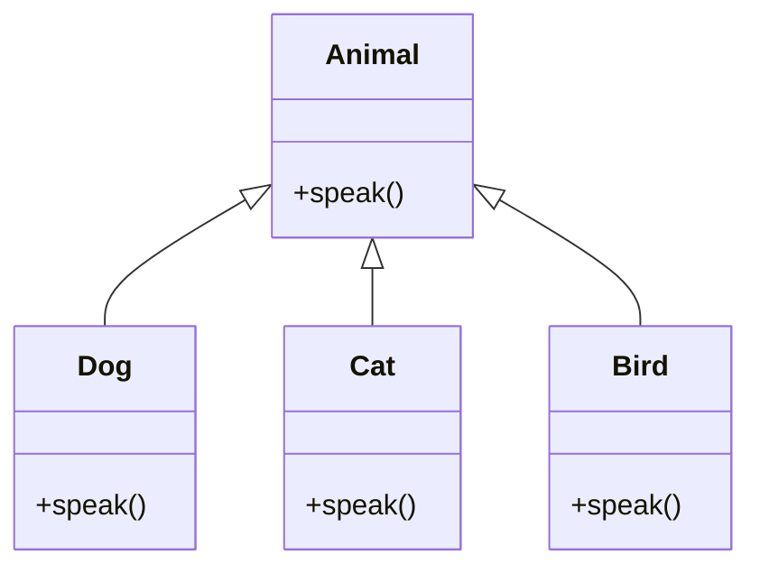

## 7.5 Method Overriding and Polymorphism

In this section, we will delve into the concepts of method overriding and polymorphism, two fundamental principles of object-oriented programming (OOP) that enhance code flexibility and reusability. By the end of this chapter, you will understand how these concepts allow you to write more adaptable and maintainable JavaScript code.

### Understanding Polymorphism

**Polymorphism** is a core concept in OOP that allows objects of different classes to be treated as objects of a common superclass. It enables a single interface to represent different underlying forms (data types). The term "polymorphism" is derived from the Greek words "poly," meaning many, and "morph," meaning form. In programming, it refers to the ability of different classes to respond to the same method call in different ways.

#### Significance of Polymorphism

Polymorphism is significant because it allows for flexibility and integration in code. It enables developers to write more generic and reusable code, which can interact with objects of different classes through a common interface. This reduces code duplication and enhances maintainability.

### Method Overriding

**Method overriding** is a feature that allows a subclass to provide a specific implementation of a method that is already defined in its superclass. When a method in a subclass has the same name, return type, and parameters as a method in its superclass, the method in the subclass overrides the method in the superclass.

#### How Method Overriding Works

When a subclass object calls an overridden method, the method defined in the subclass is executed. This allows subclasses to modify or extend the behavior of methods inherited from their superclass.

#### Example of Method Overriding

Let's consider an example to illustrate method overriding in JavaScript:

```javascript
class Animal {
  speak() {
    console.log("The animal makes a sound");
  }
}

class Dog extends Animal {
  speak() {
    console.log("The dog barks");
  }
}

class Cat extends Animal {
  speak() {
    console.log("The cat meows");
  }
}

const myDog = new Dog();
const myCat = new Cat();

myDog.speak(); // Output: The dog barks
myCat.speak(); // Output: The cat meows
```

In this example, the `Dog` and `Cat` classes override the `speak` method of the `Animal` class to provide specific implementations.

### Polymorphism in Action

Polymorphism allows us to write code that can work with objects of different classes seamlessly. Let's see how polymorphism can be used to interact with different objects through a common interface:

```javascript
function makeAnimalSpeak(animal) {
  animal.speak();
}

makeAnimalSpeak(myDog); // Output: The dog barks
makeAnimalSpeak(myCat); // Output: The cat meows
```

In this example, the `makeAnimalSpeak` function takes an `animal` parameter and calls its `speak` method. Thanks to polymorphism, this function can work with any object that has a `speak` method, regardless of its specific class.

### Use Cases for Polymorphism

Polymorphism is particularly useful in scenarios where you need to perform the same operation on objects of different types. Here are some common use cases:

1. **UI Components**: In graphical user interfaces, different components like buttons, text fields, and sliders can be treated as instances of a common interface, allowing for consistent handling of user interactions.

2. **Game Development**: In games, different entities like players, enemies, and obstacles can be treated as objects of a common superclass, enabling uniform handling of game logic.

3. **Data Processing**: In data processing applications, different data sources can be treated as instances of a common interface, allowing for flexible data handling and transformation.

### Enhancing Flexibility with Polymorphism

Polymorphism enhances flexibility by allowing you to extend and modify code without altering existing functionality. This aligns with the **Open/Closed Principle**, which states that software entities should be open for extension but closed for modification.

#### Implementing Polymorphism

To implement polymorphism effectively, ensure that your classes adhere to a common interface or superclass. This allows you to leverage method overriding to provide specific implementations in subclasses.

### Try It Yourself

To better understand method overriding and polymorphism, try modifying the code examples provided. For instance, add a new class `Bird` that extends `Animal` and overrides the `speak` method to print "The bird chirps". Then, create an instance of `Bird` and use the `makeAnimalSpeak` function to test it.

### Visualizing Polymorphism

Let's visualize how polymorphism works in JavaScript using a class hierarchy diagram:



In this diagram, `Dog`, `Cat`, and `Bird` are subclasses of `Animal`, each providing their own implementation of the `speak` method.

### Key Takeaways

- **Polymorphism** allows objects of different classes to be treated as objects of a common superclass.
- **Method overriding** enables subclasses to provide specific implementations of methods defined in their superclass.
- Polymorphism enhances code flexibility and reusability by allowing a single interface to represent different underlying forms.
- Implementing polymorphism adheres to the **Open/Closed Principle**, promoting code that is open for extension but closed for modification.

### References and Further Reading

- [MDN Web Docs: Inheritance and the prototype chain](https://developer.mozilla.org/en-US/docs/Web/JavaScript/Inheritance_and_the_prototype_chain)
- [MDN Web Docs: Classes](https://developer.mozilla.org/en-US/docs/Web/JavaScript/Reference/Classes)
- [W3Schools: JavaScript Classes](https://www.w3schools.com/js/js_classes.asp)

Remember, this is just the beginning. As you progress, you'll build more complex and interactive applications using these concepts. Keep experimenting, stay curious, and enjoy the journey!

## Quiz Time!



### What is polymorphism in OOP?

- [x] The ability of different classes to respond to the same method call in different ways.
- [ ] The process of creating new classes from existing ones.
- [ ] The use of functions to perform operations on data.
- [ ] The practice of writing code that is easy to read.

> **Explanation:** Polymorphism allows objects of different classes to respond to the same method call in different ways, enhancing flexibility and code reuse.

### What does method overriding allow in subclasses?

- [x] Providing specific implementations of methods defined in their superclass.
- [ ] Creating new methods unrelated to the superclass.
- [ ] Changing the superclass's properties.
- [ ] Removing methods from the superclass.

> **Explanation:** Method overriding allows subclasses to provide specific implementations of methods that are already defined in their superclass.

### How does polymorphism benefit code?

- [x] It enhances flexibility and reusability.
- [ ] It makes code harder to understand.
- [ ] It limits the use of interfaces.
- [ ] It increases code duplication.

> **Explanation:** Polymorphism enhances flexibility and reusability by allowing a single interface to represent different underlying forms.

### Which principle does polymorphism adhere to?

- [x] Open/Closed Principle
- [ ] Single Responsibility Principle
- [ ] Liskov Substitution Principle
- [ ] Dependency Inversion Principle

> **Explanation:** Polymorphism adheres to the Open/Closed Principle, promoting code that is open for extension but closed for modification.

### What is the output of the following code?

```javascript
class Animal {
  speak() {
    console.log("The animal makes a sound");
  }
}

class Dog extends Animal {
  speak() {
    console.log("The dog barks");
  }
}

const myDog = new Dog();
myDog.speak();
```

- [x] The dog barks
- [ ] The animal makes a sound
- [ ] The dog meows
- [ ] The cat meows

> **Explanation:** The `speak` method in the `Dog` class overrides the `speak` method in the `Animal` class, so "The dog barks" is printed.

### What is achieved by method overriding?

- [x] Polymorphic behavior
- [ ] Code duplication
- [ ] Reduced flexibility
- [ ] Increased complexity

> **Explanation:** Method overriding achieves polymorphic behavior by allowing subclasses to provide specific implementations of methods.

### Which of the following is a use case for polymorphism?

- [x] UI Components
- [ ] Data Redundancy
- [ ] Code Obfuscation
- [ ] Memory Management

> **Explanation:** Polymorphism is useful in scenarios like UI Components, where different components can be treated as instances of a common interface.

### What does the `makeAnimalSpeak` function demonstrate?

- [x] Polymorphism
- [ ] Encapsulation
- [ ] Abstraction
- [ ] Inheritance

> **Explanation:** The `makeAnimalSpeak` function demonstrates polymorphism by allowing different objects to respond to the same method call.

### True or False: Polymorphism can only be used with classes that have the same methods.

- [ ] True
- [x] False

> **Explanation:** Polymorphism can be used with classes that adhere to a common interface, even if they have different methods.

### What should you do to implement polymorphism effectively?

- [x] Ensure classes adhere to a common interface or superclass.
- [ ] Avoid using interfaces.
- [ ] Use only one class for all objects.
- [ ] Write separate code for each class.

> **Explanation:** To implement polymorphism effectively, ensure that your classes adhere to a common interface or superclass, allowing for flexible and reusable code.


