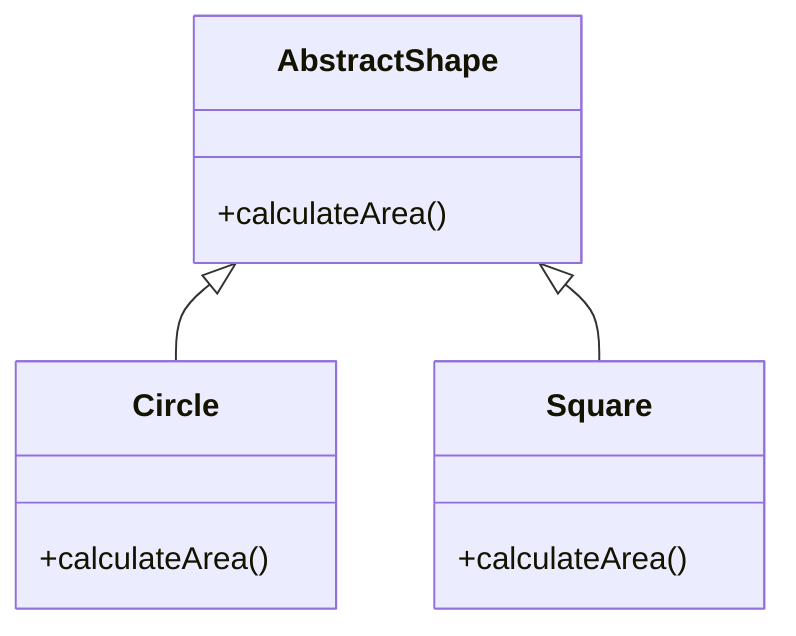

## 7.6 Abstract Classes and Methods

In this section, we will delve into the concept of abstract classes and methods within the realm of JavaScript. While JavaScript does not natively support abstract classes as seen in other object-oriented languages like Java or C#, we can simulate them to achieve similar functionality. This allows us to create a structured approach to enforcing method implementation and ensuring that certain classes are not instantiated directly. Let's explore how we can achieve this and the scenarios where it is beneficial.

### Understanding Abstract Classes

**Abstract classes** are a fundamental concept in object-oriented programming (OOP) that serve as a blueprint for other classes. They cannot be instantiated directly and are typically used to define a common interface for subclasses. Abstract classes often contain abstract methods, which are methods declared without an implementation. Subclasses inheriting from an abstract class must provide concrete implementations for these abstract methods.

#### Why JavaScript Doesn't Have Native Abstract Classes

JavaScript is a flexible, dynamic language that does not enforce strict typing or class-based constraints. This flexibility is both a strength and a limitation when it comes to implementing certain OOP principles, such as abstract classes. However, through creative use of JavaScript's prototypal inheritance and ES6 class syntax, we can simulate abstract classes to guide developers in implementing consistent interfaces.

### Simulating Abstract Classes in JavaScript

To simulate abstract classes in JavaScript, we can create a class that throws an error when an attempt is made to instantiate it directly. This approach ensures that the class is only used as a base class for other subclasses.

```javascript
class AbstractVehicle {
  constructor() {
    if (new.target === AbstractVehicle) {
      throw new Error("Cannot instantiate an abstract class directly.");
    }
  }

  startEngine() {
    throw new Error("Abstract method 'startEngine' must be implemented in subclass.");
  }
}

class Car extends AbstractVehicle {
  startEngine() {
    console.log("Car engine started.");
  }
}

const myCar = new Car();
myCar.startEngine(); // Output: Car engine started.

const vehicle = new AbstractVehicle(); // Throws Error: Cannot instantiate an abstract class directly.
```

In the example above, the `AbstractVehicle` class is designed to be an abstract class. It includes a constructor that throws an error if an instance of `AbstractVehicle` is created directly. The `startEngine` method is an abstract method, which also throws an error if not overridden in a subclass.

### Enforcing Method Implementation with Abstract Methods

Abstract methods are essential in ensuring that subclasses provide specific functionality. By defining a method in the base class that throws an error, we can enforce that subclasses must implement this method.

```javascript
class AbstractShape {
  constructor() {
    if (new.target === AbstractShape) {
      throw new Error("Cannot instantiate an abstract class directly.");
    }
  }

  calculateArea() {
    throw new Error("Abstract method 'calculateArea' must be implemented in subclass.");
  }
}

class Circle extends AbstractShape {
  constructor(radius) {
    super();
    this.radius = radius;
  }

  calculateArea() {
    return Math.PI * this.radius * this.radius;
  }
}

const myCircle = new Circle(5);
console.log(myCircle.calculateArea()); // Output: 78.53981633974483
```

In this example, `AbstractShape` is an abstract class with an abstract method `calculateArea`. The `Circle` class extends `AbstractShape` and provides a concrete implementation of the `calculateArea` method.

### Emulating Interfaces in JavaScript

While JavaScript does not have a formal concept of interfaces like some other languages, we can emulate them using abstract classes or by defining a set of methods that a class must implement. This approach relies heavily on documentation and conventions to ensure consistency.

```javascript
class AnimalInterface {
  makeSound() {
    throw new Error("Method 'makeSound' must be implemented.");
  }
}

class Dog extends AnimalInterface {
  makeSound() {
    console.log("Woof! Woof!");
  }
}

const myDog = new Dog();
myDog.makeSound(); // Output: Woof! Woof!
```

Here, `AnimalInterface` acts as an interface by defining the `makeSound` method that must be implemented by any class that extends it. The `Dog` class implements this method, adhering to the interface's contract.

### Importance of Documentation

When simulating abstract classes and interfaces in JavaScript, documentation becomes crucial. Clear documentation helps other developers understand the intended usage of your classes and methods, ensuring they implement the necessary methods correctly.

- **Document Abstract Classes:** Clearly state that a class is intended to be abstract and should not be instantiated directly.
- **Specify Abstract Methods:** List the methods that must be implemented by subclasses and provide a brief description of their expected behavior.
- **Use Comments:** Include inline comments in your code to explain the purpose of abstract methods and any constraints.

### Scenarios for Using Abstract Classes and Methods

Abstract classes and methods are particularly useful in scenarios where you want to:

- **Define a Common Interface:** Ensure that all subclasses implement a set of methods, promoting consistency across different implementations.
- **Prevent Direct Instantiation:** Create a base class that should only be used as a foundation for other classes, not instantiated on its own.
- **Encourage Code Reuse:** Share common functionality among subclasses while allowing them to provide their specific implementations for certain methods.

### Visualizing Abstract Classes and Methods

To better understand how abstract classes and methods work, let's visualize the relationship between an abstract class and its subclasses.



In this diagram, `AbstractShape` is the abstract class with an abstract method `calculateArea`. `Circle` and `Square` are subclasses that inherit from `AbstractShape` and provide their implementations of the `calculateArea` method.

### Try It Yourself

Now that we've explored the concept of abstract classes and methods, it's time to experiment with the code examples provided. Try modifying the examples to create your abstract classes and methods. Here are some suggestions:

- **Create a new abstract class** with a different set of abstract methods.
- **Implement a subclass** that provides concrete implementations for the abstract methods.
- **Experiment with error handling** by attempting to instantiate the abstract class directly and observe the error messages.

### References and Further Reading

- [MDN Web Docs: Classes](https://developer.mozilla.org/en-US/docs/Web/JavaScript/Reference/Classes)
- [JavaScript Info: Class Inheritance](https://javascript.info/class-inheritance)
- [W3Schools: JavaScript Classes](https://www.w3schools.com/js/js_classes.asp)

### Knowledge Check

Before moving on, let's summarize the key takeaways from this section:

- JavaScript does not natively support abstract classes, but we can simulate them using base classes that throw errors when instantiated directly.
- Abstract methods are defined in the base class to enforce implementation in subclasses.
- Documentation is crucial in informing other developers about the intended usage of abstract classes and methods.
- Abstract classes and methods are beneficial for defining common interfaces, preventing direct instantiation, and encouraging code reuse.

Remember, this is just the beginning. As you progress, you'll build more complex and interactive applications using these foundational concepts. Keep experimenting, stay curious, and enjoy the journey!

## Quiz Time!



### What is an abstract class in JavaScript?

- [ ] A class that can be instantiated directly.
- [x] A class that serves as a blueprint and cannot be instantiated directly.
- [ ] A class that contains only static methods.
- [ ] A class that does not have any methods.

> **Explanation:** An abstract class in JavaScript is a class that serves as a blueprint for other classes and cannot be instantiated directly.

### How do you simulate an abstract class in JavaScript?

- [ ] By using the `abstract` keyword.
- [x] By throwing an error in the constructor if the class is instantiated directly.
- [ ] By using the `interface` keyword.
- [ ] By defining only static methods.

> **Explanation:** To simulate an abstract class in JavaScript, you can throw an error in the constructor if the class is instantiated directly.

### What is the purpose of an abstract method?

- [ ] To provide a default implementation for subclasses.
- [x] To enforce that subclasses implement the method.
- [ ] To define a method that can only be called statically.
- [ ] To create a method that cannot be overridden.

> **Explanation:** The purpose of an abstract method is to enforce that subclasses provide their implementation of the method.

### How can you emulate interfaces in JavaScript?

- [ ] By using the `interface` keyword.
- [ ] By using the `abstract` keyword.
- [x] By defining a set of methods that must be implemented and using documentation to enforce it.
- [ ] By using only static methods.

> **Explanation:** In JavaScript, you can emulate interfaces by defining a set of methods that must be implemented and using documentation to enforce it.

### Why is documentation important when using abstract classes and methods?

- [ ] To ensure the code runs faster.
- [x] To inform other developers about the intended usage and required implementations.
- [ ] To reduce the file size of the code.
- [ ] To make the code look more complex.

> **Explanation:** Documentation is important to inform other developers about the intended usage of abstract classes and methods and the required implementations.

### Which of the following is a benefit of using abstract classes?

- [ ] They can be instantiated directly.
- [x] They define a common interface for subclasses.
- [ ] They allow for multiple inheritance.
- [ ] They automatically optimize code performance.

> **Explanation:** Abstract classes define a common interface for subclasses, promoting consistency and code reuse.

### What happens if you try to instantiate an abstract class directly?

- [ ] It creates an instance without any errors.
- [x] It throws an error.
- [ ] It creates a static instance.
- [ ] It logs a warning to the console.

> **Explanation:** If you try to instantiate an abstract class directly, it throws an error to prevent direct instantiation.

### What is the role of an abstract method in a base class?

- [ ] To provide a complete implementation for subclasses.
- [x] To define a method that must be implemented by subclasses.
- [ ] To create a method that can only be called by the base class.
- [ ] To define a method that cannot be inherited.

> **Explanation:** An abstract method in a base class defines a method that must be implemented by subclasses.

### Can abstract classes contain non-abstract methods?

- [x] Yes
- [ ] No

> **Explanation:** Abstract classes can contain non-abstract methods that provide common functionality for subclasses.

### Are abstract classes and methods natively supported in JavaScript?

- [ ] True
- [x] False

> **Explanation:** Abstract classes and methods are not natively supported in JavaScript, but they can be simulated using certain techniques.


