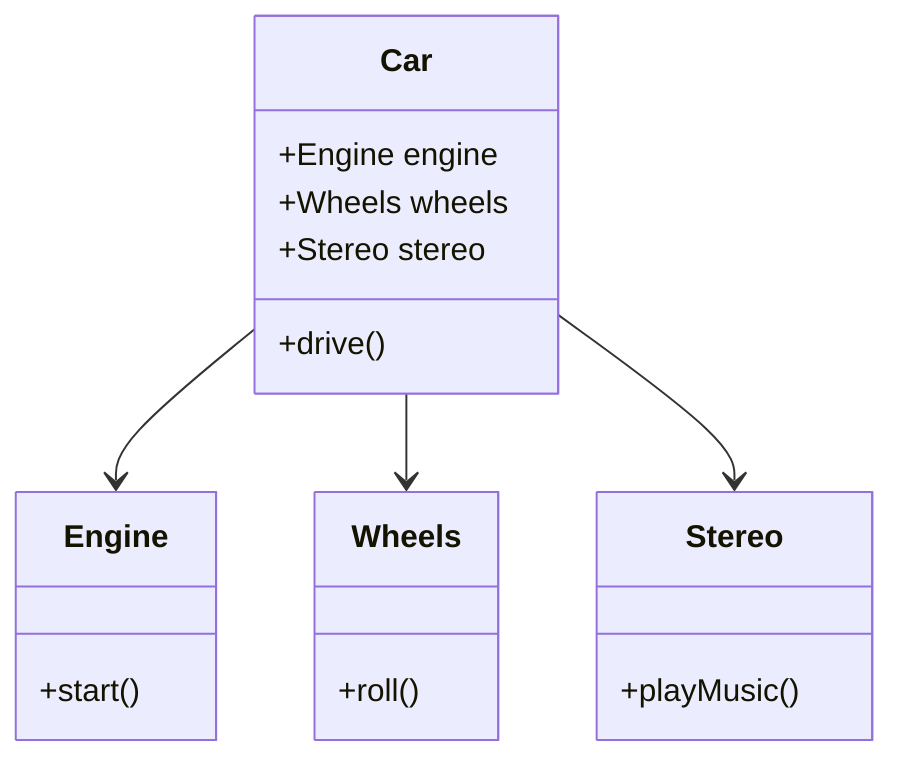
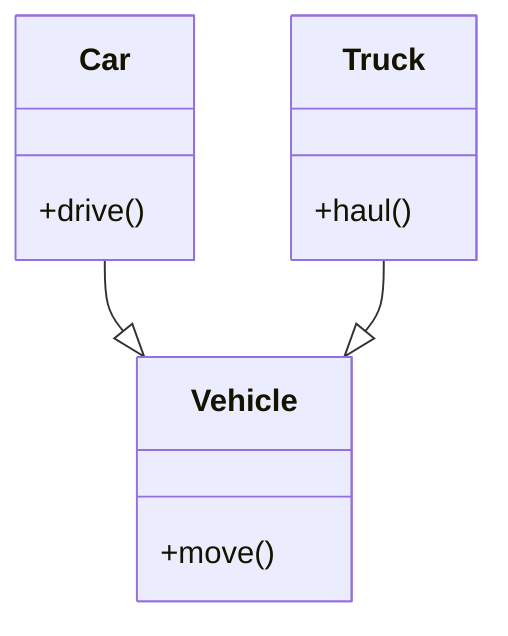

## 7.8 Composition Over Inheritance

In the world of software development, the debate between composition and inheritance is a long-standing one. As you venture deeper into object-oriented programming (OOP) with JavaScript, understanding the principle of "Composition over Inheritance" becomes crucial. This principle encourages developers to favor object composition over class inheritance to achieve greater flexibility and maintainability in their code.

### Understanding Composition Over Inheritance

**Composition over Inheritance** is a design principle that suggests using composition to achieve polymorphic behavior instead of relying on inheritance. Inheritance allows you to create a new class based on an existing class, inheriting its properties and methods. While inheritance can be powerful, it often leads to tightly coupled code that is difficult to modify or extend.

**Composition**, on the other hand, involves creating objects with desired behaviors by combining smaller, reusable components. This approach promotes loose coupling and greater flexibility, allowing you to change or extend behaviors without altering existing code structures.

### Limitations of Inheritance

Before diving into composition, let's explore some limitations of inheritance that make composition a more attractive option in many scenarios:

1. **Tight Coupling**: Inheritance creates a strong relationship between parent and child classes. Changes in the parent class can have unintended consequences on all derived classes, making the system fragile.

2. **Inflexibility**: Inheritance hierarchies can become rigid and difficult to modify. Adding new features or changing existing ones often requires altering the class hierarchy, which can be cumbersome and error-prone.

3. **Code Reusability**: While inheritance promotes code reuse, it can lead to code duplication if not carefully managed. Derived classes often need to override or extend inherited methods, leading to redundant code.

4. **Complexity**: Deep inheritance hierarchies can become complex and hard to understand. This complexity increases the learning curve for new developers and makes debugging more challenging.

### Embracing Composition

Composition allows you to build objects by assembling smaller, independent components. Each component encapsulates a specific behavior, and you can combine them to create complex objects with diverse functionalities. This approach offers several advantages:

- **Loose Coupling**: Components are independent and can be modified or replaced without affecting other parts of the system.
- **Flexibility**: You can easily add or remove behaviors by composing different components, making your system more adaptable to changes.
- **Reusability**: Components can be reused across different objects, reducing code duplication and promoting DRY (Don't Repeat Yourself) principles.
- **Simplicity**: By breaking down complex behaviors into smaller components, you create a system that is easier to understand and maintain.

### Implementing Composition in JavaScript

Let's explore how you can implement composition in JavaScript with practical examples. We'll start by creating simple components and then combine them to form more complex objects.

#### Example: Building a Car with Composition

Imagine you are building a car object with various features such as an engine, wheels, and a stereo system. Instead of creating a monolithic Car class with all these features, you can use composition to assemble the car from smaller components.

```javascript
// Define individual components
function Engine(type) {
  this.type = type;
}

Engine.prototype.start = function() {
  console.log(`Starting ${this.type} engine...`);
};

function Wheels(count) {
  this.count = count;
}

Wheels.prototype.roll = function() {
  console.log(`Rolling on ${this.count} wheels...`);
};

function Stereo(brand) {
  this.brand = brand;
}

Stereo.prototype.playMusic = function() {
  console.log(`Playing music on ${this.brand} stereo...`);
};

// Compose a Car object
function Car(engine, wheels, stereo) {
  this.engine = engine;
  this.wheels = wheels;
  this.stereo = stereo;
}

Car.prototype.drive = function() {
  this.engine.start();
  this.wheels.roll();
  this.stereo.playMusic();
};

// Create components
const myEngine = new Engine('V8');
const myWheels = new Wheels(4);
const myStereo = new Stereo('Bose');

// Assemble the car
const myCar = new Car(myEngine, myWheels, myStereo);

// Use the car
myCar.drive();
```

In this example, we define separate components for the engine, wheels, and stereo. We then compose these components into a Car object, which can perform actions like driving by utilizing the behaviors of its components.

### Design Patterns Supporting Composition

Several design patterns leverage composition to achieve flexible and maintainable designs. One such pattern is the **Decorator Pattern**.

#### The Decorator Pattern

The Decorator Pattern allows you to add new functionality to an existing object without altering its structure. It involves creating a set of decorator classes that are used to wrap concrete components.

```javascript
// Base component
function Coffee() {
  this.cost = function() {
    return 5;
  };
}

// Decorator 1
function Milk(coffee) {
  this.cost = function() {
    return coffee.cost() + 1;
  };
}

// Decorator 2
function Sugar(coffee) {
  this.cost = function() {
    return coffee.cost() + 0.5;
  };
}

// Use decorators
let myCoffee = new Coffee();
myCoffee = new Milk(myCoffee);
myCoffee = new Sugar(myCoffee);

console.log(`Total cost: $${myCoffee.cost()}`); // Total cost: $6.5
```

In this example, we start with a base Coffee component and use decorators to add Milk and Sugar. Each decorator adds its cost to the base coffee, demonstrating how you can extend functionality without modifying the original object.

### Comparing Composition and Inheritance

Both composition and inheritance have their place in software design. Understanding when to use each approach is key to building robust systems.

**When to Use Inheritance:**

- When you have a clear "is-a" relationship between classes.
- When you need to leverage polymorphism through method overriding.
- When the class hierarchy is stable and unlikely to change.

**When to Use Composition:**

- When you need flexibility and the ability to change behaviors dynamically.
- When you want to avoid tight coupling and promote loose coupling.
- When you aim to build reusable components that can be combined in different ways.

### Designing Systems for Flexibility and Maintainability

To design systems that are easy to extend and maintain, consider the following best practices:

1. **Favor Composition**: Use composition to build objects from smaller, reusable components. This approach promotes flexibility and reduces the impact of changes.

2. **Encapsulate Behavior**: Encapsulate specific behaviors within components, allowing you to modify or replace them independently.

3. **Promote Reusability**: Design components that can be reused across different parts of your application, reducing code duplication.

4. **Avoid Deep Inheritance Hierarchies**: Limit the depth of inheritance hierarchies to maintain simplicity and reduce complexity.

5. **Use Design Patterns**: Leverage design patterns like the Decorator Pattern to achieve composition and extend functionality without altering existing structures.

### Visualizing Composition Over Inheritance

To better understand the relationship between composition and inheritance, let's visualize these concepts using Mermaid.js diagrams.

#### Composition Diagram



In this diagram, the Car class is composed of Engine, Wheels, and Stereo components, illustrating how composition allows you to build complex objects from smaller parts.

#### Inheritance Diagram



In this diagram, Car and Truck inherit from the Vehicle class, demonstrating a typical inheritance hierarchy.

### Try It Yourself

To solidify your understanding of composition over inheritance, try modifying the examples provided:

- **Experiment with Components**: Create additional components for the Car example, such as a GPS system or air conditioning, and integrate them into the Car object.
- **Extend the Decorator Pattern**: Add more decorators to the Coffee example, such as a WhippedCream decorator, and calculate the total cost.

### References and Further Reading

For more in-depth exploration of composition and inheritance, consider the following resources:

- [MDN Web Docs: Inheritance and the prototype chain](https://developer.mozilla.org/en-US/docs/Web/JavaScript/Inheritance_and_the_prototype_chain)
- [Design Patterns: Elements of Reusable Object-Oriented Software](https://en.wikipedia.org/wiki/Design_Patterns)
- [JavaScript: The Good Parts by Douglas Crockford](https://www.oreilly.com/library/view/javascript-the-good/9780596517748/)

### Knowledge Check

Before moving on, let's summarize the key takeaways:

- Composition over Inheritance promotes flexibility and maintainability by assembling objects from smaller, reusable components.
- Inheritance can lead to tight coupling and inflexibility, making it less suitable for systems that require frequent changes.
- Design patterns like the Decorator Pattern leverage composition to extend functionality without altering existing structures.
- Understanding when to use composition or inheritance is crucial for building robust and adaptable systems.

Remember, this is just the beginning. As you progress, you'll build more complex and interactive systems using these principles. Keep experimenting, stay curious, and enjoy the journey!

## Quiz Time!



### What is the main advantage of using composition over inheritance?

- [x] Flexibility and maintainability
- [ ] Faster execution
- [ ] Simpler code
- [ ] Reduced memory usage

> **Explanation:** Composition allows for more flexible and maintainable code by assembling objects from smaller, reusable components.

### Which of the following is a limitation of inheritance?

- [x] Tight coupling
- [ ] Loose coupling
- [ ] High flexibility
- [ ] Easy to modify

> **Explanation:** Inheritance creates a strong relationship between classes, leading to tight coupling and potential fragility.

### What does the Decorator Pattern achieve?

- [x] Adds new functionality to an existing object without altering its structure
- [ ] Simplifies code by removing unnecessary components
- [ ] Increases execution speed
- [ ] Reduces memory usage

> **Explanation:** The Decorator Pattern allows you to extend functionality by wrapping objects with additional features.

### When should you favor composition over inheritance?

- [x] When you need flexibility and the ability to change behaviors dynamically
- [ ] When you have a clear "is-a" relationship
- [ ] When the class hierarchy is stable
- [ ] When you need to leverage polymorphism

> **Explanation:** Composition is preferred when flexibility and dynamic behavior changes are required.

### Which design pattern is commonly associated with composition?

- [x] Decorator Pattern
- [ ] Singleton Pattern
- [ ] Factory Pattern
- [ ] Observer Pattern

> **Explanation:** The Decorator Pattern is a common design pattern that utilizes composition to extend functionality.

### What is a key benefit of using composition?

- [x] Loose coupling
- [ ] Tight coupling
- [ ] Increased complexity
- [ ] Reduced flexibility

> **Explanation:** Composition promotes loose coupling by allowing components to be modified or replaced independently.

### How does composition promote reusability?

- [x] By allowing components to be reused across different objects
- [ ] By creating deep inheritance hierarchies
- [ ] By duplicating code
- [ ] By restricting component usage

> **Explanation:** Composition allows components to be reused in different contexts, reducing code duplication.

### What is the primary focus of the principle "Composition over Inheritance"?

- [x] Building objects from smaller, reusable components
- [ ] Creating deep inheritance hierarchies
- [ ] Increasing execution speed
- [ ] Simplifying code

> **Explanation:** The principle focuses on assembling objects from smaller, reusable components for flexibility.

### Which of the following is NOT a benefit of composition?

- [ ] Flexibility
- [ ] Loose coupling
- [ ] Reusability
- [x] Tight coupling

> **Explanation:** Composition promotes loose coupling, not tight coupling.

### True or False: Inheritance is always the best choice for building flexible systems.

- [ ] True
- [x] False

> **Explanation:** Inheritance can lead to tight coupling and inflexibility, making composition a better choice in many cases.


