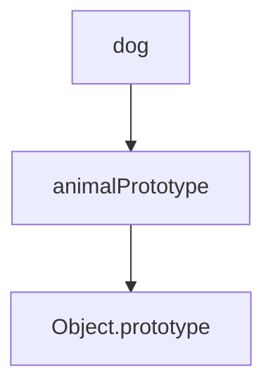

## 7.9 Delegation Patterns

In the world of software development, writing clean, efficient, and maintainable code is paramount. One way to achieve this is by using delegation patterns in object-oriented programming (OOP). Delegation allows objects to pass responsibilities to other objects, promoting code reuse and separation of concerns. In this section, we'll delve into the concept of delegation in JavaScript, explore how it works within the language's prototypal inheritance model, and demonstrate its practical applications.

### Understanding Delegation in OOP

**Delegation** in OOP refers to the practice of an object relying on another object to provide a specific behavior or functionality. Instead of implementing a feature directly, an object delegates the task to another object that is better suited to handle it. This approach promotes a modular design, where each object has a clear and focused responsibility.

#### Key Concepts of Delegation

- **Responsibility Sharing**: Objects share responsibilities by delegating tasks to other objects.
- **Code Reuse**: By delegating tasks, you can reuse existing code without duplication.
- **Separation of Concerns**: Delegation helps separate different aspects of a program, making it easier to manage and understand.

### How Objects Delegate Tasks

In JavaScript, objects can delegate tasks to other objects through various mechanisms. One of the most common ways is by using prototypal inheritance, where objects inherit properties and methods from other objects.

#### Prototypal Inheritance

JavaScript's prototypal inheritance allows objects to inherit properties and methods from a prototype. This feature is fundamental to delegation patterns, as it enables objects to delegate tasks to their prototypes.

```javascript
// Define a prototype object
const vehiclePrototype = {
  start() {
    console.log("Vehicle starting...");
  },
  stop() {
    console.log("Vehicle stopping...");
  }
};

// Create a new object that delegates to vehiclePrototype
const car = Object.create(vehiclePrototype);
car.start(); // Output: Vehicle starting...
car.stop();  // Output: Vehicle stopping...
```

In this example, the `car` object delegates the `start` and `stop` methods to the `vehiclePrototype`. This delegation allows `car` to use the methods defined in `vehiclePrototype` without having to implement them itself.

### Examples of Delegation in JavaScript

Delegation is a versatile pattern that can be used in various scenarios. Let's explore some practical examples to illustrate how delegation works in JavaScript.

#### Event Handling Mechanisms

One of the most common uses of delegation in JavaScript is in event handling. Instead of attaching an event listener to each individual element, you can delegate the event handling to a parent element. This technique is known as **event delegation**.

```javascript
// HTML structure
// <ul id="menu">
//   <li>Home</li>
//   <li>About</li>
//   <li>Contact</li>
// </ul>

const menu = document.getElementById('menu');

menu.addEventListener('click', function(event) {
  if (event.target.tagName === 'LI') {
    console.log(`You clicked on ${event.target.textContent}`);
  }
});
```

In this example, the `click` event is delegated to the `menu` element. When a list item (`LI`) is clicked, the event is captured by the `menu`, and the appropriate action is taken. This approach reduces the number of event listeners and improves performance.

#### Delegation in Object Composition

Delegation can also be used in object composition, where objects are composed of other objects to achieve desired functionality. This approach is often preferred over inheritance, as it provides more flexibility.

```javascript
const printer = {
  print() {
    console.log("Printing document...");
  }
};

const scanner = {
  scan() {
    console.log("Scanning document...");
  }
};

const copier = Object.assign({}, printer, scanner);

copier.print(); // Output: Printing document...
copier.scan();  // Output: Scanning document...
```

Here, the `copier` object delegates the `print` and `scan` methods to the `printer` and `scanner` objects, respectively. This composition allows `copier` to perform both printing and scanning without inheriting from a single prototype.

### Benefits of Delegation

Delegation offers several advantages that make it an attractive pattern in software development.

#### Code Reuse

By delegating tasks to other objects, you can reuse existing code without duplicating it. This reuse reduces redundancy and makes your codebase more efficient.

#### Separation of Concerns

Delegation helps separate different aspects of a program, making it easier to manage and understand. Each object has a clear responsibility, which simplifies maintenance and debugging.

#### Flexibility and Modularity

Delegation promotes a modular design, where objects can be easily composed and recomposed to achieve different functionalities. This flexibility allows you to adapt your code to changing requirements.

### Delegation in JavaScript's Prototypal Inheritance

JavaScript's prototypal inheritance model is a powerful tool for implementing delegation patterns. By leveraging prototypes, you can create objects that delegate tasks to other objects seamlessly.

#### How Prototypal Inheritance Supports Delegation

In JavaScript, every object has a prototype, which is another object from which it can inherit properties and methods. This prototype chain allows objects to delegate tasks to their prototypes.

```javascript
// Define a prototype object
const animalPrototype = {
  speak() {
    console.log("Animal speaking...");
  }
};

// Create a new object that delegates to animalPrototype
const dog = Object.create(animalPrototype);
dog.speak(); // Output: Animal speaking...
```

In this example, the `dog` object delegates the `speak` method to the `animalPrototype`. This delegation allows `dog` to use the method defined in `animalPrototype` without having to implement it itself.

#### Visualizing Prototypal Delegation

To better understand how prototypal delegation works, let's visualize the prototype chain using a diagram.



In this diagram, the `dog` object delegates tasks to the `animalPrototype`, which in turn delegates to `Object.prototype`. This chain of delegation allows `dog` to access methods and properties defined in its prototypes.

### Writing Modular and Maintainable Code with Delegation

Delegation is a powerful pattern that can help you write modular and maintainable code. By delegating tasks to other objects, you can create a clean and organized codebase that is easy to understand and extend.

#### Encouraging Modularity

When designing your application, consider using delegation to promote modularity. Break down complex tasks into smaller, focused objects that can delegate responsibilities to each other. This approach makes your code more manageable and easier to test.

#### Maintaining Code

Delegation helps maintain a clean separation of concerns, which simplifies maintenance and debugging. When each object has a clear responsibility, you can easily identify and fix issues without affecting other parts of the codebase.

### Try It Yourself

To reinforce your understanding of delegation patterns, try modifying the examples provided in this section. Experiment with different scenarios and see how delegation can simplify your code.

- **Modify the Event Handling Example**: Add more list items to the `menu` and see how the event delegation handles them.
- **Create a New Object Composition**: Compose a new object with different functionalities and delegate tasks to other objects.

### Conclusion

Delegation patterns are a powerful tool in JavaScript's object-oriented programming arsenal. By delegating tasks to other objects, you can promote code reuse, separation of concerns, and modularity. JavaScript's prototypal inheritance model provides a natural way to implement delegation, allowing you to create flexible and maintainable code. Remember, this is just the beginning. As you progress, you'll build more complex and interactive applications. Keep experimenting, stay curious, and enjoy the journey!

### References and Further Reading

- [MDN Web Docs: Prototypal Inheritance](https://developer.mozilla.org/en-US/docs/Web/JavaScript/Inheritance_and_the_prototype_chain)
- [MDN Web Docs: Event Delegation](https://developer.mozilla.org/en-US/docs/Learn/JavaScript/Building_blocks/Events#event_delegation)
- [JavaScript Info: Prototypal Inheritance](https://javascript.info/prototype-inheritance)

## Quiz Time!



### What is delegation in the context of OOP?

- [x] The practice of an object relying on another object to provide specific behavior or functionality.
- [ ] The process of inheriting properties from a parent object.
- [ ] The method of encapsulating data within an object.
- [ ] The technique of overriding methods in a subclass.

> **Explanation:** Delegation involves an object passing responsibilities to another object to handle specific tasks, promoting modularity and code reuse.

### How does JavaScript's prototypal inheritance support delegation?

- [x] By allowing objects to inherit properties and methods from a prototype.
- [ ] By using classes to define object behaviors.
- [ ] By encapsulating data within closures.
- [ ] By overriding methods in subclasses.

> **Explanation:** JavaScript's prototypal inheritance enables objects to delegate tasks to their prototypes, allowing them to inherit properties and methods.

### What is a benefit of using delegation patterns?

- [x] Code reuse and separation of concerns.
- [ ] Increased code complexity.
- [ ] Reduced flexibility in code design.
- [ ] Limited modularity.

> **Explanation:** Delegation patterns promote code reuse and separation of concerns, making code more modular and maintainable.

### In the event handling example, what is the role of the parent element?

- [x] To capture events and delegate them to child elements.
- [ ] To directly handle events for each child element.
- [ ] To prevent events from reaching child elements.
- [ ] To modify the event object before it reaches child elements.

> **Explanation:** The parent element captures events and delegates them to child elements, reducing the number of event listeners and improving performance.

### What is the primary advantage of using object composition over inheritance?

- [x] Flexibility and modularity.
- [ ] Increased code duplication.
- [ ] Limited code reuse.
- [ ] Reduced separation of concerns.

> **Explanation:** Object composition provides flexibility and modularity by allowing objects to be composed of other objects, promoting code reuse without inheritance.

### How can delegation help in maintaining code?

- [x] By separating concerns and making code easier to understand.
- [ ] By increasing the complexity of the codebase.
- [ ] By reducing the number of objects in the codebase.
- [ ] By making debugging more challenging.

> **Explanation:** Delegation separates concerns, making code easier to understand and maintain, and simplifying debugging.

### What is event delegation?

- [x] A technique where a parent element handles events for its child elements.
- [ ] A method of attaching event listeners to each individual element.
- [ ] A way to prevent events from propagating to parent elements.
- [ ] A process of encapsulating event handlers within closures.

> **Explanation:** Event delegation involves a parent element handling events for its child elements, reducing the number of event listeners.

### How does delegation promote code reuse?

- [x] By allowing objects to delegate tasks to other objects with existing functionality.
- [ ] By duplicating code across multiple objects.
- [ ] By encapsulating all functionality within a single object.
- [ ] By preventing objects from interacting with each other.

> **Explanation:** Delegation allows objects to reuse existing functionality by delegating tasks to other objects, reducing code duplication.

### What is the purpose of the prototype chain in JavaScript?

- [x] To allow objects to inherit properties and methods from their prototypes.
- [ ] To encapsulate data within closures.
- [ ] To define classes and subclasses.
- [ ] To override methods in subclasses.

> **Explanation:** The prototype chain allows objects to inherit properties and methods from their prototypes, supporting delegation and code reuse.

### True or False: Delegation patterns can only be used in JavaScript.

- [ ] True
- [x] False

> **Explanation:** Delegation patterns are a general concept in OOP and can be used in various programming languages, not just JavaScript.


