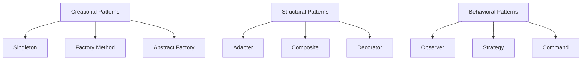

## 8.1 Introduction to Design Patterns

In the world of software development, design patterns are akin to blueprints that guide developers in solving common problems. They are not just specific to any one programming language but are universal concepts that can be applied across various languages, including JavaScript. In this section, we will delve into what design patterns are, their origins, and how they can be effectively utilized in Object-Oriented Programming (OOP) in JavaScript.

### What Are Design Patterns?

Design patterns are general, reusable solutions to common problems that occur in software design. They are not finished designs that can be directly transformed into code but are templates that describe how to solve a problem in a way that can be reused in many different situations. Think of them as best practices that have been refined over time.

#### Significance in OOP

In the context of Object-Oriented Programming, design patterns help in structuring code in a way that is both efficient and easy to understand. They promote code reusability and scalability, making it easier for developers to manage complex systems. By using design patterns, developers can avoid reinventing the wheel and instead leverage tried-and-tested solutions.

### History and Origins of Design Patterns

The concept of design patterns was popularized by the book "Design Patterns: Elements of Reusable Object-Oriented Software," published in 1994 by Erich Gamma, Richard Helm, Ralph Johnson, and John Vlissides, collectively known as the "Gang of Four" (GoF). This seminal work cataloged 23 classic design patterns and provided a foundation for software design that is still relevant today.

#### The Gang of Four

The Gang of Four's book was groundbreaking because it provided a systematic approach to solving design problems. It categorized patterns into three main types: creational, structural, and behavioral. These categories help developers understand the purpose of each pattern and when to apply them.

### How Design Patterns Provide Solutions

Design patterns offer proven solutions to recurring problems. They encapsulate best practices and provide a common language for developers to communicate their ideas. By using design patterns, developers can:

- **Improve Code Readability**: Patterns provide a standard vocabulary that makes it easier for developers to understand each other's code.
- **Enhance Maintainability**: Patterns help in organizing code in a way that is easier to maintain and extend.
- **Facilitate Code Reusability**: Patterns promote the reuse of code, reducing redundancy and improving efficiency.

#### Templates, Not Rigid Prescriptions

It's important to understand that design patterns are not rigid prescriptions. They are flexible templates that can be adapted to fit the specific needs of a project. Developers should use their judgment to decide when and how to apply a pattern, considering the unique context of their application.

### Categories of Design Patterns

Design patterns are broadly categorized into three types: creational, structural, and behavioral. Each category addresses different aspects of software design.

#### Creational Patterns

Creational patterns deal with object creation mechanisms, trying to create objects in a manner suitable to the situation. They help in making the system independent of how its objects are created, composed, and represented.

- **Singleton**: Ensures a class has only one instance and provides a global point of access to it.
- **Factory Method**: Defines an interface for creating an object but lets subclasses alter the type of objects that will be created.
- **Abstract Factory**: Provides an interface for creating families of related or dependent objects without specifying their concrete classes.

#### Structural Patterns

Structural patterns deal with object composition or the way objects are structured to form larger structures. They help ensure that if one part of a system changes, the entire system doesn't need to change.

- **Adapter**: Allows incompatible interfaces to work together.
- **Composite**: Composes objects into tree structures to represent part-whole hierarchies.
- **Decorator**: Adds additional responsibilities to an object dynamically.

#### Behavioral Patterns

Behavioral patterns focus on communication between objects, what goes on between objects, and how they operate together.

- **Observer**: Defines a one-to-many dependency between objects so that when one object changes state, all its dependents are notified.
- **Strategy**: Defines a family of algorithms, encapsulates each one, and makes them interchangeable.
- **Command**: Encapsulates a request as an object, thereby allowing for parameterization of clients with queues, requests, and operations.

### When and How to Apply Patterns

Design patterns should be applied thoughtfully and not just for the sake of using them. Here are some guidelines to consider:

- **Understand the Problem**: Before applying a pattern, ensure you fully understand the problem you're trying to solve.
- **Choose the Right Pattern**: Not all patterns are suitable for every problem. Choose the one that best fits your needs.
- **Adapt the Pattern**: Customize the pattern to fit the specific requirements of your project.
- **Avoid Overuse**: Overusing patterns can lead to unnecessary complexity. Use them judiciously.

### Code Example: Implementing a Singleton Pattern

Let's explore a simple example of a Singleton pattern in JavaScript. The Singleton pattern ensures that a class has only one instance and provides a global point of access to it.

```javascript
class Singleton {
  constructor() {
    if (Singleton.instance) {
      return Singleton.instance;
    }
    Singleton.instance = this;
    this.data = [];
  }

  addData(item) {
    this.data.push(item);
  }

  getData() {
    return this.data;
  }
}

// Usage
const singleton1 = new Singleton();
singleton1.addData('Item 1');

const singleton2 = new Singleton();
singleton2.addData('Item 2');

console.log(singleton1.getData()); // Output: ['Item 1', 'Item 2']
console.log(singleton1 === singleton2); // Output: true
```

In this example, the `Singleton` class ensures that only one instance of the class is created. Any attempt to create another instance will return the already existing instance.

### Visualizing Design Patterns

To better understand how design patterns fit into the bigger picture, let's visualize their interaction within a system.



This diagram illustrates the three main categories of design patterns and some examples within each category.

### Encouraging Critical Thinking

As you continue your journey in learning about design patterns, remember that they are tools to aid in solving problems. Encourage yourself to think critically about when and how to use them. Ask yourself:

- Does this pattern solve my problem effectively?
- Is there a simpler solution that doesn't require a pattern?
- How does this pattern affect the overall design of my system?

### Try It Yourself

Experiment with the Singleton pattern example provided above. Try modifying the code to add more functionality, such as removing data or checking if a specific item exists. This hands-on practice will help solidify your understanding of how design patterns work.

### References and Further Reading

For more in-depth information on design patterns, consider exploring the following resources:

- [MDN Web Docs: Design Patterns](https://developer.mozilla.org/en-US/docs/Web/JavaScript/Guide/Design_Patterns)
- [Refactoring.Guru: Design Patterns](https://refactoring.guru/design-patterns)
- [W3Schools: JavaScript Design Patterns](https://www.w3schools.com/js/js_design_patterns.asp)

### Summary

Design patterns are an essential part of software development, providing reusable solutions to common problems. They help in organizing code, improving readability, and enhancing maintainability. By understanding and applying design patterns, you can create more robust and scalable applications.

---

## Quiz Time!



### What are design patterns in software development?

- [x] Reusable solutions to common problems
- [ ] Specific code implementations
- [ ] Language-specific features
- [ ] Debugging techniques

> **Explanation:** Design patterns are general, reusable solutions to common problems in software design.

### Who are the "Gang of Four"?

- [x] Authors of a seminal book on design patterns
- [ ] A group of JavaScript developers
- [ ] A software company
- [ ] A programming language

> **Explanation:** The "Gang of Four" refers to the authors of "Design Patterns: Elements of Reusable Object-Oriented Software."

### Which category of design patterns deals with object creation?

- [x] Creational
- [ ] Structural
- [ ] Behavioral
- [ ] Functional

> **Explanation:** Creational patterns deal with object creation mechanisms.

### What is the Singleton pattern used for?

- [x] Ensuring a class has only one instance
- [ ] Creating multiple instances of a class
- [ ] Structuring code hierarchies
- [ ] Managing object dependencies

> **Explanation:** The Singleton pattern ensures a class has only one instance and provides a global point of access to it.

### Which pattern allows incompatible interfaces to work together?

- [x] Adapter
- [ ] Observer
- [ ] Strategy
- [ ] Command

> **Explanation:** The Adapter pattern allows incompatible interfaces to work together.

### What is the primary purpose of structural patterns?

- [x] Object composition
- [ ] Object creation
- [ ] Object behavior
- [ ] Object destruction

> **Explanation:** Structural patterns deal with object composition or the way objects are structured.

### What does the Observer pattern define?

- [x] A one-to-many dependency between objects
- [ ] A one-to-one relationship between objects
- [ ] A many-to-many relationship between objects
- [ ] A dependency-free structure

> **Explanation:** The Observer pattern defines a one-to-many dependency between objects.

### What should you consider before applying a design pattern?

- [x] Understanding the problem
- [ ] The number of lines of code
- [ ] The programming language used
- [ ] The number of developers

> **Explanation:** Understanding the problem is crucial before applying a design pattern.

### True or False: Design patterns are rigid prescriptions.

- [ ] True
- [x] False

> **Explanation:** Design patterns are flexible templates, not rigid prescriptions.

### What is the main benefit of using design patterns?

- [x] Improving code readability and maintainability
- [ ] Increasing code complexity
- [ ] Decreasing code performance
- [ ] Limiting code flexibility

> **Explanation:** Design patterns improve code readability and maintainability by providing a standard vocabulary and structure.



Remember, this is just the beginning of your journey into design patterns. As you progress, you'll discover more patterns and learn how to apply them effectively in your projects. Keep experimenting, stay curious, and enjoy the journey!
