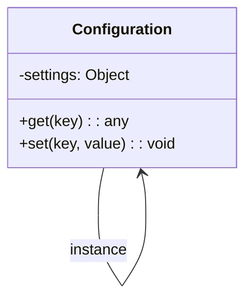
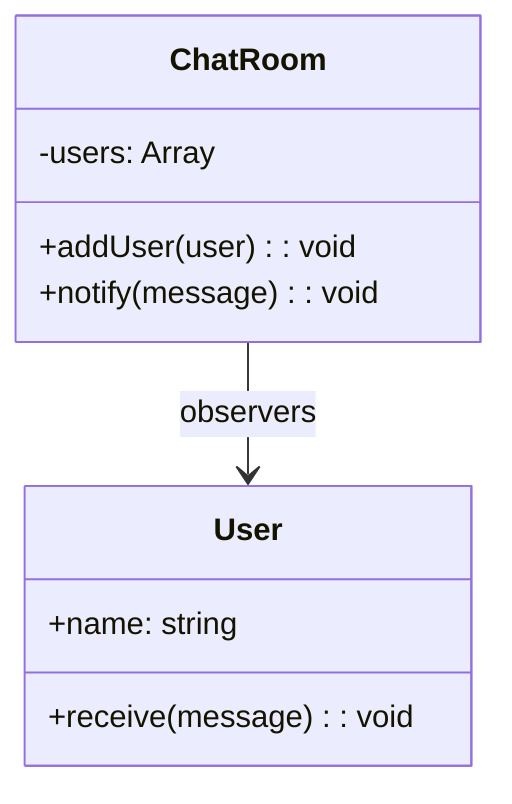

## 8.10 Applying Patterns in JavaScript Projects

Design patterns are essential tools in a developer's toolkit, offering proven solutions to common problems in software design. In this section, we will explore how to effectively apply design patterns in JavaScript projects, using real-world examples and hypothetical scenarios. By understanding the intent behind these patterns and learning how to adapt them to specific project needs, you can enhance the structure, readability, and maintainability of your code.

### Understanding Design Patterns

Design patterns are reusable solutions to common problems in software design. They are not code snippets, but rather templates that describe how to solve a problem in a particular context. Patterns can help you avoid reinventing the wheel and provide a shared language for developers to communicate solutions.

#### Types of Design Patterns

1. **Creational Patterns**: Deal with object creation mechanisms, trying to create objects in a manner suitable to the situation.
2. **Structural Patterns**: Concerned with object composition, ensuring that if one part changes, the entire structure does not need to.
3. **Behavioral Patterns**: Focus on communication between objects, making the flow of control and data more manageable.

### Real-World Example: The Singleton Pattern

The Singleton pattern ensures that a class has only one instance and provides a global point of access to it. This pattern is useful in scenarios where you need to control access to shared resources, such as a configuration object or a connection pool.

#### Scenario: Configuration Management

Imagine you are developing a web application that requires a configuration object to manage settings like API endpoints, database connections, and feature toggles. Using the Singleton pattern, you can ensure that all parts of your application access the same configuration instance.

```javascript
class Configuration {
  constructor() {
    if (Configuration.instance) {
      return Configuration.instance;
    }
    this.settings = {};
    Configuration.instance = this;
  }

  get(key) {
    return this.settings[key];
  }

  set(key, value) {
    this.settings[key] = value;
  }
}

// Usage
const config1 = new Configuration();
config1.set('apiEndpoint', 'https://api.example.com');

const config2 = new Configuration();
console.log(config2.get('apiEndpoint')); // Output: https://api.example.com
```

In this example, `Configuration` is a Singleton class. The constructor checks if an instance already exists and returns it if so, ensuring that only one instance is used throughout the application.

### Hypothetical Scenario: The Observer Pattern

The Observer pattern is a behavioral pattern that allows an object, known as the subject, to maintain a list of dependents, called observers, and notify them of any state changes. This pattern is particularly useful in event-driven programming.

#### Scenario: Real-Time Notifications

Consider a chat application where users need to receive real-time notifications when new messages arrive. The Observer pattern can be used to implement this functionality.

```javascript
class ChatRoom {
  constructor() {
    this.users = [];
  }

  addUser(user) {
    this.users.push(user);
  }

  notify(message) {
    this.users.forEach(user => user.receive(message));
  }
}

class User {
  constructor(name) {
    this.name = name;
  }

  receive(message) {
    console.log(`${this.name} received message: ${message}`);
  }
}

// Usage
const chatRoom = new ChatRoom();
const user1 = new User('Alice');
const user2 = new User('Bob');

chatRoom.addUser(user1);
chatRoom.addUser(user2);

chatRoom.notify('Hello, everyone!');
// Output:
// Alice received message: Hello, everyone!
// Bob received message: Hello, everyone!
```

In this example, `ChatRoom` acts as the subject, and `User` instances are observers. When a message is sent, all users in the chat room are notified.

### Selecting the Right Pattern

Choosing the appropriate design pattern for a problem requires understanding the problem's context and the pattern's intent. Here are some guidelines to help you select the right pattern:

1. **Identify the Problem**: Clearly define the problem you are trying to solve. Is it related to object creation, structure, or behavior?
2. **Understand the Pattern**: Study the pattern's structure, participants, and interactions. Ensure it aligns with your problem.
3. **Consider Alternatives**: Sometimes, multiple patterns can solve the same problem. Evaluate each option and choose the one that best fits your needs.
4. **Adapt the Pattern**: Patterns are templates, not rigid solutions. Adapt them to fit your specific requirements.

### Adapting Patterns to Project Needs

While design patterns provide a solid foundation, it's crucial to adapt them to your project's unique requirements. Here are some tips for adapting patterns:

- **Simplify When Possible**: Avoid overcomplicating your code by using patterns only when necessary. Simpler solutions are often more maintainable.
- **Combine Patterns**: Sometimes, combining multiple patterns can provide a more robust solution. For example, you might use the Factory pattern to create objects and the Singleton pattern to manage their lifecycle.
- **Refactor Gradually**: If you're introducing patterns into an existing codebase, do so gradually. Refactor small parts of the code to use patterns, ensuring each change improves the code's readability and maintainability.

### Avoiding Overuse of Patterns

While design patterns can greatly enhance your code, overusing them can lead to unnecessary complexity. Here are some tips to avoid overusing patterns:

- **Focus on Simplicity**: Use patterns to simplify your code, not complicate it. If a pattern adds more complexity than it solves, reconsider its use.
- **Understand the Problem**: Ensure you fully understand the problem before applying a pattern. Patterns should solve specific problems, not be used for their own sake.
- **Review and Refactor**: Regularly review your code to identify areas where patterns may be overused. Refactor as needed to simplify and improve the code.

### Practice Implementing Patterns

To truly understand design patterns, practice implementing them in your own projects. Here are some exercises to get you started:

1. **Create a Singleton Logger**: Implement a Singleton pattern to manage a logging system in your application. Ensure that all parts of your application use the same logger instance.
2. **Build an Observer-Based Event System**: Create an event system using the Observer pattern. Allow different parts of your application to subscribe to and receive notifications about specific events.
3. **Implement a Factory for Object Creation**: Use the Factory pattern to create different types of objects in your application. For example, create a factory that produces different types of user interfaces based on user preferences.

### Visualizing Design Patterns

To better understand how design patterns work, let's visualize some of the patterns we've discussed using Mermaid.js diagrams.

#### Singleton Pattern Diagram



This diagram shows the `Configuration` class with its `settings` property and `get` and `set` methods. The `Configuration` class maintains a single instance.

#### Observer Pattern Diagram



This diagram illustrates the `ChatRoom` and `User` classes. The `ChatRoom` class maintains a list of `User` observers and notifies them of messages.

### References and Further Reading

To deepen your understanding of design patterns, consider exploring the following resources:

- [MDN Web Docs: JavaScript Design Patterns](https://developer.mozilla.org/en-US/docs/Web/JavaScript/Guide/Design_Patterns)
- [W3Schools: JavaScript Design Patterns](https://www.w3schools.com/js/js_design_patterns.asp)
- [Refactoring Guru: Design Patterns](https://refactoring.guru/design-patterns)

### Knowledge Check

Before we conclude, let's test your understanding of design patterns with a few questions:

1. What is the primary purpose of design patterns in software development?
2. How does the Singleton pattern ensure that only one instance of a class exists?
3. In what scenarios might the Observer pattern be particularly useful?
4. What are some guidelines for selecting the right design pattern for a problem?
5. Why is it important to adapt design patterns to your project's specific needs?

### Embrace the Journey

Remember, mastering design patterns is a journey. As you continue to explore and apply patterns in your projects, you'll gain a deeper understanding of their benefits and limitations. Keep experimenting, stay curious, and enjoy the process of becoming a more skilled and versatile developer.

## Quiz Time!



### What is the primary purpose of design patterns in software development?

- [x] To provide reusable solutions to common problems
- [ ] To replace all code with templates
- [ ] To increase the complexity of code
- [ ] To eliminate the need for documentation

> **Explanation:** Design patterns offer reusable solutions to common problems, helping developers write more efficient and maintainable code.

### How does the Singleton pattern ensure that only one instance of a class exists?

- [x] By storing the instance in a static property
- [ ] By creating a new instance every time
- [ ] By using multiple constructors
- [ ] By deleting all other instances

> **Explanation:** The Singleton pattern uses a static property to store the instance, ensuring that only one instance is created and used throughout the application.

### In what scenarios might the Observer pattern be particularly useful?

- [x] In event-driven programming
- [ ] In creating multiple instances
- [ ] In managing a single resource
- [ ] In optimizing performance

> **Explanation:** The Observer pattern is useful in event-driven programming, where objects need to be notified of changes in other objects.

### What are some guidelines for selecting the right design pattern for a problem?

- [x] Identify the problem, understand the pattern, consider alternatives, adapt the pattern
- [ ] Use the most complex pattern available
- [ ] Apply patterns randomly
- [ ] Avoid using patterns altogether

> **Explanation:** Selecting the right pattern involves identifying the problem, understanding the pattern, considering alternatives, and adapting the pattern to fit specific needs.

### Why is it important to adapt design patterns to your project's specific needs?

- [x] To ensure they fit the project's unique requirements
- [ ] To make the code as complex as possible
- [ ] To avoid using any patterns
- [ ] To ensure all patterns are used equally

> **Explanation:** Adapting patterns to your project's needs ensures that they effectively solve the problem without adding unnecessary complexity.

### What is a potential downside of overusing design patterns?

- [x] It can lead to unnecessary complexity
- [ ] It simplifies the code too much
- [ ] It eliminates the need for testing
- [ ] It makes the code too readable

> **Explanation:** Overusing design patterns can lead to unnecessary complexity, making the code harder to understand and maintain.

### How can combining multiple patterns provide a more robust solution?

- [x] By leveraging the strengths of each pattern
- [ ] By making the code more complex
- [ ] By eliminating the need for patterns
- [ ] By using only one pattern at a time

> **Explanation:** Combining patterns can leverage the strengths of each, providing a more comprehensive solution to complex problems.

### What is the role of the `notify` method in the Observer pattern?

- [x] To update all observers with new information
- [ ] To create new observers
- [ ] To delete observers
- [ ] To store observer data

> **Explanation:** The `notify` method updates all observers with new information, ensuring they are aware of changes in the subject.

### Why is it important to practice implementing design patterns?

- [x] To gain a deeper understanding of their benefits and limitations
- [ ] To replace all existing code with patterns
- [ ] To avoid using any patterns
- [ ] To ensure all code is identical

> **Explanation:** Practicing implementation helps developers understand the benefits and limitations of patterns, improving their ability to apply them effectively.

### True or False: Design patterns are rigid solutions that should be applied without modification.

- [ ] True
- [x] False

> **Explanation:** Design patterns are templates, not rigid solutions. They should be adapted to fit the specific needs of a project.


