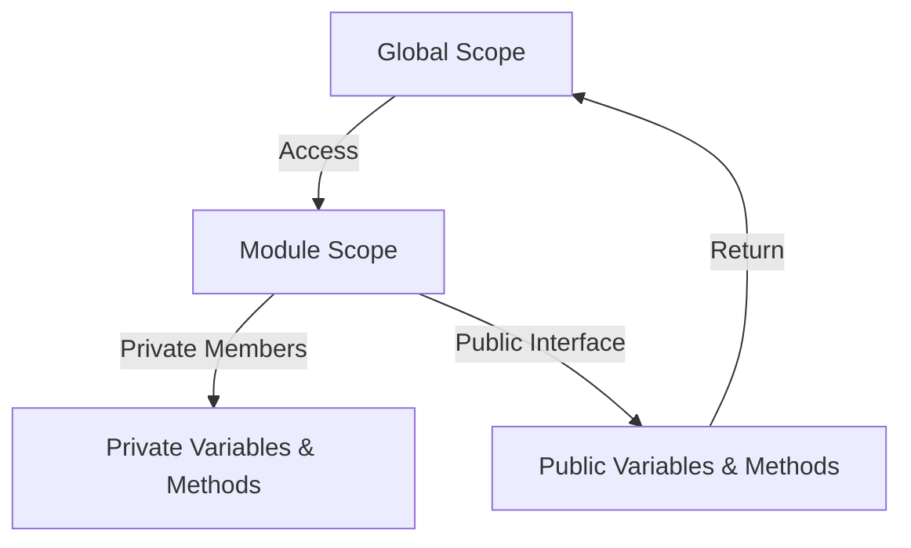

## 8.2 The Module Pattern

In the world of JavaScript, organizing and structuring code efficiently is crucial for building maintainable and scalable applications. One of the most effective design patterns for achieving this is the **Module Pattern**. This pattern allows developers to encapsulate code, create private variables, and prevent global namespace pollution. In this section, we'll explore the Module Pattern in detail, understand its purpose, and learn how to implement it using Immediately Invoked Function Expressions (IIFEs).

### Understanding the Module Pattern

The Module Pattern is a design pattern used primarily to keep pieces of code organized and to create private and public access levels. It helps in encapsulating code, which means bundling the data (variables) and the methods (functions) that operate on the data into a single unit or module. This encapsulation is achieved by using closures, a feature of JavaScript that allows functions to maintain access to their scope even after they have finished executing.

#### Purpose of the Module Pattern

The primary purpose of the Module Pattern is to:

1. **Encapsulate Code**: By grouping related functionalities together, the Module Pattern helps in organizing code logically.
2. **Create Private Variables and Methods**: It allows the creation of private members that cannot be accessed directly from outside the module.
3. **Avoid Global Namespace Pollution**: By encapsulating code within a module, it prevents the pollution of the global namespace, reducing the risk of variable name conflicts.
4. **Promote Reusability and Maintainability**: Modules can be reused across different parts of an application, and changes within a module do not affect other parts of the codebase.

### Implementing the Module Pattern with IIFEs

The Module Pattern is typically implemented using Immediately Invoked Function Expressions (IIFEs). An IIFE is a function that is executed immediately after it is defined. This technique is used to create a local scope for variables, thus achieving encapsulation.

#### Basic Structure of an IIFE

```javascript
(function() {
    // All variables and functions declared here are private
})();
```

In the context of the Module Pattern, an IIFE is used to define a module. Let's see how we can implement a simple module using this pattern.

#### Example: Creating a Basic Module

```javascript
const myModule = (function() {
    // Private variables and functions
    let privateVar = 'I am private';
    
    function privateMethod() {
        console.log('Accessing private method');
    }
    
    // Public variables and functions
    return {
        publicVar: 'I am public',
        
        publicMethod: function() {
            console.log('Accessing public method');
            privateMethod();
        }
    };
})();

console.log(myModule.publicVar); // Output: I am public
myModule.publicMethod(); // Output: Accessing public method
// Accessing private method
```

In this example, `privateVar` and `privateMethod` are private members of the module, while `publicVar` and `publicMethod` are exposed as public members. The public members are returned as an object from the IIFE, making them accessible from outside the module.

### Promoting Encapsulation with the Module Pattern

Encapsulation is a fundamental principle of object-oriented programming that involves bundling the data and the methods that operate on the data into a single unit. The Module Pattern promotes encapsulation by allowing developers to define private and public members within a module.

#### Defining Private and Public Members

- **Private Members**: These are variables and functions that are not accessible from outside the module. They are defined within the IIFE and are not returned in the public interface.

- **Public Members**: These are variables and functions that are accessible from outside the module. They are returned as part of the object from the IIFE.

Let's enhance our previous example to include both private and public members:

```javascript
const counterModule = (function() {
    // Private variable
    let counter = 0;
    
    // Private function
    function logCounter() {
        console.log(`Counter is: ${counter}`);
    }
    
    // Public interface
    return {
        increment: function() {
            counter++;
            logCounter();
        },
        
        reset: function() {
            counter = 0;
            logCounter();
        }
    };
})();

counterModule.increment(); // Output: Counter is: 1
counterModule.increment(); // Output: Counter is: 2
counterModule.reset(); // Output: Counter is: 0
```

In this example, the `counter` variable and `logCounter` function are private, while `increment` and `reset` are public methods that can be accessed from outside the module.

### Avoiding Global Namespace Pollution

One of the significant advantages of the Module Pattern is its ability to prevent global namespace pollution. In JavaScript, all variables and functions declared in the global scope are accessible from anywhere in the code, which can lead to conflicts and bugs. By encapsulating code within a module, the Module Pattern ensures that only the necessary parts of the code are exposed to the global scope.

#### Example: Preventing Namespace Pollution

Consider a scenario where we have multiple scripts that define a variable with the same name. Without the Module Pattern, this could lead to conflicts:

```javascript
// Script 1
var name = 'Alice';

// Script 2
var name = 'Bob';

console.log(name); // Output: Bob
```

In this example, the `name` variable in Script 2 overwrites the `name` variable in Script 1. By using the Module Pattern, we can avoid such conflicts:

```javascript
// Script 1
const module1 = (function() {
    const name = 'Alice';
    return {
        getName: function() {
            return name;
        }
    };
})();

// Script 2
const module2 = (function() {
    const name = 'Bob';
    return {
        getName: function() {
            return name;
        }
    };
})();

console.log(module1.getName()); // Output: Alice
console.log(module2.getName()); // Output: Bob
```

Here, each module encapsulates its `name` variable, preventing conflicts and ensuring that each module's data is isolated.

### Scenarios Where the Module Pattern is Useful

The Module Pattern is particularly useful in scenarios where:

1. **Code Organization is Crucial**: For large applications, organizing code into modules makes it easier to manage and maintain.
2. **Data Privacy is Required**: When sensitive data or logic needs to be hidden from the global scope, the Module Pattern provides a way to keep it private.
3. **Avoiding Global Conflicts**: In projects with multiple developers or third-party libraries, the Module Pattern helps avoid conflicts by encapsulating code.
4. **Reusability is Desired**: Modules can be reused across different parts of an application, promoting code reuse and reducing redundancy.

### Limitations of the Module Pattern

While the Module Pattern offers many benefits, it also has some limitations:

1. **Lack of Dynamic Imports**: The Module Pattern does not support dynamic imports, which can be a limitation in scenarios where modules need to be loaded dynamically.
2. **No Built-in Module System**: Before ES6, JavaScript did not have a built-in module system, which made it challenging to manage dependencies and module loading.
3. **Complexity in Large Applications**: In very large applications, managing numerous modules can become complex and challenging.

### Evolution Towards ES6 Modules

With the introduction of ES6, JavaScript now has a built-in module system that addresses some of the limitations of the Module Pattern. ES6 modules provide a more standardized way to define and import modules, with features like dynamic imports, named exports, and default exports.

#### Example: Using ES6 Modules

```javascript
// math.js (Module)
export const add = (a, b) => a + b;
export const subtract = (a, b) => a - b;

// main.js (Importing Module)
import { add, subtract } from './math.js';

console.log(add(5, 3)); // Output: 8
console.log(subtract(5, 3)); // Output: 2
```

In this example, `math.js` defines two functions, `add` and `subtract`, which are exported and then imported in `main.js`. ES6 modules provide a more robust and flexible way to manage dependencies and organize code.

### Try It Yourself

To get hands-on experience with the Module Pattern, try modifying the code examples provided in this section. Here are some suggestions:

- Add a new private method to the `counterModule` that logs a message whenever the counter is incremented by 2.
- Create a new module that manages a list of tasks, with methods to add, remove, and list tasks. Ensure that the task list is private.

### Visualizing the Module Pattern

To better understand how the Module Pattern works, let's visualize the encapsulation process using a diagram.



**Description**: This diagram illustrates how the Module Pattern encapsulates code within a module scope. The global scope accesses the module scope, which contains private members (variables and methods) and a public interface. The public interface is returned to the global scope, allowing access to public members while keeping private members hidden.

### Key Takeaways

- The Module Pattern is a powerful design pattern for encapsulating code and creating private variables in JavaScript.
- It helps avoid global namespace pollution by encapsulating code within a module.
- The pattern is implemented using Immediately Invoked Function Expressions (IIFEs).
- The Module Pattern is particularly useful in scenarios where code organization, data privacy, and avoiding global conflicts are important.
- While the Module Pattern has limitations, ES6 modules provide a more standardized and flexible approach to module management.

### Embrace the Journey

Remember, mastering design patterns like the Module Pattern is an essential step in becoming a proficient JavaScript developer. As you continue to explore and experiment with these patterns, you'll gain a deeper understanding of how to structure and organize your code effectively. Keep experimenting, stay curious, and enjoy the journey!

## Quiz Time!



### What is the primary purpose of the Module Pattern in JavaScript?

- [x] To encapsulate code and create private variables
- [ ] To make all variables global
- [ ] To increase the execution speed of JavaScript
- [ ] To replace all other design patterns

> **Explanation:** The Module Pattern is primarily used to encapsulate code and create private variables, promoting better organization and avoiding global namespace pollution.

### How is the Module Pattern typically implemented in JavaScript?

- [x] Using Immediately Invoked Function Expressions (IIFEs)
- [ ] Using global variables
- [ ] Using for loops
- [ ] Using switch statements

> **Explanation:** The Module Pattern is typically implemented using Immediately Invoked Function Expressions (IIFEs), which create a local scope for variables.

### Which of the following is a benefit of using the Module Pattern?

- [x] Avoiding global namespace pollution
- [ ] Increasing the size of the codebase
- [ ] Making all functions public
- [ ] Removing all private variables

> **Explanation:** The Module Pattern helps avoid global namespace pollution by encapsulating code within a module, keeping private variables hidden.

### What is an IIFE in JavaScript?

- [x] A function that is executed immediately after it is defined
- [ ] A function that is never executed
- [ ] A function that is called manually
- [ ] A function that is executed only once

> **Explanation:** An IIFE (Immediately Invoked Function Expression) is a function that is executed immediately after it is defined, creating a local scope for variables.

### What is a limitation of the Module Pattern?

- [x] Lack of dynamic imports
- [ ] It makes all variables global
- [ ] It increases the complexity of small scripts
- [ ] It requires a lot of memory

> **Explanation:** One limitation of the Module Pattern is the lack of dynamic imports, which can be a limitation in scenarios where modules need to be loaded dynamically.

### What is the difference between private and public members in a module?

- [x] Private members are not accessible from outside the module, while public members are
- [ ] Private members are always functions, while public members are always variables
- [ ] Private members are faster to execute than public members
- [ ] Private members are stored in a different file than public members

> **Explanation:** Private members are not accessible from outside the module, while public members are exposed and can be accessed from outside.

### How do ES6 modules improve upon the traditional Module Pattern?

- [x] By providing a standardized way to define and import modules
- [ ] By making all variables global
- [ ] By removing the need for encapsulation
- [ ] By increasing the execution speed of JavaScript

> **Explanation:** ES6 modules provide a standardized way to define and import modules, offering features like dynamic imports and named exports.

### In the context of the Module Pattern, what is encapsulation?

- [x] Bundling data and methods into a single unit
- [ ] Making all variables global
- [ ] Increasing the execution speed of JavaScript
- [ ] Removing all functions from the code

> **Explanation:** Encapsulation involves bundling data and methods into a single unit, allowing for better organization and data privacy.

### Which of the following scenarios is the Module Pattern particularly useful for?

- [x] When avoiding global conflicts is important
- [ ] When making all variables global is desired
- [ ] When increasing the size of the codebase is necessary
- [ ] When removing all private variables is required

> **Explanation:** The Module Pattern is particularly useful in scenarios where avoiding global conflicts is important, as it encapsulates code within a module.

### True or False: The Module Pattern can be used to create both private and public members within a module.

- [x] True
- [ ] False

> **Explanation:** True. The Module Pattern allows for the creation of both private and public members within a module, promoting encapsulation and data privacy.




