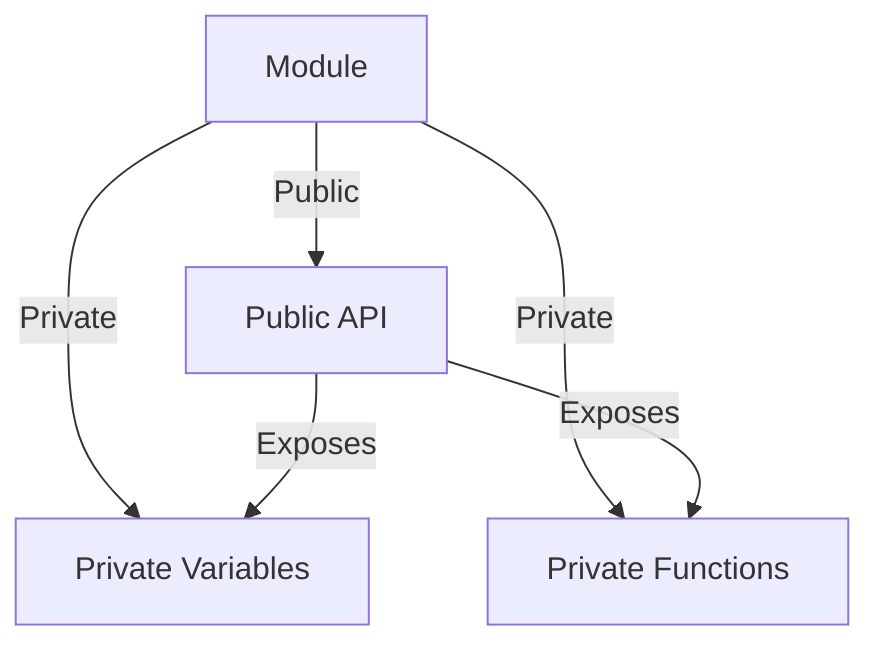

## 8.3 The Revealing Module Pattern

In the journey of mastering JavaScript and Object-Oriented Programming (OOP), understanding design patterns is crucial. One such pattern that stands out for its simplicity and effectiveness is the **Revealing Module Pattern**. This pattern is an enhancement over the traditional module pattern and is particularly useful for organizing code in a way that enhances readability and maintainability. Let's dive into the details of the Revealing Module Pattern, explore its structure, and understand its benefits and potential drawbacks.

### Introduction to the Revealing Module Pattern

The Revealing Module Pattern is a design pattern in JavaScript that helps in structuring code by encapsulating private variables and functions while exposing only the parts that are intended to be public. This pattern is an evolution of the standard module pattern, aiming to improve code clarity by explicitly outlining the public API of a module.

#### Why Use the Revealing Module Pattern?

1. **Improved Readability**: By clearly defining which parts of the code are public, the Revealing Module Pattern makes it easier for developers to understand how to interact with a module.
2. **Encapsulation**: It allows you to hide the internal details of a module, exposing only the necessary parts, which is a core principle of OOP.
3. **Maintainability**: With a clear separation between public and private components, maintaining and updating code becomes more manageable.

### Understanding the Standard Module Pattern

Before we delve deeper into the Revealing Module Pattern, let's briefly revisit the standard module pattern. The module pattern in JavaScript is used to create modules that encapsulate private data and expose public methods. Here's a simple example:

```javascript
var myModule = (function() {
    var privateVariable = 'I am private';

    function privateFunction() {
        console.log(privateVariable);
    }

    return {
        publicMethod: function() {
            privateFunction();
        }
    };
})();

myModule.publicMethod(); // Outputs: I am private
```

In this example, `privateVariable` and `privateFunction` are hidden from the outside world, while `publicMethod` is exposed as part of the module's public API.

### The Revealing Module Pattern: A Step Forward

The Revealing Module Pattern takes the module pattern a step further by using a consistent syntax to define all functions and variables at the top of the module and then returning an object that maps public names to private functions. This approach makes it clear which functions and variables are intended to be public.

#### Structure of the Revealing Module Pattern

The structure of the Revealing Module Pattern involves:

1. **Defining all variables and functions**: Declare all variables and functions at the top of the module.
2. **Returning an object**: Return an object that maps public names to private functions or variables.

Here's how you can implement the Revealing Module Pattern:

```javascript
var revealingModule = (function() {
    var privateVar = 'I am private';
    var publicVar = 'I am public';

    function privateFunction() {
        console.log(privateVar);
    }

    function publicFunction() {
        console.log(publicVar);
    }

    function setPrivateVar(value) {
        privateVar = value;
    }

    return {
        publicFunction: publicFunction,
        setPrivateVar: setPrivateVar
    };
})();

revealingModule.publicFunction(); // Outputs: I am public
revealingModule.setPrivateVar('New private value');
```

In this example, `publicFunction` and `setPrivateVar` are exposed, while `privateVar` and `privateFunction` remain hidden.

### Benefits of the Revealing Module Pattern

The Revealing Module Pattern offers several benefits:

1. **Clarity**: By explicitly defining what is public, the pattern makes it easier to understand the module's API.
2. **Consistency**: The pattern enforces a consistent way of defining and exposing module components.
3. **Ease of Refactoring**: With a clear separation of public and private components, refactoring becomes more straightforward.

### Potential Drawbacks

While the Revealing Module Pattern is beneficial, it does have some potential drawbacks:

1. **Less Flexibility**: Once a module's API is defined, changing it can be challenging, especially if other parts of the code depend on it.
2. **Overhead**: In some cases, the pattern might introduce unnecessary complexity, especially for simple modules.

### When to Use the Revealing Module Pattern

The Revealing Module Pattern is ideal for situations where you need a clear and consistent API for your modules. It is particularly useful for larger projects where maintainability and readability are priorities. However, for smaller scripts or when performance is a critical concern, the overhead of using this pattern might not be justified.

### Code Examples: Structuring Modules with the Revealing Module Pattern

Let's explore some practical examples to see how the Revealing Module Pattern can be applied in different scenarios.

#### Example 1: A Simple Calculator Module

```javascript
var calculatorModule = (function() {
    var result = 0;

    function add(x) {
        result += x;
    }

    function subtract(x) {
        result -= x;
    }

    function multiply(x) {
        result *= x;
    }

    function divide(x) {
        if (x !== 0) {
            result /= x;
        } else {
            console.error('Cannot divide by zero');
        }
    }

    function getResult() {
        return result;
    }

    return {
        add: add,
        subtract: subtract,
        multiply: multiply,
        divide: divide,
        getResult: getResult
    };
})();

calculatorModule.add(5);
calculatorModule.multiply(2);
console.log(calculatorModule.getResult()); // Outputs: 10
```

In this example, we have a simple calculator module that exposes methods for basic arithmetic operations while keeping the `result` variable private.

#### Example 2: A User Management Module

```javascript
var userModule = (function() {
    var users = [];

    function addUser(user) {
        users.push(user);
    }

    function removeUser(user) {
        var index = users.indexOf(user);
        if (index > -1) {
            users.splice(index, 1);
        }
    }

    function listUsers() {
        return users.slice();
    }

    return {
        addUser: addUser,
        removeUser: removeUser,
        listUsers: listUsers
    };
})();

userModule.addUser('Alice');
userModule.addUser('Bob');
console.log(userModule.listUsers()); // Outputs: ['Alice', 'Bob']
userModule.removeUser('Alice');
console.log(userModule.listUsers()); // Outputs: ['Bob']
```

Here, the `userModule` manages a list of users, exposing methods to add, remove, and list users while keeping the `users` array private.

### Visualizing the Revealing Module Pattern

To better understand how the Revealing Module Pattern works, let's visualize the structure of a module using a diagram.



**Description**: This diagram illustrates the structure of a module using the Revealing Module Pattern. The module contains private variables and functions, with a public API that exposes selected parts.

### Try It Yourself

To get a hands-on understanding of the Revealing Module Pattern, try modifying the examples above. For instance, add new methods to the calculator module or change how users are managed in the user module. Experimenting with the code will help solidify your understanding of how this pattern works.

### References and Further Reading

- [MDN Web Docs: JavaScript Modules](https://developer.mozilla.org/en-US/docs/Web/JavaScript/Guide/Modules)
- [JavaScript Design Patterns](https://www.patterns.dev/posts/classic-design-patterns/)
- [W3Schools: JavaScript Modules](https://www.w3schools.com/js/js_modules.asp)

### Knowledge Check

To reinforce your understanding of the Revealing Module Pattern, let's go through some questions and exercises.

1. **What is the primary advantage of using the Revealing Module Pattern over the standard module pattern?**
2. **How does the Revealing Module Pattern enhance code readability?**
3. **Try creating a module using the Revealing Module Pattern that manages a collection of books. Include methods to add, remove, and list books.**

### Embrace the Journey

Remember, mastering design patterns like the Revealing Module Pattern is a significant step in your journey as a JavaScript developer. As you continue to explore and experiment with these patterns, you'll gain a deeper understanding of how to write clean, maintainable, and efficient code. Keep experimenting, stay curious, and enjoy the journey!

## Quiz Time!



### What is the primary purpose of the Revealing Module Pattern?

- [x] To clearly define the public API of a module
- [ ] To improve performance of JavaScript code
- [ ] To make all module variables public
- [ ] To eliminate the need for functions

> **Explanation:** The Revealing Module Pattern is used to clearly define which parts of a module are public, enhancing readability and maintainability.

### How does the Revealing Module Pattern improve code readability?

- [x] By explicitly outlining which parts of the module are public
- [ ] By removing all private variables
- [ ] By using fewer lines of code
- [ ] By making all variables global

> **Explanation:** The pattern improves readability by clearly defining the public API, making it easier to understand how to interact with the module.

### Which of the following is a potential drawback of the Revealing Module Pattern?

- [x] Less flexibility in changing internal implementations
- [ ] Increased performance
- [ ] More global variables
- [ ] Easier debugging

> **Explanation:** The Revealing Module Pattern can be less flexible because once the public API is defined, changing it can affect other parts of the code that depend on it.

### In the Revealing Module Pattern, how are private variables typically declared?

- [x] At the top of the module
- [ ] Inside the return statement
- [ ] As global variables
- [ ] Inside public functions

> **Explanation:** Private variables are typically declared at the top of the module to keep them encapsulated and hidden from the outside.

### What is the main difference between the standard module pattern and the Revealing Module Pattern?

- [x] The Revealing Module Pattern explicitly defines the public API
- [ ] The standard module pattern uses more global variables
- [ ] The Revealing Module Pattern does not use functions
- [ ] The standard module pattern is only for small scripts

> **Explanation:** The main difference is that the Revealing Module Pattern explicitly outlines the public API, making it clear which parts are accessible from outside the module.

### Which method is used to expose functions in the Revealing Module Pattern?

- [x] Returning an object that maps public names to private functions
- [ ] Declaring them as global functions
- [ ] Using `console.log` to display them
- [ ] Placing them inside the `window` object

> **Explanation:** Functions are exposed by returning an object that maps public names to private functions, defining the module's public API.

### How can the Revealing Module Pattern aid in refactoring code?

- [x] By providing a clear separation between public and private components
- [ ] By making all variables public
- [ ] By reducing the number of functions
- [ ] By using fewer lines of code

> **Explanation:** The clear separation between public and private components makes it easier to refactor code without affecting other parts of the application.

### What is a common use case for the Revealing Module Pattern?

- [x] Creating a clear and consistent API for larger projects
- [ ] Writing simple scripts with no dependencies
- [ ] Making all variables global
- [ ] Eliminating the need for functions

> **Explanation:** The pattern is ideal for larger projects where a clear and consistent API is needed for maintainability and readability.

### Which of the following is NOT a benefit of the Revealing Module Pattern?

- [ ] Improved readability
- [ ] Consistency
- [x] Increased performance
- [ ] Ease of refactoring

> **Explanation:** While the pattern offers improved readability, consistency, and ease of refactoring, it does not necessarily increase performance.

### True or False: The Revealing Module Pattern makes all module variables public.

- [ ] True
- [x] False

> **Explanation:** False. The Revealing Module Pattern encapsulates private variables and only exposes those intended to be public.


