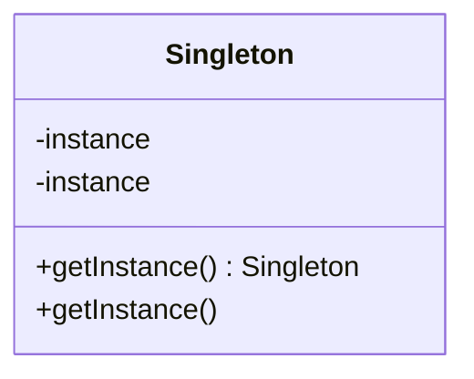

## 8.4 The Singleton Pattern

In the world of software design, patterns play a crucial role in providing solutions to common problems. One such pattern is the **Singleton Pattern**. This pattern ensures that a class has only one instance and provides a global point of access to that instance. Let's delve into the Singleton Pattern, understand when it's appropriate to use, and explore how to implement it in JavaScript.

### Understanding the Singleton Pattern

The Singleton Pattern is a design pattern that restricts the instantiation of a class to a single instance. This is particularly useful when exactly one object is needed to coordinate actions across the system. Think of it like a single manager in an office who oversees all operations. In software, this manager might be a configuration manager, a logging service, or a resource manager.

#### Key Characteristics of the Singleton Pattern

1. **Single Instance**: The pattern ensures that only one instance of the class exists.
2. **Global Access Point**: It provides a way to access this instance globally.
3. **Lazy Initialization**: The instance is created only when it is needed.

### When to Use the Singleton Pattern

The Singleton Pattern is appropriate in scenarios where:

- **Resource Management**: You need to manage a shared resource, such as a database connection pool.
- **Configuration Management**: A single configuration object needs to be accessed throughout the application.
- **Logging**: A single logging service is required to maintain a consistent log format and output.

However, it's important to be cautious. Overuse of the Singleton Pattern can lead to issues such as hidden dependencies and difficulties in testing.

### Implementing the Singleton Pattern in JavaScript

Let's explore how to implement a Singleton Pattern in JavaScript. We'll start with a simple example and then move on to more complex implementations.

#### Basic Singleton Implementation

Here's a basic implementation of a singleton in JavaScript using a closure:

```javascript
const Singleton = (function() {
  let instance;

  function createInstance() {
    const object = new Object("I am the instance");
    return object;
  }

  return {
    getInstance: function() {
      if (!instance) {
        instance = createInstance();
      }
      return instance;
    }
  };
})();

const instance1 = Singleton.getInstance();
const instance2 = Singleton.getInstance();

console.log(instance1 === instance2); // true
```

**Explanation**:
- We use an immediately invoked function expression (IIFE) to create a private scope.
- The `instance` variable holds the singleton instance.
- The `createInstance` function creates the instance.
- The `getInstance` method checks if an instance exists; if not, it creates one.

#### ES6 Class-Based Singleton

With ES6, we can use classes to implement the Singleton Pattern:

```javascript
class Singleton {
  constructor() {
    if (Singleton.instance) {
      return Singleton.instance;
    }
    Singleton.instance = this;
    this.data = "I am the instance";
  }
}

const instance1 = new Singleton();
const instance2 = new Singleton();

console.log(instance1 === instance2); // true
```

**Explanation**:
- The `constructor` checks if an instance already exists and returns it if so.
- The `instance` is stored as a static property of the class.

### Common Use Cases for the Singleton Pattern

1. **Configuration Management**: A singleton can hold configuration settings that need to be accessed throughout the application.
2. **Logging Services**: A singleton logger can ensure that all parts of an application log messages in a consistent format.
3. **Resource Management**: Managing resources like database connections or thread pools can be efficiently handled by a singleton.

### Potential Issues with the Singleton Pattern

While the Singleton Pattern can be useful, it comes with potential drawbacks:

- **Testing Difficulties**: Singletons can make unit testing challenging because they introduce global state.
- **Hidden Dependencies**: Overuse can lead to hidden dependencies, making the codebase harder to understand and maintain.
- **Concurrency Issues**: In a multi-threaded environment, ensuring a single instance can be complex.

### Alternatives to the Singleton Pattern

In some cases, singletons might not be the best choice. Consider these alternatives:

- **Dependency Injection**: Instead of using a singleton, inject dependencies where needed. This makes testing easier and reduces hidden dependencies.
- **Module Pattern**: Use JavaScript modules to encapsulate functionality without enforcing a single instance.
- **Factory Pattern**: Use a factory to create instances as needed, providing more flexibility.

### Try It Yourself

To better understand the Singleton Pattern, try modifying the examples above:

1. **Modify the Singleton**: Change the data stored in the singleton instance and observe how it affects different parts of the application.
2. **Create a Logger Singleton**: Implement a logger that logs messages with timestamps.
3. **Test Singleton Behavior**: Write tests to verify that only one instance of the singleton is created.

### Visualizing the Singleton Pattern

To help visualize the Singleton Pattern, let's use a diagram to represent its structure and flow:



**Description**: This diagram shows the Singleton class with a private `instance` variable and a public `getInstance` method.

### References and Further Reading

- [MDN Web Docs: Design Patterns](https://developer.mozilla.org/en-US/docs/Web/JavaScript/Guide/Design_Patterns)
- [W3Schools: JavaScript Design Patterns](https://www.w3schools.com/js/js_design_patterns.asp)

### Knowledge Check

- What is the primary purpose of the Singleton Pattern?
- How does the Singleton Pattern ensure only one instance of a class is created?
- What are some common use cases for the Singleton Pattern?
- What are potential issues with using the Singleton Pattern?
- What are some alternatives to the Singleton Pattern?

### Embrace the Journey

Remember, understanding design patterns like the Singleton Pattern is just the beginning. As you progress, you'll learn to apply these patterns to build more complex and efficient applications. Keep experimenting, stay curious, and enjoy the journey!

## Quiz Time!



### What is the primary purpose of the Singleton Pattern?

- [x] To ensure a class has only one instance and provide a global point of access
- [ ] To create multiple instances of a class
- [ ] To encapsulate a group of related classes
- [ ] To provide a blueprint for creating objects

> **Explanation:** The Singleton Pattern ensures a class has only one instance and provides a global point of access to it.

### How does the Singleton Pattern ensure only one instance of a class is created?

- [x] By storing the instance in a private variable and checking if it exists before creating a new one
- [ ] By using a public variable to store the instance
- [ ] By creating a new instance every time the class is called
- [ ] By using a static method to create instances

> **Explanation:** The Singleton Pattern uses a private variable to store the instance and checks if it exists before creating a new one.

### What is a common use case for the Singleton Pattern?

- [x] Configuration management
- [ ] Creating multiple instances of a class
- [ ] Encapsulating a group of related classes
- [ ] Providing a blueprint for creating objects

> **Explanation:** A common use case for the Singleton Pattern is configuration management, where a single configuration object is accessed throughout the application.

### What is a potential issue with using the Singleton Pattern?

- [x] Testing difficulties due to global state
- [ ] Creating multiple instances of a class
- [ ] Encapsulating a group of related classes
- [ ] Providing a blueprint for creating objects

> **Explanation:** Singletons can make unit testing challenging because they introduce global state.

### What is an alternative to the Singleton Pattern?

- [x] Dependency Injection
- [ ] Creating multiple instances of a class
- [ ] Encapsulating a group of related classes
- [ ] Providing a blueprint for creating objects

> **Explanation:** Dependency Injection is an alternative to the Singleton Pattern, as it allows for easier testing and reduces hidden dependencies.

### Can the Singleton Pattern lead to hidden dependencies?

- [x] Yes
- [ ] No

> **Explanation:** Overuse of the Singleton Pattern can lead to hidden dependencies, making the codebase harder to understand and maintain.

### Is the Singleton Pattern suitable for managing shared resources?

- [x] Yes
- [ ] No

> **Explanation:** The Singleton Pattern is suitable for managing shared resources, such as database connections or thread pools.

### Does the Singleton Pattern provide a global access point to the instance?

- [x] Yes
- [ ] No

> **Explanation:** The Singleton Pattern provides a global access point to the instance, allowing it to be accessed from anywhere in the application.

### Can the Singleton Pattern be implemented using ES6 classes?

- [x] Yes
- [ ] No

> **Explanation:** The Singleton Pattern can be implemented using ES6 classes by using a static property to store the instance.

### Is lazy initialization a characteristic of the Singleton Pattern?

- [x] True
- [ ] False

> **Explanation:** Lazy initialization is a characteristic of the Singleton Pattern, where the instance is created only when it is needed.


