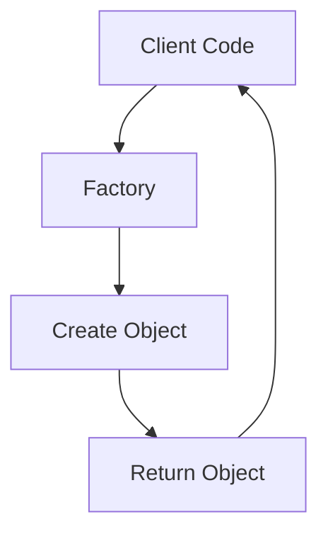

## 8.5 The Factory Pattern

In the realm of software development, design patterns play a crucial role in solving common problems in a standardized way. One such pattern is the **Factory Pattern**, a creational pattern that provides a way to create objects without specifying the exact class of object that will be created. This approach abstracts the instantiation process, offering flexibility and reducing coupling in your code. In this section, we'll delve into the Factory Pattern, explore its advantages, and provide practical examples to illustrate its implementation in JavaScript.

### Understanding the Factory Pattern

The Factory Pattern is a design pattern that defines an interface for creating objects but allows subclasses to alter the type of objects that will be created. This pattern is particularly useful when the exact types and dependencies of the objects are not known until runtime. By using a factory, we can encapsulate the object creation logic, making our code more modular and easier to maintain.

#### Key Concepts

- **Abstraction**: The Factory Pattern abstracts the process of object creation, allowing the client code to work with interfaces rather than concrete implementations.
- **Flexibility**: It provides flexibility in terms of object creation, enabling the system to decide which class to instantiate at runtime.
- **Reduced Coupling**: By decoupling the client code from the concrete classes, the Factory Pattern reduces the dependency between components.

### Simple Factory Implementation

Let's start with a simple example to illustrate the Factory Pattern in JavaScript. Suppose we are building a system that handles different types of vehicles. Instead of creating each vehicle directly, we can use a factory to manage the creation process.

```javascript
// Vehicle Factory
class VehicleFactory {
  createVehicle(type) {
    let vehicle;

    if (type === 'car') {
      vehicle = new Car();
    } else if (type === 'truck') {
      vehicle = new Truck();
    }

    vehicle.type = type;
    vehicle.start = function() {
      console.log(`Starting a ${this.type}`);
    };

    return vehicle;
  }
}

// Vehicle Classes
class Car {
  constructor() {
    this.wheels = 4;
  }
}

class Truck {
  constructor() {
    this.wheels = 6;
  }
}

// Usage
const factory = new VehicleFactory();
const car = factory.createVehicle('car');
const truck = factory.createVehicle('truck');

car.start(); // Output: Starting a car
truck.start(); // Output: Starting a truck
```

In this example, the `VehicleFactory` class encapsulates the logic for creating different types of vehicles. The client code simply calls `createVehicle` with the desired type, and the factory handles the rest.

### Complex Factory Implementation

As systems grow in complexity, so does the need for more sophisticated factory implementations. A complex factory might involve additional logic, such as configuration settings or dependency injection.

Consider a scenario where we need to create different types of notifications (e.g., email, SMS, push notifications) based on user preferences. Here's how a more complex factory might look:

```javascript
// Notification Factory
class NotificationFactory {
  constructor(config) {
    this.config = config;
  }

  createNotification(type) {
    let notification;

    switch (type) {
      case 'email':
        notification = new EmailNotification(this.config.email);
        break;
      case 'sms':
        notification = new SMSNotification(this.config.sms);
        break;
      case 'push':
        notification = new PushNotification(this.config.push);
        break;
      default:
        throw new Error('Invalid notification type');
    }

    return notification;
  }
}

// Notification Classes
class EmailNotification {
  constructor(config) {
    this.config = config;
  }

  send(message) {
    console.log(`Sending email: ${message}`);
  }
}

class SMSNotification {
  constructor(config) {
    this.config = config;
  }

  send(message) {
    console.log(`Sending SMS: ${message}`);
  }
}

class PushNotification {
  constructor(config) {
    this.config = config;
  }

  send(message) {
    console.log(`Sending push notification: ${message}`);
  }
}

// Configuration
const config = {
  email: { /* email config */ },
  sms: { /* sms config */ },
  push: { /* push config */ }
};

// Usage
const notificationFactory = new NotificationFactory(config);
const emailNotification = notificationFactory.createNotification('email');
emailNotification.send('Hello via Email!');
```

In this example, the `NotificationFactory` takes a configuration object, allowing each notification type to be initialized with specific settings. The factory uses a switch statement to determine which notification class to instantiate based on the type provided.

### Advantages of the Factory Pattern

- **Flexibility**: The Factory Pattern allows for easy extension of new types without modifying existing code. New classes can be added, and the factory can be updated to handle them.
- **Reduced Coupling**: By using a factory, the client code is decoupled from the concrete classes, leading to a more modular and maintainable codebase.
- **Centralized Object Creation**: The factory centralizes the object creation logic, making it easier to manage and modify.

### Scenarios for Using the Factory Pattern

The Factory Pattern is particularly useful in scenarios where:

- The exact types of objects are not known until runtime.
- The system needs to manage a large number of related classes.
- The object creation process involves complex logic or configuration.

### Object Lifecycle Management

When designing systems with the Factory Pattern, it's important to consider the lifecycle of the objects being created. The factory can play a role in managing the initialization, configuration, and destruction of objects, ensuring that resources are used efficiently.

### Try It Yourself

To reinforce your understanding of the Factory Pattern, try modifying the examples provided:

- Add a new vehicle type (e.g., motorcycle) to the `VehicleFactory`.
- Extend the `NotificationFactory` to support a new notification type (e.g., in-app notifications).

Experiment with different configurations and observe how the factory manages the creation process.

### Visualizing the Factory Pattern

To better understand how the Factory Pattern works, let's visualize the process using a flowchart.



In this diagram, the client code interacts with the factory, which creates and returns the appropriate object based on the input provided.

### References and Further Reading

For more information on the Factory Pattern and other design patterns, consider exploring the following resources:

- [MDN Web Docs: Design Patterns](https://developer.mozilla.org/en-US/docs/Web/JavaScript/Guide/Design_Patterns)
- [Refactoring Guru: Factory Method](https://refactoring.guru/design-patterns/factory-method)
- [W3Schools: JavaScript Design Patterns](https://www.w3schools.com/js/js_design_patterns.asp)

### Knowledge Check

To test your understanding of the Factory Pattern, consider the following questions:

- What are the main benefits of using the Factory Pattern?
- How does the Factory Pattern reduce coupling in your code?
- In what scenarios would you choose to use the Factory Pattern?

### Embrace the Journey

Remember, learning design patterns is an ongoing journey. As you continue to develop your skills, you'll discover new ways to apply these patterns to solve complex problems. Keep experimenting, stay curious, and enjoy the process of becoming a more proficient developer!

## Quiz Time!



### What is the primary purpose of the Factory Pattern?

- [x] To create objects without specifying the exact class
- [ ] To manage object destruction
- [ ] To handle object serialization
- [ ] To optimize object performance

> **Explanation:** The Factory Pattern is designed to create objects without specifying the exact class of object that will be created.

### How does the Factory Pattern contribute to reduced coupling?

- [x] By decoupling client code from concrete classes
- [ ] By increasing the number of dependencies
- [ ] By making all classes abstract
- [ ] By using global variables

> **Explanation:** The Factory Pattern reduces coupling by allowing client code to interact with interfaces rather than concrete implementations.

### In which scenario is the Factory Pattern most useful?

- [x] When the exact types of objects are not known until runtime
- [ ] When all objects are known at compile time
- [ ] When no objects need to be created
- [ ] When objects are immutable

> **Explanation:** The Factory Pattern is particularly useful when the exact types of objects are not known until runtime.

### What is a key advantage of using a factory for object creation?

- [x] Centralized object creation logic
- [ ] Increased code duplication
- [ ] Reduced flexibility
- [ ] Increased complexity

> **Explanation:** A key advantage of the Factory Pattern is that it centralizes the object creation logic, making it easier to manage and modify.

### What does the Factory Pattern abstract?

- [x] The process of object creation
- [ ] The process of object destruction
- [ ] The process of object serialization
- [ ] The process of object optimization

> **Explanation:** The Factory Pattern abstracts the process of object creation, allowing for flexibility and reduced coupling.

### Which of the following is NOT a benefit of the Factory Pattern?

- [ ] Flexibility
- [ ] Reduced coupling
- [x] Increased code duplication
- [ ] Centralized object creation

> **Explanation:** The Factory Pattern reduces code duplication by centralizing object creation logic.

### What role does a factory play in object lifecycle management?

- [x] It manages initialization, configuration, and destruction of objects
- [ ] It only manages object destruction
- [ ] It only manages object serialization
- [ ] It does not play any role

> **Explanation:** A factory can manage the initialization, configuration, and destruction of objects, ensuring efficient resource use.

### How can you extend a factory to support new types?

- [x] By adding new classes and updating the factory logic
- [ ] By deleting existing classes
- [ ] By using global variables
- [ ] By ignoring the factory pattern

> **Explanation:** New classes can be added, and the factory logic can be updated to support them.

### What is the result of using a factory in terms of code maintenance?

- [x] Easier code maintenance
- [ ] More complex code maintenance
- [ ] No change in code maintenance
- [ ] Increased code duplication

> **Explanation:** Using a factory results in easier code maintenance due to centralized object creation logic.

### True or False: The Factory Pattern is only useful for creating simple objects.

- [ ] True
- [x] False

> **Explanation:** The Factory Pattern is useful for creating both simple and complex objects, especially when the creation process involves complex logic or configuration.




