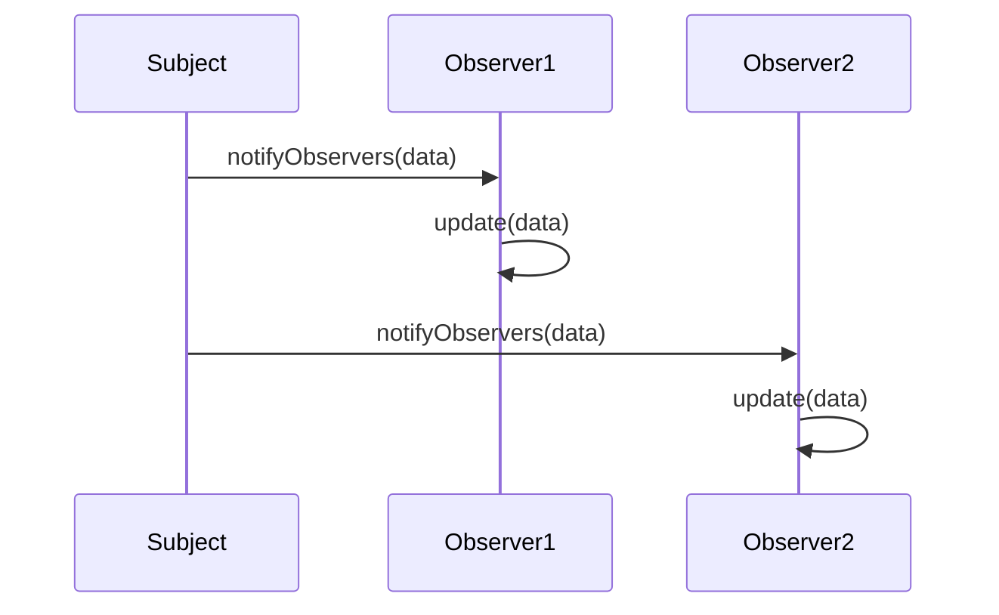

## 8.6 The Observer Pattern

In the realm of software design, the **Observer Pattern** stands out as a fundamental design pattern that facilitates communication between objects in an event-driven manner. This pattern is particularly useful in scenarios where a change in one object needs to be reflected across multiple dependent objects. Let's delve into the intricacies of the Observer Pattern, its components, and how it can be implemented in JavaScript.

### Understanding the Observer Pattern

The Observer Pattern is a behavioral design pattern that defines a one-to-many dependency between objects. When the state of one object (the **subject**) changes, all its dependents (the **observers**) are notified and updated automatically. This pattern is widely used in event-driven programming, where it allows for a clean separation of concerns and promotes loose coupling between components.

#### Key Components

1. **Subject**: The core object that holds the state and notifies observers of any changes. It maintains a list of observers and provides methods to add, remove, and notify them.

2. **Observers**: These are objects that want to be informed about changes in the subject. They implement an interface to update themselves when the subject changes.

#### How It Works

The subject maintains a list of observers and provides methods to add or remove observers. When a change occurs in the subject, it calls a method to notify all registered observers, often passing itself as a parameter so observers can query the subject for updated data.

### Implementing the Observer Pattern in JavaScript

Let's walk through a simple implementation of the Observer Pattern in JavaScript. We'll create a `Subject` class and an `Observer` class to demonstrate how these components interact.

```javascript
// Subject class
class Subject {
  constructor() {
    this.observers = []; // Array to hold observer functions
  }

  // Method to add an observer
  addObserver(observer) {
    this.observers.push(observer);
  }

  // Method to remove an observer
  removeObserver(observer) {
    this.observers = this.observers.filter(obs => obs !== observer);
  }

  // Method to notify all observers
  notifyObservers(data) {
    this.observers.forEach(observer => observer.update(data));
  }
}

// Observer class
class Observer {
  constructor(name) {
    this.name = name;
  }

  // Update method to be called when subject changes
  update(data) {
    console.log(`${this.name} received data: ${data}`);
  }
}

// Example usage
const subject = new Subject();
const observer1 = new Observer('Observer 1');
const observer2 = new Observer('Observer 2');

subject.addObserver(observer1);
subject.addObserver(observer2);

// Simulate a change in the subject
subject.notifyObservers('New Data Available');
```

In this example, the `Subject` class manages a list of observers and provides methods to add, remove, and notify them. The `Observer` class implements an `update` method that is called when the subject changes.

### Event-Driven Programming with the Observer Pattern

The Observer Pattern is a cornerstone of event-driven programming. It allows objects to communicate without being tightly coupled, making it easier to manage complex interactions in applications. This pattern is particularly useful in user interface (UI) programming, where UI components need to respond to user actions or data changes.

#### Practical Applications

1. **UI Events**: In a web application, UI components can act as observers that respond to user interactions like clicks, inputs, or form submissions. For example, a button click can trigger updates in multiple parts of the UI without the button needing to know about the details of those components.

2. **Data Change Notifications**: In applications that deal with dynamic data, the Observer Pattern can be used to notify components of data changes. For instance, in a real-time dashboard, data updates can be propagated to all visual components displaying that data.

3. **Decoupling Components**: By using the Observer Pattern, components can be decoupled from each other, making the system more modular and easier to maintain. This decoupling is achieved by allowing components to communicate through a shared subject rather than direct references.

### Potential Issues and Solutions

While the Observer Pattern offers many benefits, it also comes with potential challenges:

1. **Memory Leaks**: If observers are not properly removed from the subject, they can lead to memory leaks. This happens when observers that are no longer needed are still retained in memory because they are still registered with the subject.

   **Solution**: Implement a robust mechanism for removing observers when they are no longer needed. This can be done by providing a `removeObserver` method and ensuring it is called appropriately.

2. **Performance Overhead**: Notifying a large number of observers can introduce performance overhead, especially if the update process is complex.

   **Solution**: Optimize the notification process by batching updates or using techniques like debouncing to limit the frequency of updates.

3. **Complexity in Large Systems**: In large systems with many interconnected components, managing the relationships between subjects and observers can become complex.

   **Solution**: Use design tools and documentation to map out the relationships between components and ensure a clear understanding of the system architecture.

### Encouraging the Use of the Observer Pattern

The Observer Pattern is a powerful tool for creating flexible and maintainable software systems. By decoupling components and promoting a clean separation of concerns, it enables developers to build systems that are easier to understand, extend, and maintain.

#### Try It Yourself

To get a better grasp of the Observer Pattern, try modifying the example code above:

- Add more observers and see how the system behaves when multiple observers are notified.
- Implement a mechanism to remove observers and test its effectiveness.
- Experiment with different types of data being passed to observers and observe how they handle these changes.

### Visualizing the Observer Pattern

To better understand how the Observer Pattern works, let's visualize the interaction between the subject and its observers using a sequence diagram.



In this diagram, the `Subject` notifies `Observer1` and `Observer2` by calling their `update` methods. Each observer then processes the data independently.

### References and Further Reading

To deepen your understanding of the Observer Pattern and its applications, consider exploring the following resources:

- [MDN Web Docs: Observer Pattern](https://developer.mozilla.org/en-US/docs/Web/JavaScript/Guide/Patterns)
- [W3Schools: JavaScript Design Patterns](https://www.w3schools.com/js/js_design_patterns.asp)
- [Refactoring Guru: Observer Pattern](https://refactoring.guru/design-patterns/observer)

### Knowledge Check

Before we wrap up, let's reinforce what we've learned with a few questions:

- What are the main components of the Observer Pattern?
- How does the Observer Pattern support event-driven programming?
- What are some practical applications of the Observer Pattern?
- How can memory leaks occur in the Observer Pattern, and how can they be prevented?

### Embrace the Journey

Remember, mastering design patterns like the Observer Pattern is a journey. As you continue to explore and experiment, you'll find new ways to apply these concepts to your projects. Keep practicing, stay curious, and enjoy the process of learning and growing as a developer!

## Quiz Time!



### What are the two main components of the Observer Pattern?

- [x] Subject and Observers
- [ ] Publisher and Subscriber
- [ ] Sender and Receiver
- [ ] Client and Server

> **Explanation:** The Observer Pattern consists of a Subject that maintains a list of Observers. When the Subject's state changes, it notifies all Observers.

### How does the Observer Pattern benefit event-driven programming?

- [x] It allows objects to communicate without being tightly coupled.
- [ ] It increases the complexity of the code.
- [ ] It requires more memory usage.
- [ ] It slows down the execution of the program.

> **Explanation:** The Observer Pattern decouples objects, allowing them to communicate through events without direct dependencies, which is ideal for event-driven programming.

### What is a common issue with the Observer Pattern?

- [x] Memory leaks due to lingering subscriptions
- [ ] Difficulty in understanding the code
- [ ] Inability to handle multiple events
- [ ] Lack of flexibility

> **Explanation:** If observers are not properly removed, they can cause memory leaks by remaining in the subject's list even when no longer needed.

### What method should be implemented to prevent memory leaks in the Observer Pattern?

- [x] removeObserver
- [ ] addObserver
- [ ] notifyObservers
- [ ] update

> **Explanation:** Implementing a `removeObserver` method ensures that observers can be removed when they are no longer needed, preventing memory leaks.

### In the Observer Pattern, what role does the Subject play?

- [x] Maintains a list of observers and notifies them of changes
- [ ] Receives notifications from observers
- [ ] Processes data independently
- [ ] Acts as a mediator between observers

> **Explanation:** The Subject is responsible for maintaining a list of observers and notifying them when its state changes.

### What is a practical application of the Observer Pattern?

- [x] UI events and data change notifications
- [ ] File management
- [ ] Network communication
- [ ] Database queries

> **Explanation:** The Observer Pattern is commonly used for handling UI events and notifying components of data changes.

### How can performance overhead be minimized in the Observer Pattern?

- [x] By batching updates or using debouncing
- [ ] By adding more observers
- [ ] By increasing the frequency of notifications
- [ ] By simplifying the observer logic

> **Explanation:** Batching updates or using debouncing can reduce the frequency of notifications, minimizing performance overhead.

### What is the purpose of the update method in an Observer?

- [x] To process data when notified by the Subject
- [ ] To add new observers to the Subject
- [ ] To remove observers from the Subject
- [ ] To initialize the Subject

> **Explanation:** The update method is called by the Subject to notify the Observer of changes, allowing it to process the data.

### Which design pattern is ideal for decoupling components in a system?

- [x] Observer Pattern
- [ ] Singleton Pattern
- [ ] Factory Pattern
- [ ] Command Pattern

> **Explanation:** The Observer Pattern is ideal for decoupling components, allowing them to communicate through events without direct dependencies.

### True or False: The Observer Pattern can only be used in UI programming.

- [ ] True
- [x] False

> **Explanation:** While the Observer Pattern is commonly used in UI programming, it can be applied in any scenario where objects need to be notified of changes in other objects.


