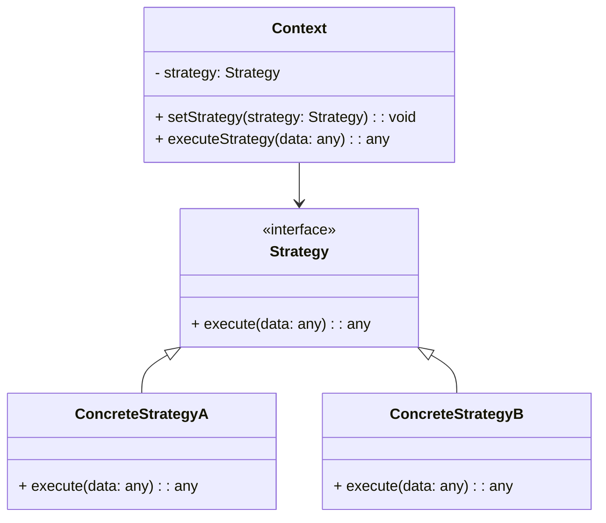

## 8.7 The Strategy Pattern

In the world of software development, flexibility and maintainability are key to building robust applications. One way to achieve these goals is through the use of design patterns. Among these patterns, the **Strategy Pattern** stands out for its ability to define a family of algorithms and make them interchangeable. This pattern is particularly useful when you need to select an algorithm at runtime without altering the code that uses it.

### Understanding the Strategy Pattern

The Strategy Pattern is a behavioral design pattern that enables selecting an algorithm's behavior at runtime. It defines a family of algorithms, encapsulates each one, and makes them interchangeable. This pattern allows the algorithm to vary independently from the clients that use it.

#### Key Concepts

- **Strategy**: An interface common to all supported algorithms. Context uses this interface to call the algorithm defined by a ConcreteStrategy.
- **ConcreteStrategy**: Implements the algorithm using the Strategy interface.
- **Context**: Maintains a reference to a Strategy object and is configured with a ConcreteStrategy object.

### Why Use the Strategy Pattern?

The Strategy Pattern is beneficial in scenarios where:

- You have multiple algorithms for a specific task, and you want to switch between them easily.
- You want to avoid using conditional statements to choose the algorithm.
- You want to adhere to the **Open/Closed Principle**, which states that software entities should be open for extension but closed for modification.

### Implementing the Strategy Pattern in JavaScript

Let's dive into how you can implement the Strategy Pattern in JavaScript. We'll start by defining a simple example where we have different sorting algorithms.

#### Example: Sorting Algorithms

Imagine you have a list of numbers, and you want to sort them using different algorithms. You can use the Strategy Pattern to define these algorithms and switch between them easily.

```javascript
// Strategy Interface
class SortStrategy {
  sort(data) {
    throw new Error("This method should be overridden!");
  }
}

// Concrete Strategy 1: Bubble Sort
class BubbleSortStrategy extends SortStrategy {
  sort(data) {
    console.log("Sorting using Bubble Sort");
    // Bubble sort algorithm implementation
    for (let i = 0; i < data.length; i++) {
      for (let j = 0; j < data.length - i - 1; j++) {
        if (data[j] > data[j + 1]) {
          [data[j], data[j + 1]] = [data[j + 1], data[j]];
        }
      }
    }
    return data;
  }
}

// Concrete Strategy 2: Quick Sort
class QuickSortStrategy extends SortStrategy {
  sort(data) {
    console.log("Sorting using Quick Sort");
    // Quick sort algorithm implementation
    if (data.length <= 1) {
      return data;
    }
    const pivot = data[data.length - 1];
    const left = [];
    const right = [];
    for (const el of data.slice(0, data.length - 1)) {
      el < pivot ? left.push(el) : right.push(el);
    }
    return [...this.sort(left), pivot, ...this.sort(right)];
  }
}

// Context
class Sorter {
  constructor(strategy) {
    this.strategy = strategy;
  }

  setStrategy(strategy) {
    this.strategy = strategy;
  }

  sort(data) {
    return this.strategy.sort(data);
  }
}

// Client Code
const data = [5, 3, 8, 4, 2];
const sorter = new Sorter(new BubbleSortStrategy());
console.log(sorter.sort(data)); // Output: [2, 3, 4, 5, 8]

sorter.setStrategy(new QuickSortStrategy());
console.log(sorter.sort(data)); // Output: [2, 3, 4, 5, 8]
```

In this example, we have two sorting strategies: `BubbleSortStrategy` and `QuickSortStrategy`. The `Sorter` class acts as the context, which can switch between different sorting strategies.

### Benefits of the Strategy Pattern

1. **Code Flexibility**: By encapsulating algorithms, you can easily switch between them without modifying the client code.
2. **Adherence to the Open/Closed Principle**: You can add new strategies without changing the existing code.
3. **Separation of Concerns**: The Strategy Pattern promotes a clean separation between the algorithm's implementation and its usage.

### Real-World Applications

The Strategy Pattern is widely used in various applications. Here are a few examples:

1. **Validation**: Different validation strategies can be applied to user input based on context.
2. **Compression**: Different compression algorithms can be selected based on file type or size.
3. **Payment Processing**: Different payment methods (credit card, PayPal, etc.) can be implemented as strategies.

### Visualizing the Strategy Pattern

To better understand the Strategy Pattern, let's visualize it using a diagram.



In this diagram, the `Context` class maintains a reference to a `Strategy` object. The `Strategy` interface is implemented by `ConcreteStrategyA` and `ConcreteStrategyB`, allowing the context to switch between different strategies.

### Try It Yourself

To get hands-on experience with the Strategy Pattern, try modifying the code example above. Here are a few suggestions:

- Implement a new sorting strategy, such as Merge Sort or Insertion Sort.
- Create a validation strategy for different types of user input (e.g., email, phone number).
- Experiment with different data sets to see how each sorting algorithm performs.

### Assessing Strategies

When implementing the Strategy Pattern, it's important to assess the strategies based on the context and requirements. Consider the following:

- **Performance**: Some algorithms may be more efficient than others for specific data sets.
- **Complexity**: Choose a strategy that is easy to understand and maintain.
- **Scalability**: Ensure the strategy can handle larger data sets or more complex scenarios.

### References and Further Reading

For more information on the Strategy Pattern and design patterns in general, consider the following resources:

- [MDN Web Docs: Design Patterns](https://developer.mozilla.org/en-US/docs/Web/JavaScript/Guide/Design_Patterns)
- [Refactoring Guru: Strategy Pattern](https://refactoring.guru/design-patterns/strategy)
- [W3Schools: JavaScript Design Patterns](https://www.w3schools.com/js/js_design_patterns.asp)

### Knowledge Check

Before moving on, take a moment to review what you've learned about the Strategy Pattern. Consider the following questions:

- What are the key components of the Strategy Pattern?
- How does the Strategy Pattern adhere to the Open/Closed Principle?
- In what scenarios would you use the Strategy Pattern?

### Embrace the Journey

Remember, learning design patterns is a journey. As you continue to explore and implement different patterns, you'll gain a deeper understanding of how to build flexible and maintainable applications. Keep experimenting, stay curious, and enjoy the process!

## Quiz Time!



### What is the primary purpose of the Strategy Pattern?

- [x] To define a family of algorithms and make them interchangeable.
- [ ] To create a single instance of a class.
- [ ] To encapsulate a request as an object.
- [ ] To provide a way to access the elements of an aggregate object sequentially.

> **Explanation:** The Strategy Pattern is used to define a family of algorithms and make them interchangeable, allowing the algorithm to vary independently from the clients that use it.

### Which of the following is NOT a component of the Strategy Pattern?

- [ ] Strategy
- [x] Singleton
- [ ] ConcreteStrategy
- [ ] Context

> **Explanation:** The Singleton is not a component of the Strategy Pattern. The Strategy Pattern consists of Strategy, ConcreteStrategy, and Context.

### How does the Strategy Pattern adhere to the Open/Closed Principle?

- [x] By allowing new strategies to be added without modifying existing code.
- [ ] By ensuring only one instance of a class is created.
- [ ] By encapsulating a request as an object.
- [ ] By providing a way to access the elements of an aggregate object sequentially.

> **Explanation:** The Strategy Pattern adheres to the Open/Closed Principle by allowing new strategies to be added without modifying existing code, thus keeping the code open for extension but closed for modification.

### What is the role of the Context in the Strategy Pattern?

- [x] To maintain a reference to a Strategy object and use it to execute an algorithm.
- [ ] To implement the algorithm using the Strategy interface.
- [ ] To define a family of algorithms.
- [ ] To encapsulate a request as an object.

> **Explanation:** The Context maintains a reference to a Strategy object and uses it to execute an algorithm defined by a ConcreteStrategy.

### Which of the following is an example of where the Strategy Pattern can be applied?

- [x] Sorting methods
- [x] Validation
- [ ] Singleton instance creation
- [ ] Iterator pattern implementation

> **Explanation:** The Strategy Pattern can be applied to sorting methods and validation, where different algorithms or strategies can be used based on the context.

### What is a benefit of using the Strategy Pattern?

- [x] Code flexibility
- [ ] Ensuring a single instance of a class
- [ ] Encapsulating a request as an object
- [ ] Providing a way to access the elements of an aggregate object sequentially

> **Explanation:** One of the benefits of using the Strategy Pattern is code flexibility, as it allows algorithms to be interchangeable without modifying the client code.

### What does the ConcreteStrategy do in the Strategy Pattern?

- [x] Implements the algorithm using the Strategy interface.
- [ ] Maintains a reference to a Strategy object.
- [ ] Defines a family of algorithms.
- [ ] Encapsulates a request as an object.

> **Explanation:** The ConcreteStrategy implements the algorithm using the Strategy interface, providing specific implementations of the strategy.

### How can you switch between different strategies in the Strategy Pattern?

- [x] By setting a new strategy in the Context.
- [ ] By creating a new instance of the Context.
- [ ] By modifying the Strategy interface.
- [ ] By encapsulating a request as an object.

> **Explanation:** You can switch between different strategies in the Strategy Pattern by setting a new strategy in the Context, allowing the algorithm to vary independently.

### True or False: The Strategy Pattern can help avoid using conditional statements to choose an algorithm.

- [x] True
- [ ] False

> **Explanation:** True. The Strategy Pattern helps avoid using conditional statements to choose an algorithm by encapsulating each algorithm in a separate strategy.

### Which principle does the Strategy Pattern promote by separating the algorithm's implementation from its usage?

- [x] Separation of Concerns
- [ ] Single Responsibility Principle
- [ ] Dependency Inversion Principle
- [ ] Liskov Substitution Principle

> **Explanation:** The Strategy Pattern promotes the Separation of Concerns by separating the algorithm's implementation from its usage, allowing for cleaner and more maintainable code.


