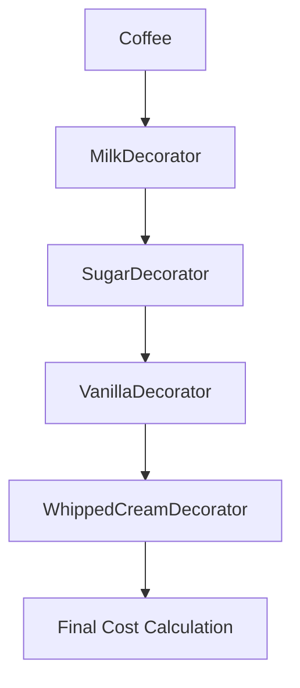

## 8.8 The Decorator Pattern

In the world of software development, flexibility and maintainability are key to building robust applications. The Decorator Pattern is a structural design pattern that allows us to add new functionality to objects dynamically without altering their structure. This pattern is particularly useful in scenarios where subclassing would lead to a proliferation of classes, often referred to as "class explosion." In this section, we'll explore the Decorator Pattern in JavaScript, understand its advantages, and learn how to implement it effectively.

### Introduction to the Decorator Pattern

The Decorator Pattern is a design pattern that allows behavior to be added to individual objects, either statically or dynamically, without affecting the behavior of other objects from the same class. This pattern is often used to adhere to the **Single Responsibility Principle**, which states that a class should have only one reason to change. By using decorators, we can keep our classes focused and extend their functionality without modifying their code.

#### Key Concepts

- **Dynamic Behavior Extension**: Decorators provide a way to extend the behavior of objects at runtime.
- **Alternative to Subclassing**: Instead of creating a complex hierarchy of subclasses, decorators allow for flexible and reusable code.
- **Single Responsibility Principle**: By using decorators, we can ensure that each class has a single responsibility, making the code easier to maintain.

### Implementing the Decorator Pattern in JavaScript

Let's dive into how we can implement the Decorator Pattern in JavaScript. We'll start with a simple example and gradually build upon it to demonstrate the power and flexibility of decorators.

#### Basic Example

Consider a simple `Coffee` class that represents a basic coffee drink. We want to add additional features like milk and sugar without modifying the original class.

```javascript
// Basic Coffee class
class Coffee {
  cost() {
    return 5;
  }
}

// Decorator for adding milk
class MilkDecorator {
  constructor(coffee) {
    this.coffee = coffee;
  }

  cost() {
    return this.coffee.cost() + 1.5;
  }
}

// Decorator for adding sugar
class SugarDecorator {
  constructor(coffee) {
    this.coffee = coffee;
  }

  cost() {
    return this.coffee.cost() + 0.5;
  }
}

// Usage
let myCoffee = new Coffee();
console.log(`Basic Coffee: $${myCoffee.cost()}`); // Basic Coffee: $5

myCoffee = new MilkDecorator(myCoffee);
console.log(`Coffee with Milk: $${myCoffee.cost()}`); // Coffee with Milk: $6.5

myCoffee = new SugarDecorator(myCoffee);
console.log(`Coffee with Milk and Sugar: $${myCoffee.cost()}`); // Coffee with Milk and Sugar: $7
```

In this example, we have a `Coffee` class with a `cost` method. We then create two decorators, `MilkDecorator` and `SugarDecorator`, that add additional costs to the coffee. The decorators wrap around the original object, allowing us to add functionality without altering the original class.

#### Advantages of the Decorator Pattern

The Decorator Pattern offers several advantages:

1. **Flexibility**: Decorators provide a flexible alternative to subclassing for extending functionality. We can mix and match decorators to create new behaviors.
2. **Avoids Class Explosion**: By using decorators, we avoid creating a large number of subclasses, each representing a different combination of features.
3. **Adheres to the Single Responsibility Principle**: Each decorator has a single responsibility, making the code easier to understand and maintain.

### Managing Complexity with Multiple Decorators

While the Decorator Pattern offers flexibility, it can also introduce complexity, especially when multiple decorators are involved. It's important to manage this complexity to maintain readability and maintainability.

#### Example with Multiple Decorators

Let's extend our coffee example by adding more decorators and demonstrating how to manage multiple decorators.

```javascript
// Decorator for adding vanilla flavor
class VanillaDecorator {
  constructor(coffee) {
    this.coffee = coffee;
  }

  cost() {
    return this.coffee.cost() + 2;
  }
}

// Decorator for adding whipped cream
class WhippedCreamDecorator {
  constructor(coffee) {
    this.coffee = coffee;
  }

  cost() {
    return this.coffee.cost() + 1;
  }
}

// Usage with multiple decorators
let fancyCoffee = new Coffee();
fancyCoffee = new MilkDecorator(fancyCoffee);
fancyCoffee = new SugarDecorator(fancyCoffee);
fancyCoffee = new VanillaDecorator(fancyCoffee);
fancyCoffee = new WhippedCreamDecorator(fancyCoffee);

console.log(`Fancy Coffee: $${fancyCoffee.cost()}`); // Fancy Coffee: $11
```

In this example, we have added two more decorators: `VanillaDecorator` and `WhippedCreamDecorator`. By chaining these decorators, we can create a "fancy" coffee with multiple features.

#### Managing Complexity

To manage complexity when using multiple decorators, consider the following strategies:

- **Use Clear Naming Conventions**: Clearly name your decorators to indicate their purpose and functionality.
- **Document the Order of Decorators**: The order in which decorators are applied can affect the final behavior. Document this order to avoid confusion.
- **Limit the Number of Decorators**: While decorators offer flexibility, using too many can make the code difficult to follow. Limit the number of decorators to maintain readability.

### Decorators and the Single Responsibility Principle

The Single Responsibility Principle (SRP) is a fundamental concept in software design that states that a class should have only one reason to change. Decorators help us adhere to this principle by allowing us to separate concerns and extend functionality without modifying existing code.

#### Example: Adhering to SRP with Decorators

Let's revisit our coffee example and see how decorators help us adhere to the SRP.

```javascript
// Basic Coffee class
class Coffee {
  cost() {
    return 5;
  }
}

// Decorator for adding milk
class MilkDecorator {
  constructor(coffee) {
    this.coffee = coffee;
  }

  cost() {
    return this.coffee.cost() + 1.5;
  }
}

// Decorator for adding sugar
class SugarDecorator {
  constructor(coffee) {
    this.coffee = coffee;
  }

  cost() {
    return this.coffee.cost() + 0.5;
  }
}

// Usage
let myCoffee = new Coffee();
myCoffee = new MilkDecorator(myCoffee);
myCoffee = new SugarDecorator(myCoffee);

console.log(`Coffee with Milk and Sugar: $${myCoffee.cost()}`); // Coffee with Milk and Sugar: $7
```

In this example, each decorator has a single responsibility: adding a specific feature to the coffee. This separation of concerns makes the code easier to understand and maintain.

### Potential Complexity and How to Manage It

While the Decorator Pattern offers many benefits, it can also introduce complexity, especially when dealing with multiple decorators. Here are some tips for managing this complexity:

1. **Use Factory Functions**: Consider using factory functions to create decorated objects. This can help encapsulate the creation logic and make the code more readable.

   ```javascript
   function createFancyCoffee() {
     let coffee = new Coffee();
     coffee = new MilkDecorator(coffee);
     coffee = new SugarDecorator(coffee);
     coffee = new VanillaDecorator(coffee);
     coffee = new WhippedCreamDecorator(coffee);
     return coffee;
   }

   let fancyCoffee = createFancyCoffee();
   console.log(`Fancy Coffee: $${fancyCoffee.cost()}`); // Fancy Coffee: $11
   ```

2. **Document the Decorator Chain**: Clearly document the order and purpose of each decorator in the chain. This can help other developers understand the code and make modifications if necessary.

3. **Limit the Number of Decorators**: While decorators offer flexibility, using too many can make the code difficult to follow. Limit the number of decorators to maintain readability.

### Try It Yourself

Now that we've covered the basics of the Decorator Pattern, it's time to experiment with it yourself. Here are some ideas to get you started:

- **Modify the Coffee Example**: Try adding new features to the coffee, such as caramel or chocolate, by creating new decorators.
- **Create a Decorator for a Different Class**: Choose a different class, such as a `Pizza` or `Sandwich`, and implement decorators to add features like extra cheese or toppings.
- **Experiment with Order**: Change the order of decorators and observe how it affects the final behavior.

### Visualizing the Decorator Pattern

To better understand how the Decorator Pattern works, let's visualize the process of decorating an object using a flowchart.



In this flowchart, we start with a `Coffee` object and apply a series of decorators: `MilkDecorator`, `SugarDecorator`, `VanillaDecorator`, and `WhippedCreamDecorator`. Each decorator wraps around the previous one, adding new functionality.

### References and Further Reading

For more information on the Decorator Pattern and other design patterns, consider the following resources:

- [MDN Web Docs: Decorator Pattern](https://developer.mozilla.org/en-US/docs/Web/JavaScript/Guide/Decorators)
- [Refactoring Guru: Decorator Pattern](https://refactoring.guru/design-patterns/decorator)
- [W3Schools: JavaScript Design Patterns](https://www.w3schools.com/js/js_design_patterns.asp)

### Knowledge Check

Before we wrap up, let's review some key points:

- The Decorator Pattern allows us to add functionality to objects dynamically without modifying their structure.
- Decorators provide an alternative to subclassing, offering flexibility and avoiding class explosion.
- By using decorators, we can adhere to the Single Responsibility Principle, making our code easier to maintain.
- It's important to manage complexity when using multiple decorators to maintain readability.

### Embrace the Journey

Remember, learning design patterns is a journey. The Decorator Pattern is just one of many patterns that can help you write more flexible and maintainable code. As you continue to explore object-oriented programming in JavaScript, keep experimenting, stay curious, and enjoy the process!

## Quiz Time!



### What is the primary purpose of the Decorator Pattern?

- [x] To add functionality to objects dynamically without modifying their structure
- [ ] To create new classes that inherit from existing ones
- [ ] To encapsulate a group of individual factories
- [ ] To provide a way to access the elements of an aggregate object sequentially

> **Explanation:** The Decorator Pattern allows us to add functionality to objects dynamically without modifying their structure, providing an alternative to subclassing.

### How does the Decorator Pattern help adhere to the Single Responsibility Principle?

- [x] By allowing each decorator to have a single responsibility
- [ ] By creating a complex hierarchy of subclasses
- [ ] By encapsulating a group of individual factories
- [ ] By providing a way to access the elements of an aggregate object sequentially

> **Explanation:** Each decorator in the Decorator Pattern has a single responsibility, which helps adhere to the Single Responsibility Principle.

### What is a potential disadvantage of using the Decorator Pattern?

- [x] It can introduce complexity when multiple decorators are used
- [ ] It requires modifying the original class
- [ ] It limits the flexibility of the code
- [ ] It makes the code less maintainable

> **Explanation:** While the Decorator Pattern offers flexibility, it can introduce complexity when multiple decorators are used, making the code harder to follow.

### How can we manage complexity when using multiple decorators?

- [x] By using factory functions to create decorated objects
- [ ] By creating a complex hierarchy of subclasses
- [ ] By encapsulating a group of individual factories
- [ ] By providing a way to access the elements of an aggregate object sequentially

> **Explanation:** Using factory functions to create decorated objects can help manage complexity and make the code more readable.

### What is the benefit of using decorators over subclassing?

- [x] Decorators provide flexibility and avoid class explosion
- [ ] Decorators require modifying the original class
- [ ] Decorators limit the flexibility of the code
- [ ] Decorators make the code less maintainable

> **Explanation:** Decorators provide flexibility and avoid class explosion by allowing us to add functionality to objects dynamically without creating a large number of subclasses.

### In the coffee example, what is the final cost of a coffee with milk, sugar, vanilla, and whipped cream?

- [x] $11
- [ ] $10
- [ ] $9
- [ ] $8

> **Explanation:** The final cost of a coffee with milk, sugar, vanilla, and whipped cream is $11, as each decorator adds to the base cost of $5.

### What is the role of the `cost` method in the coffee example?

- [x] To calculate the total cost of the coffee with all decorators applied
- [ ] To create a new instance of the coffee
- [ ] To modify the original coffee class
- [ ] To provide a way to access the elements of an aggregate object sequentially

> **Explanation:** The `cost` method calculates the total cost of the coffee with all decorators applied, adding the cost of each decorator to the base cost.

### Which of the following is NOT a benefit of the Decorator Pattern?

- [ ] It allows dynamic behavior extension
- [ ] It provides an alternative to subclassing
- [x] It requires modifying the original class
- [ ] It adheres to the Single Responsibility Principle

> **Explanation:** The Decorator Pattern does not require modifying the original class; instead, it allows dynamic behavior extension and adheres to the Single Responsibility Principle.

### How can we visualize the process of decorating an object?

- [x] By using a flowchart to represent the decorator chain
- [ ] By creating a complex hierarchy of subclasses
- [ ] By encapsulating a group of individual factories
- [ ] By providing a way to access the elements of an aggregate object sequentially

> **Explanation:** A flowchart can be used to represent the decorator chain, showing how each decorator wraps around the previous one to add new functionality.

### True or False: The Decorator Pattern is only applicable to JavaScript.

- [ ] True
- [x] False

> **Explanation:** False. The Decorator Pattern is a design pattern that can be applied in many programming languages, not just JavaScript.


