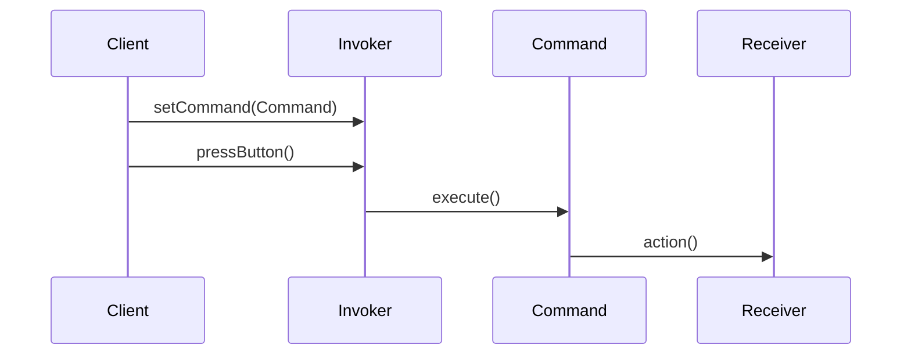

## 8.9 The Command Pattern

In the realm of software design, the Command Pattern stands out as a versatile and powerful tool. It allows developers to encapsulate requests as objects, which can be parameterized, queued, logged, and even undone. This pattern is particularly useful in scenarios where actions need to be executed, undone, or queued in a flexible manner. In this section, we will explore the Command Pattern in JavaScript, understand its components, and see how it can be implemented to enhance software design.

### Understanding the Command Pattern

The Command Pattern is a behavioral design pattern that turns a request into a stand-alone object containing all the information about the request. This transformation allows for parameterizing other objects with different requests, delaying or queueing a request's execution, and supporting undoable operations.

#### Key Concepts of the Command Pattern

- **Command Object**: Encapsulates all the details of an action or request.
- **Receiver**: The object that performs the actual work when the command is executed.
- **Invoker**: The object that decides when to execute the command.
- **Client**: Creates the command object and sets its receiver.

By encapsulating requests, the Command Pattern decouples the sender of a request from its receiver, allowing for more flexible and maintainable code.

### Primary Use Cases

The Command Pattern is particularly useful in the following scenarios:

- **Undo/Redo Functionality**: By storing commands in a history list, you can easily implement undo and redo operations.
- **Transaction Management**: Commands can be queued and executed in a controlled manner, making them ideal for managing transactions.
- **Macro Recording**: Commands can be recorded and replayed, allowing for macro functionality.
- **Decoupling**: It decouples the invoker of a request from the object that performs the action, enhancing flexibility and scalability.

### Implementing the Command Pattern in JavaScript

Let's dive into how we can implement the Command Pattern in JavaScript. We'll build a simple example to illustrate the pattern's components and how they interact.

#### Step 1: Define the Command Interface

First, we need to define a command interface. In JavaScript, this can be done by creating a class with an `execute` method.

```javascript
class Command {
  execute() {
    throw new Error("This method should be overridden.");
  }
}
```

#### Step 2: Create Concrete Command Classes

Next, we create concrete command classes that implement the command interface. These classes will encapsulate the actions to be performed.

```javascript
class LightOnCommand extends Command {
  constructor(light) {
    super();
    this.light = light;
  }

  execute() {
    this.light.turnOn();
  }
}

class LightOffCommand extends Command {
  constructor(light) {
    super();
    this.light = light;
  }

  execute() {
    this.light.turnOff();
  }
}
```

#### Step 3: Define the Receiver

The receiver is the object that knows how to perform the work needed to carry out the request. In our example, the receiver is a `Light` class.

```javascript
class Light {
  turnOn() {
    console.log("The light is on.");
  }

  turnOff() {
    console.log("The light is off.");
  }
}
```

#### Step 4: Implement the Invoker

The invoker is responsible for executing the command. It doesn't know how the command is executed, only that it can execute it.

```javascript
class RemoteControl {
  constructor() {
    this.command = null;
  }

  setCommand(command) {
    this.command = command;
  }

  pressButton() {
    if (this.command) {
      this.command.execute();
    }
  }
}
```

#### Step 5: Putting It All Together

Finally, let's see how these components work together.

```javascript
// Create the receiver
const light = new Light();

// Create command objects
const lightOn = new LightOnCommand(light);
const lightOff = new LightOffCommand(light);

// Create the invoker
const remote = new RemoteControl();

// Turn the light on
remote.setCommand(lightOn);
remote.pressButton(); // Output: The light is on.

// Turn the light off
remote.setCommand(lightOff);
remote.pressButton(); // Output: The light is off.
```

### Benefits of the Command Pattern

The Command Pattern offers several benefits:

- **Decoupling**: It decouples the invoker from the receiver, allowing for flexible command execution.
- **Extensibility**: New commands can be added without changing existing code.
- **Undo/Redo**: Commands can be stored and reversed, enabling undo/redo functionality.
- **Macro Commands**: Multiple commands can be combined into a single command, allowing for complex operations.

### Scenarios for Enhanced Extensibility

The Command Pattern is particularly useful in applications where actions need to be executed in a flexible manner. Here are some scenarios where it can enhance extensibility:

- **Graphical User Interfaces (GUIs)**: Buttons and menu items can be associated with commands, allowing for dynamic behavior changes.
- **Game Development**: Actions such as move, attack, and defend can be encapsulated as commands, making it easy to implement complex behaviors.
- **Home Automation**: Commands can be used to control devices, allowing for flexible automation setups.

### Visualizing the Command Pattern

To better understand the Command Pattern, let's visualize its components and interactions using a sequence diagram.



**Diagram Description**: This sequence diagram illustrates the interaction between the client, invoker, command, and receiver. The client sets the command on the invoker, which then executes the command, triggering the receiver's action.

### Try It Yourself

Now that we've covered the basics of the Command Pattern, try modifying the example to add new commands. For instance, you could create a `DimLightCommand` that dims the light to a specific level. Experiment with adding undo functionality by storing executed commands in a history list.

### References and Further Reading

For more information on the Command Pattern and other design patterns, consider exploring the following resources:

- [MDN Web Docs: JavaScript](https://developer.mozilla.org/en-US/docs/Web/JavaScript)
- [Refactoring Guru: Command Pattern](https://refactoring.guru/design-patterns/command)
- [W3Schools: JavaScript Tutorial](https://www.w3schools.com/js/)

### Knowledge Check

To reinforce your understanding of the Command Pattern, let's go through some key takeaways:

- The Command Pattern encapsulates requests as objects, allowing for flexible and extensible software design.
- It decouples the invoker from the receiver, enhancing maintainability.
- Commands can be queued, logged, and undone, making them ideal for complex applications.

### Embrace the Journey

Remember, this is just the beginning. As you progress, you'll discover more design patterns and techniques that will empower you to build robust and scalable applications. Keep experimenting, stay curious, and enjoy the journey!

## Quiz Time!



### What is the primary purpose of the Command Pattern?

- [x] To encapsulate a request as an object
- [ ] To create a single instance of a class
- [ ] To provide a global point of access
- [ ] To define a family of algorithms

> **Explanation:** The Command Pattern encapsulates a request as an object, allowing for flexible and extensible software design.

### Which component of the Command Pattern is responsible for executing the command?

- [ ] Client
- [x] Invoker
- [ ] Receiver
- [ ] Command

> **Explanation:** The Invoker is responsible for executing the command, while the Command encapsulates the action and the Receiver performs the actual work.

### What is a key benefit of the Command Pattern?

- [x] Decoupling the invoker from the receiver
- [ ] Ensuring a class has only one instance
- [ ] Simplifying module syntax
- [ ] Creating non-enumerable properties

> **Explanation:** The Command Pattern decouples the invoker from the receiver, enhancing flexibility and maintainability.

### How can the Command Pattern support undo functionality?

- [x] By storing executed commands in a history list
- [ ] By using the singleton pattern
- [ ] By defining a family of algorithms
- [ ] By creating non-enumerable properties

> **Explanation:** The Command Pattern can support undo functionality by storing executed commands in a history list, allowing them to be reversed.

### Which of the following is NOT a component of the Command Pattern?

- [ ] Command
- [ ] Receiver
- [ ] Invoker
- [x] Singleton

> **Explanation:** The Singleton is not a component of the Command Pattern. The Command Pattern consists of Command, Receiver, Invoker, and Client.

### What role does the Client play in the Command Pattern?

- [x] It creates the command object and sets its receiver
- [ ] It performs the actual work
- [ ] It decides when to execute the command
- [ ] It encapsulates the request

> **Explanation:** The Client creates the command object and sets its receiver, while the Invoker decides when to execute the command.

### In which scenario is the Command Pattern particularly useful?

- [x] Implementing undo/redo functionality
- [ ] Ensuring a class has only one instance
- [ ] Simplifying module syntax
- [ ] Creating non-enumerable properties

> **Explanation:** The Command Pattern is particularly useful for implementing undo/redo functionality by storing commands in a history list.

### What is the role of the Receiver in the Command Pattern?

- [ ] It creates the command object
- [ ] It decides when to execute the command
- [x] It performs the actual work when the command is executed
- [ ] It encapsulates the request

> **Explanation:** The Receiver performs the actual work when the command is executed, while the Command encapsulates the request.

### How does the Command Pattern enhance extensibility?

- [x] By allowing new commands to be added without changing existing code
- [ ] By ensuring a class has only one instance
- [ ] By simplifying module syntax
- [ ] By creating non-enumerable properties

> **Explanation:** The Command Pattern enhances extensibility by allowing new commands to be added without changing existing code, making it easy to extend functionality.

### True or False: The Command Pattern can be used to create macro commands that combine multiple commands into one.

- [x] True
- [ ] False

> **Explanation:** True. The Command Pattern can be used to create macro commands that combine multiple commands into one, allowing for complex operations.


