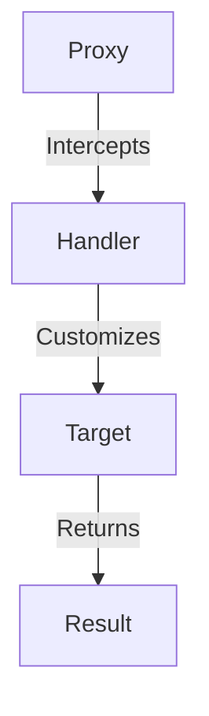

## 9.1 Metaprogramming in JavaScript

Welcome to the fascinating world of metaprogramming in JavaScript! In this section, we will explore how JavaScript allows us to write programs that can manipulate other programs or even themselves. This capability, known as metaprogramming, leverages powerful language features to enhance flexibility and expressiveness in your code.

### What is Metaprogramming?

Metaprogramming is a programming technique where programs have the ability to treat other programs as their data. This means that a program can be designed to read, generate, analyze, or transform other programs, and even modify itself while running. Metaprogramming can be used to automate repetitive tasks, create domain-specific languages, and implement features like aspect-oriented programming.

### Significance of Metaprogramming in Software Development

Metaprogramming plays a significant role in software development by providing the following benefits:

- **Flexibility**: It allows developers to write more adaptable and reusable code.
- **Expressiveness**: Developers can create more readable and concise code by abstracting complex patterns.
- **Automation**: It enables the automation of repetitive coding tasks, reducing errors and saving time.
- **Customization**: Developers can tailor the behavior of libraries and frameworks to better fit specific needs.

### Metaprogramming Capabilities in JavaScript

JavaScript, as a dynamic language, offers several metaprogramming capabilities that allow developers to execute code dynamically and modify it at runtime. Let's explore some of these capabilities:

#### Dynamic Code Execution

JavaScript provides mechanisms to execute code dynamically, which is a core aspect of metaprogramming. The two primary methods for dynamic code execution are `eval()` and the `Function` constructor.

1. **Using `eval()`**

   The `eval()` function evaluates a string as JavaScript code. It can execute a string of code at runtime, allowing for dynamic code execution.

   ```javascript
   // Example of eval()
   const code = "console.log('Hello, World!')";
   eval(code); // Outputs: Hello, World!
   ```

   **Caution**: While `eval()` can be powerful, it poses significant security risks, such as code injection attacks. Use it sparingly and only with trusted input.

2. **Using the `Function` Constructor**

   The `Function` constructor creates a new function from a string of code. It is safer than `eval()` because it creates a new function scope.

   ```javascript
   // Example of Function constructor
   const add = new Function('a', 'b', 'return a + b');
   console.log(add(2, 3)); // Outputs: 5
   ```

#### Dynamic Property Access

JavaScript allows dynamic access to object properties using bracket notation. This feature is particularly useful in metaprogramming for accessing properties whose names are not known until runtime.

```javascript
// Dynamic property access
const obj = { name: 'Alice', age: 25 };
const propName = 'name';
console.log(obj[propName]); // Outputs: Alice
```

### Proxies and Reflection in JavaScript

JavaScript introduces powerful metaprogramming capabilities through proxies and the Reflect API, enabling developers to intercept and customize operations on objects.

#### Proxies

A proxy is an object that wraps another object and intercepts operations performed on it, such as property access, assignment, and function invocation. Proxies provide a way to customize the behavior of objects.

```javascript
// Example of a proxy
const target = { message: 'Hello' };
const handler = {
  get: function(target, property) {
    if (property === 'message') {
      return target[property] + ', World!';
    }
    return target[property];
  }
};

const proxy = new Proxy(target, handler);
console.log(proxy.message); // Outputs: Hello, World!
```

In this example, the proxy intercepts the `get` operation and customizes the behavior of accessing the `message` property.

#### The Reflect API

The Reflect API is a built-in object that provides methods for interceptable JavaScript operations. It complements proxies by providing a way to perform default operations.

```javascript
// Example of using Reflect
const target = { x: 10, y: 20 };
const handler = {
  get: function(target, property) {
    console.log(`Accessing property: ${property}`);
    return Reflect.get(target, property);
  }
};

const proxy = new Proxy(target, handler);
console.log(proxy.x); // Outputs: Accessing property: x
                      //          10
```

### Practical Applications of Metaprogramming

Metaprogramming can be applied in various practical scenarios to enhance code flexibility and expressiveness.

#### Creating Domain-Specific Languages (DSLs)

Metaprogramming allows developers to create domain-specific languages tailored to specific problem domains. These languages can simplify complex tasks by providing a more intuitive syntax.

#### Implementing Aspect-Oriented Programming (AOP)

Aspect-oriented programming is a programming paradigm that aims to increase modularity by allowing the separation of cross-cutting concerns. Metaprogramming can be used to implement AOP by dynamically adding behavior to existing code.

### Risks and Drawbacks of Metaprogramming

While metaprogramming offers many benefits, it also comes with potential risks and drawbacks:

- **Security Vulnerabilities**: Dynamic code execution can introduce security risks, such as code injection attacks.
- **Increased Complexity**: Metaprogramming can make code harder to understand and maintain, especially for developers unfamiliar with the techniques.
- **Performance Overhead**: Intercepting and modifying operations at runtime can introduce performance overhead.

### Best Practices for Metaprogramming

To mitigate the risks associated with metaprogramming, consider the following best practices:

- **Use with Caution**: Only use metaprogramming when necessary and with trusted input.
- **Keep It Simple**: Avoid unnecessary complexity and strive for clear and maintainable code.
- **Document Thoroughly**: Provide clear documentation to help others understand the metaprogramming techniques used.
- **Test Rigorously**: Ensure thorough testing to catch potential issues early.

### Try It Yourself

Now that we've explored the concepts of metaprogramming, let's encourage you to experiment with the examples provided. Try modifying the code to see how changes affect the behavior. For instance, you could:

- Change the property name in the dynamic property access example.
- Modify the handler in the proxy example to intercept different operations.

### Visualizing Metaprogramming Concepts

To better understand how metaprogramming works in JavaScript, let's visualize the interaction between proxies, targets, and handlers using a diagram.



**Diagram Description**: This diagram illustrates how a proxy intercepts operations on a target object, allowing a handler to customize the behavior before returning the result.

### References and Further Reading

For more information on metaprogramming in JavaScript, consider exploring the following resources:

- [MDN Web Docs on Proxies](https://developer.mozilla.org/en-US/docs/Web/JavaScript/Reference/Global_Objects/Proxy)
- [MDN Web Docs on Reflect](https://developer.mozilla.org/en-US/docs/Web/JavaScript/Reference/Global_Objects/Reflect)
- [JavaScript.info on Metaprogramming](https://javascript.info/metaprogramming)

### Knowledge Check

Before we conclude, let's reinforce what we've learned with a few questions:

- What is metaprogramming, and why is it significant in software development?
- How does JavaScript support dynamic code execution?
- What are proxies, and how do they enhance metaprogramming capabilities?
- What are some practical applications of metaprogramming?
- What are the potential risks associated with metaprogramming?

### Embrace the Journey

Remember, this is just the beginning of your journey into the world of metaprogramming. As you progress, you'll discover more ways to leverage these powerful techniques to write more flexible and expressive code. Keep experimenting, stay curious, and enjoy the journey!

## Quiz Time!



### What is metaprogramming?

- [x] A technique where programs can manipulate other programs or themselves
- [ ] A method for optimizing code performance
- [ ] A way to write code without using variables
- [ ] A process for compiling code into machine language

> **Explanation:** Metaprogramming involves writing programs that can manipulate other programs or themselves, enhancing flexibility and expressiveness.

### Which JavaScript function allows dynamic code execution?

- [x] eval()
- [ ] console.log()
- [ ] parseInt()
- [ ] JSON.stringify()

> **Explanation:** The `eval()` function in JavaScript allows dynamic code execution by evaluating a string as JavaScript code.

### What is a proxy in JavaScript?

- [x] An object that intercepts operations on another object
- [ ] A function that executes code asynchronously
- [ ] A method for handling errors in code
- [ ] A data structure for storing key-value pairs

> **Explanation:** A proxy in JavaScript is an object that wraps another object and intercepts operations performed on it, allowing customization of behavior.

### How can metaprogramming be used in software development?

- [x] To create domain-specific languages
- [ ] To increase the size of the codebase
- [ ] To remove all comments from code
- [ ] To convert JavaScript code to Python

> **Explanation:** Metaprogramming can be used to create domain-specific languages, which simplify complex tasks by providing a more intuitive syntax.

### What is the Reflect API used for?

- [x] To perform default operations in JavaScript
- [ ] To create new HTML elements
- [ ] To manage memory allocation
- [ ] To encrypt data in web applications

> **Explanation:** The Reflect API provides methods for interceptable JavaScript operations, complementing proxies by allowing default operations to be performed.

### What is a potential risk of using metaprogramming?

- [x] Security vulnerabilities
- [ ] Faster code execution
- [ ] Increased readability
- [ ] Simplified debugging

> **Explanation:** Metaprogramming can introduce security vulnerabilities, such as code injection attacks, due to dynamic code execution.

### Which of the following is a best practice for metaprogramming?

- [x] Use with caution and trusted input
- [ ] Avoid using any comments
- [ ] Always use `eval()` for dynamic code
- [ ] Write code without testing

> **Explanation:** It is important to use metaprogramming with caution and trusted input to avoid security risks and maintain code clarity.

### What does the `Function` constructor do?

- [x] Creates a new function from a string of code
- [ ] Logs messages to the console
- [ ] Parses JSON data
- [ ] Encrypts text for security

> **Explanation:** The `Function` constructor creates a new function from a string of code, providing a safer alternative to `eval()` for dynamic code execution.

### How can proxies enhance code flexibility?

- [x] By intercepting and customizing object operations
- [ ] By removing all error messages
- [ ] By converting JavaScript to another language
- [ ] By increasing the number of variables

> **Explanation:** Proxies enhance code flexibility by intercepting and customizing operations on objects, allowing developers to tailor behavior.

### True or False: Metaprogramming can lead to increased code complexity.

- [x] True
- [ ] False

> **Explanation:** Metaprogramming can lead to increased code complexity, making it harder to understand and maintain, especially for developers unfamiliar with the techniques.


