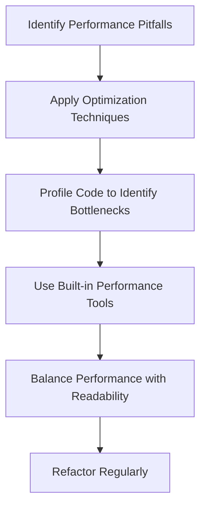

## 9.10 Performance Optimization in OOP

Object-oriented programming (OOP) in JavaScript provides a robust framework for building scalable and maintainable applications. However, as with any programming paradigm, there are performance considerations to keep in mind. In this section, we'll explore techniques to enhance the performance of your object-oriented code, ensuring that your applications run efficiently without sacrificing readability and maintainability.

### Understanding Performance Pitfalls in OOP

Before diving into optimization techniques, it's crucial to recognize common performance pitfalls in OOP. These pitfalls can lead to inefficient code execution and increased resource consumption, which can impact the overall performance of your application.

#### 1. Deep Inheritance Hierarchies

One of the most common pitfalls in OOP is the use of deep inheritance hierarchies. While inheritance allows for code reuse and logical organization, excessive use can lead to complex and slow code execution. Each level of inheritance adds overhead, as JavaScript must traverse the prototype chain to resolve properties and methods.

#### 2. Excessive Object Creation

Creating too many objects, especially in a short time, can lead to performance bottlenecks. Each object consumes memory, and excessive creation can strain the garbage collector, leading to increased latency and reduced application responsiveness.

#### 3. Unnecessary Computations

Performing unnecessary computations, such as recalculating values that haven't changed, can waste CPU cycles and slow down your application. This is particularly relevant in scenarios where computations are performed repeatedly, such as in loops or recursive functions.

### Strategies for Optimizing Object-Oriented Code

Now that we've identified some common pitfalls, let's explore strategies to optimize your object-oriented JavaScript code.

#### Method Inlining

Method inlining is a technique where small, frequently called methods are replaced with their body code to reduce the overhead of function calls. This can lead to significant performance improvements, especially in performance-critical sections of your code.

```javascript
class MathOperations {
  // Original method
  square(num) {
    return num * num;
  }
}

// Inlined method
class MathOperations {
  calculateSquare(num) {
    // Directly return the computation instead of calling a separate method
    return num * num;
  }
}
```

#### Memoization

Memoization is a powerful optimization technique that involves caching the results of expensive function calls and returning the cached result when the same inputs occur again. This is particularly useful for functions with expensive computations or recursive calls.

```javascript
class Fibonacci {
  constructor() {
    this.cache = {};
  }

  calculate(n) {
    if (n in this.cache) {
      return this.cache[n];
    }
    if (n <= 1) {
      return n;
    }
    this.cache[n] = this.calculate(n - 1) + this.calculate(n - 2);
    return this.cache[n];
  }
}

const fib = new Fibonacci();
console.log(fib.calculate(10)); // Outputs: 55
```

#### Efficient Use of Data Structures

Choosing the right data structure can have a significant impact on the performance of your application. Arrays, objects, maps, and sets each have their strengths and weaknesses. Understanding these can help you select the most efficient structure for your needs.

- **Arrays** are great for ordered collections and support fast access by index.
- **Objects** are ideal for key-value pairs but can have slower access times compared to maps.
- **Maps** offer better performance for frequent additions and deletions.
- **Sets** are useful for storing unique values and provide fast lookups.

#### Avoiding Unnecessary Computations

To avoid unnecessary computations, ensure that your code only performs calculations when needed. This can be achieved through techniques such as lazy evaluation, where computations are deferred until their results are required.

```javascript
class DataProcessor {
  constructor(data) {
    this.data = data;
    this.processedData = null;
  }

  processData() {
    if (!this.processedData) {
      // Perform expensive computation only if necessary
      this.processedData = this.data.map(item => item * 2);
    }
    return this.processedData;
  }
}

const processor = new DataProcessor([1, 2, 3]);
console.log(processor.processData()); // Outputs: [2, 4, 6]
```

### Profiling Code to Identify Bottlenecks

Profiling is an essential step in performance optimization. It involves analyzing your code to identify sections that are causing performance issues. JavaScript provides several tools for profiling, including the built-in performance API and browser developer tools.

#### Using the Performance API

The Performance API allows you to measure the time taken by specific code blocks, helping you identify bottlenecks.

```javascript
const start = performance.now();

// Code block to measure
for (let i = 0; i < 1000000; i++) {
  // Some computation
}

const end = performance.now();
console.log(`Execution time: ${end - start} milliseconds`);
```

#### Browser Developer Tools

Most modern browsers come with developer tools that include performance profiling features. These tools allow you to record the execution of your application and analyze the performance of different functions and operations.

- **Chrome DevTools**: Provides a comprehensive set of tools for profiling and debugging JavaScript applications.
- **Firefox Developer Edition**: Offers performance analysis tools similar to Chrome DevTools.
- **Safari Web Inspector**: Includes a timeline for analyzing resource usage and performance.

### Balancing Performance with Readability and Maintainability

While optimizing for performance is important, it's crucial to balance these efforts with code readability and maintainability. Over-optimization can lead to complex and hard-to-understand code, which can be challenging to maintain and extend.

#### Tips for Balancing Optimization

1. **Prioritize Readability**: Write clear and understandable code. Use comments and meaningful variable names to enhance readability.
2. **Optimize Critical Sections**: Focus your optimization efforts on performance-critical sections of your code. Use profiling to identify these areas.
3. **Avoid Premature Optimization**: Optimize only when necessary. Premature optimization can lead to unnecessary complexity.
4. **Refactor Regularly**: Regularly review and refactor your code to improve both performance and readability.

### Using Built-in JavaScript Performance Tools

JavaScript provides several built-in tools and functions to help you optimize performance. These tools can be used to measure execution time, analyze memory usage, and identify potential bottlenecks.

#### Benchmarking Practices

Benchmarking involves running your code under controlled conditions to measure its performance. This can help you compare different implementations and choose the most efficient one.

```javascript
function benchmark(fn, iterations = 1000) {
  const start = performance.now();
  for (let i = 0; i < iterations; i++) {
    fn();
  }
  const end = performance.now();
  return end - start;
}

function testFunction() {
  // Some computation
}

console.log(`Benchmark time: ${benchmark(testFunction)} milliseconds`);
```

### Conclusion

Performance optimization in object-oriented JavaScript is a critical aspect of building efficient applications. By understanding common pitfalls, employing optimization techniques, and using profiling tools, you can enhance the performance of your code while maintaining readability and maintainability. Remember, optimization is a continuous process, and balancing performance with other aspects of software development is key to creating successful applications.

### Try It Yourself

Experiment with the code examples provided in this section. Try modifying the `Fibonacci` class to use an iterative approach instead of recursion. Measure the performance of both implementations using the `benchmark` function and compare the results.

### Visualizing Performance Optimization

To help visualize the concepts discussed in this section, let's use a flowchart to represent the process of optimizing object-oriented code in JavaScript.



This flowchart illustrates the iterative nature of performance optimization, emphasizing the importance of continuous improvement and balance.

### References and Further Reading

- [MDN Web Docs: Performance](https://developer.mozilla.org/en-US/docs/Web/API/Performance)
- [Google Chrome DevTools](https://developer.chrome.com/docs/devtools/)
- [JavaScript.info: Performance Optimization](https://javascript.info/performance)

## Quiz Time!



### What is a common performance pitfall in OOP related to inheritance?

- [x] Deep inheritance hierarchies
- [ ] Shallow inheritance hierarchies
- [ ] No inheritance
- [ ] Flat inheritance hierarchies

> **Explanation:** Deep inheritance hierarchies can lead to complex and slow code execution due to the overhead of traversing the prototype chain.

### Which technique involves caching the results of expensive function calls?

- [x] Memoization
- [ ] Method inlining
- [ ] Lazy evaluation
- [ ] Benchmarking

> **Explanation:** Memoization caches the results of expensive function calls to avoid redundant computations.

### What is the purpose of method inlining?

- [x] To reduce the overhead of function calls
- [ ] To increase the number of function calls
- [ ] To cache function results
- [ ] To defer computations

> **Explanation:** Method inlining replaces small, frequently called methods with their body code to reduce the overhead of function calls.

### Which data structure is ideal for storing unique values?

- [x] Set
- [ ] Array
- [ ] Object
- [ ] Map

> **Explanation:** A Set is used for storing unique values and provides fast lookups.

### What is the role of the Performance API in JavaScript?

- [x] To measure the time taken by specific code blocks
- [ ] To create new objects
- [ ] To inline methods
- [ ] To manage memory

> **Explanation:** The Performance API measures the time taken by specific code blocks, helping identify bottlenecks.

### Why is balancing performance with readability important?

- [x] To maintain code maintainability and understandability
- [ ] To increase code complexity
- [ ] To reduce code size
- [ ] To avoid using comments

> **Explanation:** Balancing performance with readability ensures that code remains maintainable and understandable.

### What is the benefit of using browser developer tools for profiling?

- [x] They provide a comprehensive set of tools for analyzing performance
- [ ] They replace the need for comments
- [ ] They increase code execution speed
- [ ] They remove unused variables

> **Explanation:** Browser developer tools offer a comprehensive set of tools for analyzing performance and debugging JavaScript applications.

### What should be prioritized when optimizing code?

- [x] Readability
- [ ] Complexity
- [ ] Obfuscation
- [ ] Redundancy

> **Explanation:** Readability should be prioritized to ensure that code is easy to understand and maintain.

### Which technique involves deferring computations until their results are required?

- [x] Lazy evaluation
- [ ] Memoization
- [ ] Method inlining
- [ ] Benchmarking

> **Explanation:** Lazy evaluation defers computations until their results are required, avoiding unnecessary computations.

### True or False: Premature optimization can lead to unnecessary complexity.

- [x] True
- [ ] False

> **Explanation:** Premature optimization can lead to unnecessary complexity, making code harder to maintain and understand.


