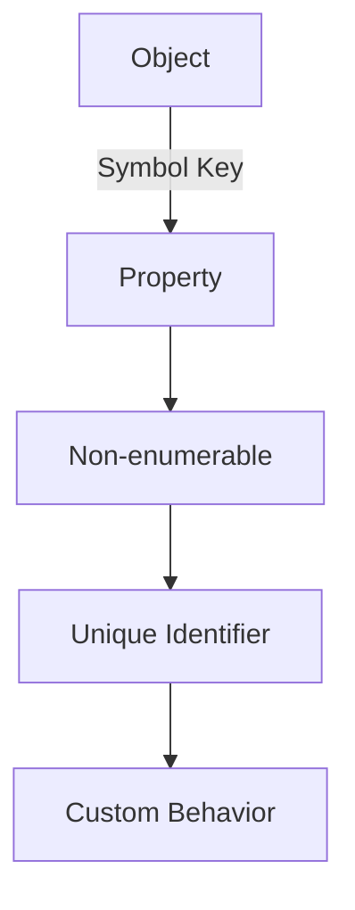

## 9.2 Symbols and Their Uses

In the world of JavaScript, symbols are a relatively new addition, introduced with ECMAScript 6 (ES6). They provide a unique and immutable data type that can be used as identifiers for object properties. This section will delve into the characteristics of symbols, their practical uses, and how they can enhance your object-oriented programming in JavaScript.

### Introduction to Symbols

Symbols in JavaScript are a primitive data type, just like numbers, strings, and booleans. However, unlike other primitives, each symbol is unique. This uniqueness is what makes symbols particularly useful as property keys in objects, where they can help avoid naming conflicts.

#### Characteristics of Symbols

- **Uniqueness**: Every symbol is unique, even if two symbols are created with the same description.
- **Immutability**: Once a symbol is created, it cannot be changed.
- **Non-enumerability**: Symbol properties are not included in standard object property enumerations, such as `for...in` loops or `Object.keys()`.

Let's see how we can create a symbol in JavaScript:

```javascript
// Creating a symbol
const mySymbol = Symbol('description');

// Logging the symbol
console.log(mySymbol); // Output: Symbol(description)
```

In the example above, we create a symbol with a description. The description is optional and is used only for debugging purposes; it does not affect the uniqueness of the symbol.

### Using Symbols as Property Keys

Symbols can be used as property keys in objects, providing a way to create properties that are unique and non-enumerable. This can be particularly useful in large codebases or when developing libraries, where name collisions can be a concern.

#### Defining Symbol-Keyed Properties

To define a symbol-keyed property, you simply use a symbol as the key in an object literal or with the bracket notation.

```javascript
// Creating symbols
const uniqueId = Symbol('id');

// Using symbol as a property key
const user = {
  [uniqueId]: 12345,
  name: 'Alice'
};

// Accessing symbol-keyed property
console.log(user[uniqueId]); // Output: 12345
```

In this example, `uniqueId` is a symbol used as a property key in the `user` object. This property is not enumerable, meaning it won't show up in `for...in` loops or `Object.keys()`.

#### Accessing Symbol-Keyed Properties

Symbol-keyed properties can be accessed using the bracket notation, similar to how you access properties with string keys.

```javascript
// Accessing symbol-keyed property
console.log(user[uniqueId]); // Output: 12345
```

### Use Cases for Symbols

Symbols can be used in various scenarios to enhance object-oriented programming in JavaScript. Here are some common use cases:

#### Implementing Private Properties

While symbols do not provide true privacy, they can be used to create properties that are harder to access accidentally, as they do not appear in standard property enumerations.

```javascript
// Symbol for private property
const _private = Symbol('private');

class MyClass {
  constructor() {
    this[_private] = 'secret';
  }

  getPrivate() {
    return this[_private];
  }
}

const instance = new MyClass();
console.log(instance.getPrivate()); // Output: secret
```

In this example, `_private` is a symbol used to define a "private" property in `MyClass`. The property is not directly accessible through standard enumeration methods.

#### Customizing Object Behavior

Symbols can also be used to customize object behavior by implementing well-known symbols. These are predefined symbols that JavaScript uses to hook into certain object behaviors.

### Well-Known Symbols

JavaScript provides several well-known symbols that allow developers to customize object behavior. These symbols are part of the language specification and are used by JavaScript engines to perform certain operations.

#### Symbol.iterator

`Symbol.iterator` is a well-known symbol that specifies the default iterator for an object. It is used by the `for...of` loop and other iteration protocols.

```javascript
// Custom iterable object
const iterableObject = {
  data: [1, 2, 3],
  [Symbol.iterator]() {
    let index = 0;
    const data = this.data;
    return {
      next() {
        if (index < data.length) {
          return { value: data[index++], done: false };
        } else {
          return { done: true };
        }
      }
    };
  }
};

// Using for...of loop
for (const value of iterableObject) {
  console.log(value); // Output: 1, 2, 3
}
```

In this example, we define a custom iterable object by implementing the `Symbol.iterator` method. This allows us to use the `for...of` loop to iterate over the object's data.

#### Symbol.toStringTag

`Symbol.toStringTag` is used to customize the default string description of an object when `Object.prototype.toString()` is called.

```javascript
// Custom object with toStringTag
const customObject = {
  [Symbol.toStringTag]: 'CustomObject'
};

console.log(Object.prototype.toString.call(customObject)); // Output: [object CustomObject]
```

Here, we define a custom `toStringTag` for `customObject`, which changes the default string representation when `Object.prototype.toString()` is used.

### Benefits of Using Symbols

Symbols offer several advantages, especially in large codebases or when developing libraries:

- **Avoiding Name Collisions**: Symbols provide a way to create unique property keys, reducing the risk of name collisions in objects.
- **Enhancing Encapsulation**: By using symbols, you can create properties that are not easily accessible or enumerable, enhancing encapsulation.
- **Customizing Object Behavior**: Well-known symbols allow you to customize the behavior of objects, making them more flexible and powerful.

### Limitations of Symbols

While symbols are powerful, they come with some limitations:

- **Non-enumerability**: Symbol-keyed properties are not included in `for...in` loops or `Object.keys()`, which can make them less visible.
- **Serialization**: Symbols are not serialized in JSON.stringify(), meaning they are not included in JSON representations of objects.

### Visualizing Symbol Usage

Let's visualize how symbols interact with objects in JavaScript using a diagram.



This diagram illustrates how symbols can be used as unique, non-enumerable property keys in objects, allowing for custom behavior and enhanced encapsulation.

### Try It Yourself

Experiment with symbols by creating your own symbol-keyed properties and using well-known symbols to customize object behavior. Try modifying the examples above to see how symbols can be integrated into your JavaScript code.

### References and Further Reading

For more information on symbols and their uses in JavaScript, check out the following resources:

- [MDN Web Docs: Symbol](https://developer.mozilla.org/en-US/docs/Web/JavaScript/Reference/Global_Objects/Symbol)
- [ECMAScript 2015 Language Specification](https://www.ecma-international.org/ecma-262/6.0/)

### Knowledge Check

Before moving on, let's review some key points:

- Symbols are a unique and immutable data type in JavaScript.
- They can be used as property keys to avoid name collisions.
- Symbol-keyed properties are non-enumerable.
- Well-known symbols allow customization of object behavior.

### Embrace the Journey

Remember, symbols are just one tool in your JavaScript toolkit. As you continue your journey in object-oriented programming, you'll discover more ways to leverage symbols and other features to write clean, efficient, and maintainable code. Keep experimenting, stay curious, and enjoy the journey!

## Quiz Time!



### What is a unique characteristic of symbols in JavaScript?

- [x] They are unique and immutable.
- [ ] They are mutable and enumerable.
- [ ] They are always enumerable.
- [ ] They can be duplicated.

> **Explanation:** Symbols are unique and immutable, meaning each symbol is distinct and cannot be changed once created.

### How can symbols be used in JavaScript objects?

- [x] As unique property keys.
- [ ] As enumerable property keys.
- [ ] As methods only.
- [ ] As global variables.

> **Explanation:** Symbols can be used as unique property keys in objects, helping to avoid naming conflicts.

### Which method is used to define a custom iterator for an object?

- [x] Symbol.iterator
- [ ] Symbol.toStringTag
- [ ] Symbol.for
- [ ] Symbol.keyFor

> **Explanation:** Symbol.iterator is a well-known symbol used to define a custom iterator for an object.

### What is the purpose of Symbol.toStringTag?

- [x] To customize the default string description of an object.
- [ ] To create private properties.
- [ ] To iterate over object properties.
- [ ] To serialize objects.

> **Explanation:** Symbol.toStringTag is used to customize the default string description of an object when Object.prototype.toString() is called.

### Why are symbol-keyed properties not included in for...in loops?

- [x] Because they are non-enumerable.
- [ ] Because they are mutable.
- [ ] Because they are global.
- [ ] Because they are serialized.

> **Explanation:** Symbol-keyed properties are non-enumerable, meaning they do not appear in for...in loops or Object.keys().

### Which of the following is a limitation of symbols?

- [x] They are not serialized in JSON.stringify().
- [ ] They are always enumerable.
- [ ] They can be duplicated.
- [ ] They are mutable.

> **Explanation:** Symbols are not serialized in JSON.stringify(), meaning they are not included in JSON representations of objects.

### How can symbols enhance encapsulation in JavaScript?

- [x] By creating properties that are not easily accessible or enumerable.
- [ ] By making properties mutable.
- [ ] By duplicating property keys.
- [ ] By creating global variables.

> **Explanation:** Symbols enhance encapsulation by creating properties that are not easily accessible or enumerable, making them less visible.

### Which of the following is a well-known symbol in JavaScript?

- [x] Symbol.iterator
- [ ] Symbol.private
- [ ] Symbol.global
- [ ] Symbol.mutable

> **Explanation:** Symbol.iterator is a well-known symbol used to define custom iterators for objects.

### What is the benefit of using symbols in large codebases?

- [x] They help avoid name collisions.
- [ ] They make properties enumerable.
- [ ] They serialize objects.
- [ ] They create global variables.

> **Explanation:** Symbols help avoid name collisions by providing unique property keys, which is beneficial in large codebases.

### True or False: Symbols can be used to create global variables.

- [ ] True
- [x] False

> **Explanation:** Symbols are used as unique property keys and are not intended for creating global variables.


