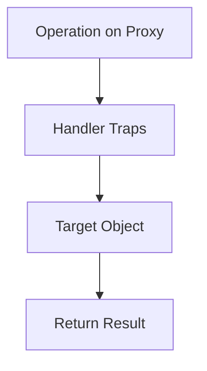

## 9.3 The Proxy Object

In the world of JavaScript, the ability to intercept and redefine operations on objects opens up a realm of possibilities for developers. This is where the Proxy object comes into play. Proxies allow us to create a layer of control over the behavior of objects, enabling us to customize how they interact with the rest of our code. In this section, we'll explore what Proxy objects are, how they work, and how you can leverage them to enhance your JavaScript applications.

### What is a Proxy Object?

A Proxy object in JavaScript acts as a wrapper around another object, known as the target object. This wrapper intercepts operations performed on the target object, allowing you to redefine or customize these operations. This can include property access, assignment, enumeration, function invocation, and more.

Think of a Proxy as a middleman that stands between the target object and any interaction with it. By using a Proxy, you can control how these interactions occur, providing a powerful tool for validation, logging, and even implementing complex design patterns.

### Creating a Proxy

To create a Proxy, you need two components: the target object and a handler object. The handler object contains traps, which are methods that intercept operations on the target object. Here's the basic syntax for creating a Proxy:

```javascript
const targetObject = {
  name: "John",
  age: 30
};

const handler = {
  get: function(target, property) {
    console.log(`Getting property ${property}`);
    return target[property];
  }
};

const proxy = new Proxy(targetObject, handler);

console.log(proxy.name); // Logs: Getting property name
                         // Returns: John
```

In this example, we create a Proxy for `targetObject`. The handler object defines a `get` trap, which intercepts property access on the target object. Whenever we access a property through the proxy, the `get` trap logs a message and then returns the corresponding property from the target object.

### Understanding Traps

Traps are the heart of the Proxy API. They allow you to intercept and redefine various operations on the target object. Here are some common traps you can use:

- **`get(target, property, receiver)`**: Intercepts property access.
- **`set(target, property, value, receiver)`**: Intercepts property assignment.
- **`has(target, property)`**: Intercepts the `in` operator.
- **`deleteProperty(target, property)`**: Intercepts property deletion.
- **`apply(target, thisArg, argumentsList)`**: Intercepts function calls.
- **`construct(target, argumentsList, newTarget)`**: Intercepts `new` operator.

Let's explore some of these traps with examples.

#### The `get` Trap

The `get` trap is triggered whenever a property is accessed. It allows you to customize what happens when a property is read:

```javascript
const handler = {
  get: function(target, property) {
    if (property in target) {
      return target[property];
    } else {
      return `Property ${property} does not exist.`;
    }
  }
};

const proxy = new Proxy(targetObject, handler);

console.log(proxy.name); // John
console.log(proxy.height); // Property height does not exist.
```

In this example, if the property exists in the target object, it is returned. Otherwise, a custom message is returned.

#### The `set` Trap

The `set` trap is triggered when a property is assigned a value. This is useful for validation or enforcing constraints:

```javascript
const handler = {
  set: function(target, property, value) {
    if (property === "age" && typeof value !== "number") {
      throw new TypeError("Age must be a number");
    }
    target[property] = value;
    return true;
  }
};

const proxy = new Proxy(targetObject, handler);

proxy.age = 35; // Works fine
proxy.age = "thirty-five"; // Throws TypeError: Age must be a number
```

Here, the `set` trap ensures that the `age` property is always assigned a number, throwing an error otherwise.

#### The `apply` Trap

The `apply` trap is used to intercept function calls. This can be useful for logging or modifying arguments:

```javascript
function sum(a, b) {
  return a + b;
}

const handler = {
  apply: function(target, thisArg, argumentsList) {
    console.log(`Called with arguments: ${argumentsList}`);
    return target(...argumentsList);
  }
};

const proxy = new Proxy(sum, handler);

console.log(proxy(2, 3)); // Logs: Called with arguments: 2,3
                          // Returns: 5
```

In this example, the `apply` trap logs the arguments passed to the `sum` function before calling it.

### Practical Uses of Proxies

Proxies can be used in a variety of scenarios to enhance your JavaScript applications. Let's explore some practical use cases.

#### Validation

Proxies can enforce validation rules on objects, ensuring that only valid data is stored:

```javascript
const user = {
  name: "Alice",
  age: 25
};

const handler = {
  set: function(target, property, value) {
    if (property === "age" && (value < 0 || value > 120)) {
      throw new RangeError("Age must be between 0 and 120");
    }
    target[property] = value;
    return true;
  }
};

const proxy = new Proxy(user, handler);

proxy.age = 30; // Works fine
proxy.age = 150; // Throws RangeError: Age must be between 0 and 120
```

#### Property Tracing

Proxies can log or trace property access, which is useful for debugging or monitoring:

```javascript
const handler = {
  get: function(target, property) {
    console.log(`Accessed property: ${property}`);
    return target[property];
  }
};

const proxy = new Proxy(targetObject, handler);

console.log(proxy.name); // Logs: Accessed property: name
                         // Returns: John
```

#### Value Correction

Proxies can automatically correct or transform values before they are stored:

```javascript
const handler = {
  set: function(target, property, value) {
    if (property === "name") {
      value = value.trim();
    }
    target[property] = value;
    return true;
  }
};

const proxy = new Proxy(targetObject, handler);

proxy.name = "  John  ";
console.log(proxy.name); // John (whitespace trimmed)
```

### Observing Changes and Reactive Programming

Proxies can be used to observe changes to objects, making them a powerful tool for implementing reactive programming patterns. By intercepting property changes, you can trigger updates or reactions in your application.

For example, you can use a Proxy to automatically update the UI when the underlying data changes:

```javascript
const data = {
  text: "Hello, World!"
};

const handler = {
  set: function(target, property, value) {
    target[property] = value;
    document.getElementById("output").textContent = target.text;
    return true;
  }
};

const proxy = new Proxy(data, handler);

proxy.text = "Hello, Proxy!"; // Updates the UI automatically
```

In this example, whenever the `text` property is updated, the UI is automatically refreshed to reflect the new value.

### Performance Considerations

While Proxies offer powerful capabilities, they can introduce performance overhead. Each intercepted operation involves additional function calls, which can impact performance, especially in performance-critical applications or when dealing with large datasets.

It's important to weigh the benefits of using Proxies against their potential impact on performance. In many cases, the flexibility and control they provide can outweigh the performance costs, but it's crucial to profile and test your application to ensure it meets your performance requirements.

### Experimenting with Proxies

To truly understand the capabilities and limitations of Proxies, it's essential to experiment with them in your own projects. Try implementing different traps and see how they affect the behavior of your objects. Experiment with validation, logging, and reactive programming patterns to see how Proxies can enhance your applications.

Remember, Proxies are a powerful tool, but they should be used judiciously. Not every problem requires a Proxy, and in some cases, simpler solutions may be more appropriate. However, when used effectively, Proxies can provide a level of control and customization that is difficult to achieve with other techniques.

### Visualizing Proxy Operations

To help visualize how Proxies work, let's look at a simple diagram that illustrates the flow of operations between a Proxy, its handler, and the target object.



This diagram shows that when an operation is performed on a Proxy, it first goes through the handler's traps. If the trap allows it, the operation is then performed on the target object, and the result is returned.

### Key Takeaways

- **Proxy objects** allow you to intercept and customize operations on target objects.
- **Traps** are methods in the handler object that intercept operations like property access, assignment, and function invocation.
- Proxies can be used for **validation**, **property tracing**, **value correction**, and **reactive programming**.
- Be mindful of **performance considerations** when using Proxies, especially in performance-critical applications.
- **Experiment with Proxies** to understand their capabilities and limitations, and use them judiciously in your projects.

### References and Further Reading

- [MDN Web Docs: Proxy](https://developer.mozilla.org/en-US/docs/Web/JavaScript/Reference/Global_Objects/Proxy)
- [JavaScript.info: Proxies](https://javascript.info/proxy)
- [W3Schools: JavaScript Proxy](https://www.w3schools.com/js/js_object_proxies.asp)

Remember, this is just the beginning. As you progress, you'll build more complex and interactive applications using Proxies. Keep experimenting, stay curious, and enjoy the journey!

## Quiz Time!



### What is a Proxy object in JavaScript?

- [x] A wrapper that intercepts operations on a target object
- [ ] A method for creating new objects
- [ ] A function that returns a promise
- [ ] A built-in JavaScript library

> **Explanation:** A Proxy object acts as a wrapper around another object, intercepting operations on that object.

### Which of the following is a trap used in a Proxy handler?

- [x] get
- [ ] fetch
- [ ] execute
- [ ] call

> **Explanation:** The `get` trap is used to intercept property access on the target object.

### What does the `set` trap in a Proxy do?

- [x] Intercepts property assignment
- [ ] Intercepts function calls
- [ ] Intercepts property deletion
- [ ] Intercepts object creation

> **Explanation:** The `set` trap is used to intercept and customize property assignments on the target object.

### How can Proxies be used in reactive programming?

- [x] By observing changes to objects and triggering updates
- [ ] By creating new objects
- [ ] By deleting properties
- [ ] By fetching data from a server

> **Explanation:** Proxies can observe changes to objects and trigger updates, making them useful for reactive programming.

### What is a potential downside of using Proxies?

- [x] Performance overhead
- [ ] Lack of flexibility
- [ ] Inability to intercept operations
- [ ] Limited browser support

> **Explanation:** Proxies can introduce performance overhead due to additional function calls for intercepted operations.

### Which trap would you use to intercept function calls on a target object?

- [x] apply
- [ ] get
- [ ] set
- [ ] deleteProperty

> **Explanation:** The `apply` trap is used to intercept function calls on the target object.

### What is the role of the handler object in a Proxy?

- [x] It contains traps that intercept operations on the target object
- [ ] It defines the target object
- [ ] It executes the operations
- [ ] It logs errors

> **Explanation:** The handler object contains traps that intercept and customize operations on the target object.

### Can Proxies be used to validate data before it is stored in an object?

- [x] Yes
- [ ] No

> **Explanation:** Proxies can use traps like `set` to validate data before it is stored in the target object.

### What happens if a property does not exist in the target object and is accessed through a Proxy?

- [x] The `get` trap can handle it and return a custom message
- [ ] An error is thrown
- [ ] The property is automatically created
- [ ] The operation is ignored

> **Explanation:** The `get` trap can intercept the access and return a custom message if the property does not exist.

### True or False: Proxies can only be used with objects, not functions.

- [ ] True
- [x] False

> **Explanation:** Proxies can be used with both objects and functions, allowing interception of property access and function calls.


