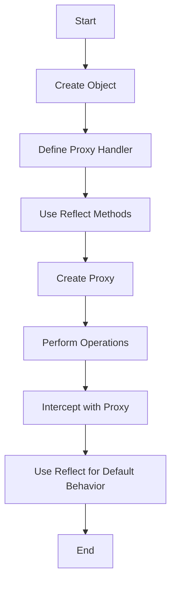

## 9.4 The Reflect API

In the world of JavaScript, the Reflect API is a relatively modern addition that provides a set of static methods for performing common object operations. Introduced in ECMAScript 2015 (ES6), the Reflect API offers a standardized way to interact with objects, complementing the Proxy API by providing methods that mirror proxy traps. This makes it a powerful tool for metaprogramming, allowing developers to write clearer and more maintainable code.

### What is the Reflect API?

The Reflect API is a built-in object in JavaScript that provides a set of methods for intercepting and manipulating object operations. These methods are similar to those found in the Proxy API, and they allow developers to perform operations such as getting, setting, and deleting properties, as well as invoking functions and constructors, all in a consistent manner.

#### Key Features of the Reflect API

- **Standardization**: Reflect methods provide a standard way to perform object operations, ensuring consistency across different parts of your code.
- **Complementary to Proxies**: Reflect methods mirror the traps in the Proxy API, making them ideal for use in custom proxies.
- **Improved Code Clarity**: Using Reflect can make your code more readable and maintainable by providing clear and explicit methods for object manipulation.

### How Does Reflect Complement Proxy?

The Proxy API in JavaScript allows you to define custom behavior for fundamental operations on objects, such as property access and assignment. The Reflect API complements this by providing methods that correspond to each of the proxy traps. This means that when you create a proxy, you can use Reflect methods to ensure that the default behavior is preserved, making your custom behavior more predictable and consistent.

#### Example: Proxy and Reflect Working Together

Let's look at a simple example where we use both Proxy and Reflect to intercept and manipulate object property access:

```javascript
const target = {
  name: 'JavaScript',
  version: 'ES6'
};

const handler = {
  get: function(obj, prop) {
    console.log(`Getting property: ${prop}`);
    return Reflect.get(obj, prop);
  },
  set: function(obj, prop, value) {
    console.log(`Setting property: ${prop} to ${value}`);
    return Reflect.set(obj, prop, value);
  }
};

const proxy = new Proxy(target, handler);

console.log(proxy.name); // Output: Getting property: name \n JavaScript
proxy.version = 'ES2021'; // Output: Setting property: version to ES2021
```

In this example, we use a proxy to intercept `get` and `set` operations on the `target` object. The `Reflect.get()` and `Reflect.set()` methods are used within the proxy traps to perform the default behavior of getting and setting properties, ensuring that the proxy behaves as expected.

### Exploring Reflect Methods

The Reflect API provides a variety of methods for performing different object operations. Let's explore some of the most commonly used methods and how they can be applied in JavaScript programming.

#### Reflect.get()

The `Reflect.get()` method is used to retrieve the value of a property from an object. It is similar to the `obj[prop]` syntax but provides a more explicit and standardized way to access properties.

```javascript
const user = {
  name: 'Alice',
  age: 25
};

console.log(Reflect.get(user, 'name')); // Output: Alice
```

#### Reflect.set()

The `Reflect.set()` method is used to set the value of a property on an object. It returns a boolean indicating whether the operation was successful.

```javascript
const user = {
  name: 'Alice',
  age: 25
};

Reflect.set(user, 'age', 26);
console.log(user.age); // Output: 26
```

#### Reflect.has()

The `Reflect.has()` method checks if a property exists on an object, similar to the `in` operator.

```javascript
const user = {
  name: 'Alice',
  age: 25
};

console.log(Reflect.has(user, 'name')); // Output: true
console.log(Reflect.has(user, 'email')); // Output: false
```

#### Reflect.deleteProperty()

The `Reflect.deleteProperty()` method is used to delete a property from an object. It returns a boolean indicating whether the property was successfully deleted.

```javascript
const user = {
  name: 'Alice',
  age: 25
};

Reflect.deleteProperty(user, 'age');
console.log(user); // Output: { name: 'Alice' }
```

#### Reflect.ownKeys()

The `Reflect.ownKeys()` method returns an array of the object's own property keys, including both string and symbol keys.

```javascript
const user = {
  name: 'Alice',
  age: 25
};

console.log(Reflect.ownKeys(user)); // Output: ['name', 'age']
```

### Benefits of Using the Reflect API

Using the Reflect API in your JavaScript code offers several benefits, particularly when it comes to metaprogramming and working with proxies.

#### 1. Consistency and Predictability

Reflect methods provide a consistent and predictable way to perform object operations. This is especially useful when working with proxies, as it ensures that the default behavior is preserved.

#### 2. Improved Code Clarity

By using explicit methods for object operations, the Reflect API can make your code more readable and easier to understand. This is particularly beneficial in large codebases where clarity is crucial.

#### 3. Simplified Metaprogramming

The Reflect API simplifies metaprogramming tasks by providing a set of tools for intercepting and manipulating object operations. This makes it easier to implement custom behavior and extend the functionality of your objects.

### Encouraging the Use of Reflect in Custom Proxies

When creating custom proxies, it's a good practice to use Reflect methods to ensure that the default behavior of object operations is preserved. This not only makes your proxies more predictable but also helps maintain consistency across your code.

#### Example: Using Reflect in a Custom Proxy

Let's create a custom proxy that logs property access and modification while preserving the default behavior using Reflect methods:

```javascript
const product = {
  name: 'Laptop',
  price: 1000
};

const handler = {
  get: function(target, prop) {
    console.log(`Accessing property: ${prop}`);
    return Reflect.get(target, prop);
  },
  set: function(target, prop, value) {
    console.log(`Modifying property: ${prop} to ${value}`);
    return Reflect.set(target, prop, value);
  }
};

const productProxy = new Proxy(product, handler);

console.log(productProxy.name); // Output: Accessing property: name \n Laptop
productProxy.price = 1200; // Output: Modifying property: price to 1200
```

In this example, we use Reflect methods within the proxy traps to ensure that the default behavior of getting and setting properties is preserved, while also adding custom logging behavior.

### Try It Yourself

To get a better understanding of how the Reflect API works, try modifying the code examples provided in this section. Experiment with different Reflect methods and see how they affect the behavior of your objects and proxies. This hands-on approach will help reinforce your understanding of the Reflect API and its applications in JavaScript programming.

### Visualizing Reflect and Proxy Interaction

To better understand how Reflect and Proxy interact, let's visualize the process using a flowchart. This will help you see the flow of operations and how Reflect methods are used within proxy traps.



**Diagram Description**: This flowchart illustrates the process of using Reflect methods within a proxy. It starts with creating an object and defining a proxy handler. Reflect methods are used within the handler to ensure default behavior is preserved, and the proxy is then created. Operations performed on the proxy are intercepted, and Reflect methods are used to maintain consistency.

### References and Links

For further reading and a deeper dive into the Reflect API and its applications, consider exploring the following resources:

- [MDN Web Docs: Reflect](https://developer.mozilla.org/en-US/docs/Web/JavaScript/Reference/Global_Objects/Reflect)
- [JavaScript.info: Reflect](https://javascript.info/reflect)
- [W3Schools: JavaScript Reflect](https://www.w3schools.com/js/js_reflect.asp)

### Knowledge Check

To ensure you've grasped the key concepts covered in this section, here are some questions and challenges to test your understanding:

1. What is the purpose of the Reflect API in JavaScript?
2. How does the Reflect API complement the Proxy API?
3. Demonstrate how to use the `Reflect.get()` method to access a property.
4. Explain the benefits of using Reflect methods in custom proxies.
5. Try modifying a proxy handler to use `Reflect.deleteProperty()` and observe the changes.

### Embrace the Journey

Remember, mastering JavaScript and its advanced features like the Reflect API takes time and practice. As you continue to explore and experiment with these concepts, you'll gain a deeper understanding and become more confident in your programming skills. Keep experimenting, stay curious, and enjoy the journey!

## Quiz Time!



### What is the primary purpose of the Reflect API in JavaScript?

- [x] To provide a standardized way to perform object operations
- [ ] To replace the Proxy API
- [ ] To enhance the performance of JavaScript applications
- [ ] To simplify DOM manipulation

> **Explanation:** The Reflect API provides a standardized set of methods for performing common object operations, complementing the Proxy API.

### How does the Reflect API complement the Proxy API?

- [x] By providing methods that mirror proxy traps
- [ ] By replacing the need for proxy traps
- [ ] By enhancing the performance of proxies
- [ ] By simplifying the creation of proxies

> **Explanation:** Reflect methods correspond to proxy traps, allowing for consistent and predictable behavior when creating custom proxies.

### Which Reflect method is used to retrieve the value of a property from an object?

- [x] Reflect.get()
- [ ] Reflect.set()
- [ ] Reflect.has()
- [ ] Reflect.deleteProperty()

> **Explanation:** `Reflect.get()` is used to access the value of a property on an object.

### What does the Reflect.set() method return?

- [x] A boolean indicating whether the operation was successful
- [ ] The new value of the property
- [ ] The old value of the property
- [ ] An error if the operation fails

> **Explanation:** `Reflect.set()` returns a boolean indicating the success of the property assignment.

### Which Reflect method checks if a property exists on an object?

- [x] Reflect.has()
- [ ] Reflect.get()
- [ ] Reflect.set()
- [ ] Reflect.deleteProperty()

> **Explanation:** `Reflect.has()` is used to check the existence of a property on an object.

### What is the output of Reflect.ownKeys()?

- [x] An array of the object's own property keys
- [ ] A boolean indicating the presence of keys
- [ ] The values of the object's properties
- [ ] The number of properties on the object

> **Explanation:** `Reflect.ownKeys()` returns an array containing the object's own property keys.

### Why is it beneficial to use Reflect methods in custom proxies?

- [x] To ensure consistent behavior and preserve default operations
- [ ] To enhance the performance of proxies
- [ ] To simplify the creation of proxy handlers
- [ ] To replace the need for proxy traps

> **Explanation:** Using Reflect methods in proxies helps maintain consistent and predictable behavior by preserving default operations.

### Which Reflect method is used to delete a property from an object?

- [x] Reflect.deleteProperty()
- [ ] Reflect.get()
- [ ] Reflect.set()
- [ ] Reflect.has()

> **Explanation:** `Reflect.deleteProperty()` is used to remove a property from an object.

### What is the benefit of using Reflect for metaprogramming?

- [x] It simplifies tasks by providing tools for intercepting and manipulating object operations
- [ ] It enhances the performance of JavaScript applications
- [ ] It replaces the need for custom proxies
- [ ] It simplifies DOM manipulation

> **Explanation:** Reflect simplifies metaprogramming by providing standardized methods for object manipulation.

### True or False: Reflect methods can be used to enhance the performance of JavaScript applications.

- [ ] True
- [x] False

> **Explanation:** Reflect methods are primarily used for standardizing object operations and complementing proxies, not for performance enhancement.


