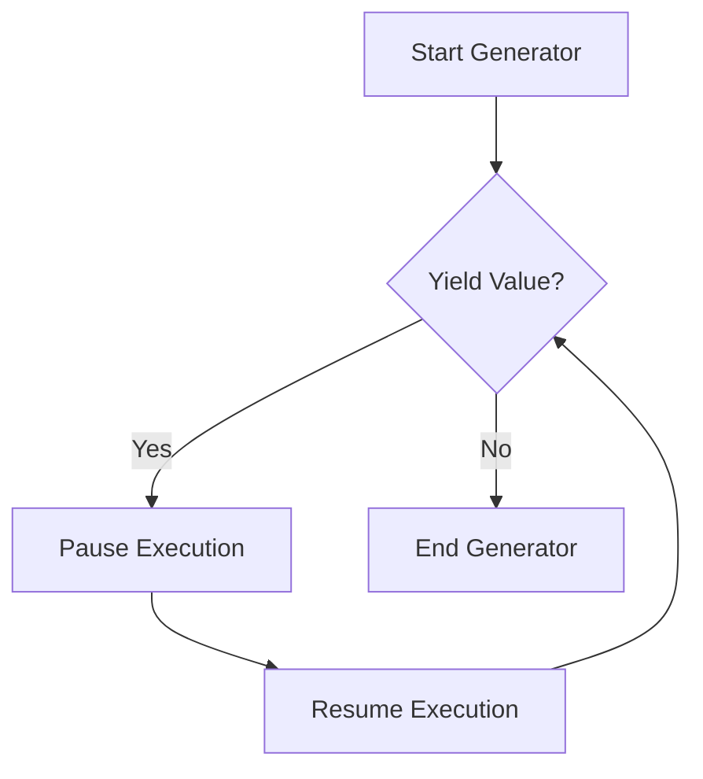

## 9.5 Iterators and Generators

In this section, we will explore the fascinating world of iterators and generators in JavaScript. These powerful tools allow us to create custom iterable objects and simplify asynchronous code, making our programs more efficient and easier to manage. Let's dive in and discover how iterators and generators can enhance your JavaScript skills!

### Understanding Iterators and Iterables

Before we delve into iterators and generators, it's essential to understand the concepts of iterables and iterators in JavaScript. 

#### What Are Iterables?

An **iterable** is any object that implements the `Symbol.iterator` method, which returns an iterator. This method allows the object to be iterated over using constructs like `for...of` loops. Common examples of iterables in JavaScript include arrays, strings, maps, and sets.

#### What Are Iterators?

An **iterator** is an object that adheres to the iterator protocol. It provides a `next()` method that returns an object with two properties: `value` and `done`. The `value` property contains the current element, and `done` is a boolean indicating whether the iteration is complete.

Here's a simple example to illustrate the concept:

```javascript
const myArray = [1, 2, 3];
const iterator = myArray[Symbol.iterator]();

console.log(iterator.next()); // { value: 1, done: false }
console.log(iterator.next()); // { value: 2, done: false }
console.log(iterator.next()); // { value: 3, done: false }
console.log(iterator.next()); // { value: undefined, done: true }
```

In this example, `myArray` is an iterable, and `iterator` is an iterator that allows us to traverse the array elements one by one.

### Implementing Custom Iterators

JavaScript allows us to create custom iterators for our objects, enabling us to define how they should be iterated over. To do this, we need to implement the `[Symbol.iterator]` method in our object.

#### Creating a Custom Iterator

Let's create a custom iterator for a simple range object that iterates over numbers within a specified range:

```javascript
class Range {
  constructor(start, end) {
    this.start = start;
    this.end = end;
  }

  [Symbol.iterator]() {
    let current = this.start;
    const end = this.end;

    return {
      next() {
        if (current <= end) {
          return { value: current++, done: false };
        } else {
          return { done: true };
        }
      }
    };
  }
}

const range = new Range(1, 5);
for (const num of range) {
  console.log(num); // 1, 2, 3, 4, 5
}
```

In this example, the `Range` class implements the `[Symbol.iterator]` method, which returns an iterator object with a `next()` method. This method generates numbers from `start` to `end`, making the `Range` object iterable.

### Introducing Generators

Generators provide a more concise and powerful way to create iterators. They are functions that can be paused and resumed, allowing us to produce a sequence of values over time.

#### The `function*` Syntax

Generators are defined using the `function*` syntax, and they use the `yield` keyword to produce values. Here's a simple generator function:

```javascript
function* simpleGenerator() {
  yield 1;
  yield 2;
  yield 3;
}

const generator = simpleGenerator();
console.log(generator.next()); // { value: 1, done: false }
console.log(generator.next()); // { value: 2, done: false }
console.log(generator.next()); // { value: 3, done: false }
console.log(generator.next()); // { value: undefined, done: true }
```

In this example, `simpleGenerator` is a generator function that yields values 1, 2, and 3. Each call to `next()` returns the next value in the sequence.

#### Using `yield` in Generators

The `yield` keyword is used to pause the execution of a generator function and return a value. When the generator is resumed, it continues execution from where it left off.

Let's see a more complex example:

```javascript
function* fibonacciGenerator() {
  let [prev, curr] = [0, 1];
  while (true) {
    yield curr;
    [prev, curr] = [curr, prev + curr];
  }
}

const fib = fibonacciGenerator();
console.log(fib.next().value); // 1
console.log(fib.next().value); // 1
console.log(fib.next().value); // 2
console.log(fib.next().value); // 3
console.log(fib.next().value); // 5
```

This generator function produces an infinite sequence of Fibonacci numbers. The `yield` keyword allows us to generate each number on demand, making it efficient for handling potentially infinite sequences.

### Practical Applications of Generators

Generators have several practical applications in JavaScript, including lazy evaluation and handling infinite sequences.

#### Lazy Evaluation

Lazy evaluation means that values are computed only when needed. Generators are perfect for implementing lazy evaluation, as they allow us to produce values on demand.

Consider a scenario where we need to process a large dataset. Instead of loading the entire dataset into memory, we can use a generator to process each item one at a time:

```javascript
function* dataProcessor(data) {
  for (const item of data) {
    yield processItem(item);
  }
}

function processItem(item) {
  // Simulate processing
  return item * 2;
}

const data = [1, 2, 3, 4, 5];
const processor = dataProcessor(data);

for (const result of processor) {
  console.log(result); // 2, 4, 6, 8, 10
}
```

In this example, `dataProcessor` is a generator that processes each item in the dataset lazily, reducing memory usage and improving performance.

#### Handling Infinite Sequences

Generators are ideal for handling infinite sequences, as they allow us to generate values indefinitely without running out of memory.

We've already seen how to create an infinite Fibonacci sequence using a generator. This approach can be applied to other infinite sequences, such as generating prime numbers or random numbers.

### Simplifying Asynchronous Code with Generators

Generators can also simplify asynchronous code by allowing us to write asynchronous operations in a synchronous style. This is achieved through generator-based coroutines.

#### Generator-Based Coroutines

A coroutine is a function that can pause its execution and resume later, making it ideal for handling asynchronous operations. Generators can be used to implement coroutines in JavaScript.

Let's see an example of using a generator to handle asynchronous operations:

```javascript
function* asyncTask() {
  const result1 = yield fetchData('https://api.example.com/data1');
  console.log(result1);

  const result2 = yield fetchData('https://api.example.com/data2');
  console.log(result2);
}

function fetchData(url) {
  return new Promise((resolve) => {
    setTimeout(() => {
      resolve(`Data from ${url}`);
    }, 1000);
  });
}

function run(generator) {
  const iterator = generator();

  function iterate(iteration) {
    if (iteration.done) return;
    const promise = iteration.value;
    promise.then((result) => iterate(iterator.next(result)));
  }

  iterate(iterator.next());
}

run(asyncTask);
```

In this example, `asyncTask` is a generator function that performs asynchronous operations using `yield`. The `run` function executes the generator and handles the promises, allowing us to write asynchronous code in a more readable and maintainable way.

#### Libraries and Frameworks Utilizing Generators

Several libraries and frameworks have utilized generators for asynchronous flow control. For example, the `co` library allows us to work with generator-based coroutines easily, and the Koa framework uses generators to handle asynchronous middleware.

Here's a brief overview of how `co` works:

```javascript
const co = require('co');

co(function* () {
  const result1 = yield fetchData('https://api.example.com/data1');
  console.log(result1);

  const result2 = yield fetchData('https://api.example.com/data2');
  console.log(result2);
});
```

The `co` library simplifies the execution of generator functions, handling the promise resolution and rejection automatically.

### Try It Yourself

Now that we've covered the basics of iterators and generators, it's time to experiment with them yourself! Try modifying the code examples provided in this section to create your own custom iterators and generators. Here are a few ideas to get you started:

- Create a custom iterator for a collection of objects, such as a library of books or a playlist of songs.
- Implement a generator function that produces a sequence of prime numbers.
- Use a generator to handle asynchronous operations, such as fetching data from multiple APIs.

### Visualizing Iterators and Generators

To help you understand how iterators and generators work, let's visualize the process using Mermaid.js diagrams.

#### Iterator Flowchart

```mermaid
flowchart TD
  A[Start] --> B{Is done?}
  B -- No --> C[Return value]
  C --> D[Call next()]
  D --> B
  B -- Yes --> E[End]
```

This flowchart illustrates the process of iterating over an iterable using an iterator. The iterator checks if the iteration is complete and returns the next value if not.

#### Generator Flowchart



This flowchart shows how a generator function works. The generator yields a value and pauses execution until it's resumed, allowing us to produce values over time.

### Key Takeaways

- Iterables are objects that implement the `Symbol.iterator` method, allowing them to be iterated over.
- Iterators are objects that provide a `next()` method to traverse elements in an iterable.
- Generators are functions that can pause and resume execution, making them ideal for creating iterators and handling asynchronous code.
- The `yield` keyword is used in generators to produce values and pause execution.
- Generators can be used for lazy evaluation, handling infinite sequences, and simplifying asynchronous code.
- Libraries like `co` and frameworks like Koa have leveraged generators for asynchronous flow control.

### Embrace the Journey

Remember, mastering iterators and generators is just one step in your JavaScript journey. As you continue to explore the language, you'll discover even more powerful tools and techniques to enhance your coding skills. Keep experimenting, stay curious, and enjoy the process of learning!

## Quiz Time!



### What is an iterable in JavaScript?

- [x] An object that implements the `Symbol.iterator` method.
- [ ] An object that provides a `next()` method.
- [ ] A function that can pause and resume execution.
- [ ] A method that returns an iterator.

> **Explanation:** An iterable is any object that implements the `Symbol.iterator` method, allowing it to be iterated over using constructs like `for...of` loops.

### What does the `next()` method of an iterator return?

- [x] An object with `value` and `done` properties.
- [ ] A boolean indicating if the iteration is complete.
- [ ] The current element in the iterable.
- [ ] An array of all elements in the iterable.

> **Explanation:** The `next()` method returns an object with two properties: `value`, which is the current element, and `done`, a boolean indicating if the iteration is complete.

### How do you define a generator function in JavaScript?

- [x] Using the `function*` syntax.
- [ ] Using the `function` keyword.
- [ ] Using the `class` keyword.
- [ ] Using the `yield` keyword.

> **Explanation:** A generator function is defined using the `function*` syntax, which allows it to yield values and pause execution.

### What is the purpose of the `yield` keyword in a generator function?

- [x] To produce a value and pause execution.
- [ ] To return a value and end execution.
- [ ] To define a generator function.
- [ ] To implement the iterator protocol.

> **Explanation:** The `yield` keyword is used in a generator function to produce a value and pause execution until the generator is resumed.

### Which of the following is a practical application of generators?

- [x] Lazy evaluation.
- [x] Handling infinite sequences.
- [ ] Implementing classes.
- [ ] Defining object properties.

> **Explanation:** Generators are useful for lazy evaluation, where values are computed only when needed, and for handling infinite sequences by generating values on demand.

### What is a coroutine in JavaScript?

- [x] A function that can pause its execution and resume later.
- [ ] A method that returns an iterator.
- [ ] A class that implements the iterator protocol.
- [ ] A function that executes synchronously.

> **Explanation:** A coroutine is a function that can pause its execution and resume later, making it ideal for handling asynchronous operations.

### How does the `co` library simplify working with generators?

- [x] By handling promise resolution and rejection automatically.
- [ ] By defining generator functions.
- [ ] By implementing the iterator protocol.
- [ ] By creating custom iterators.

> **Explanation:** The `co` library simplifies the execution of generator functions by handling promise resolution and rejection automatically.

### What is the result of calling `next()` on a generator that has completed execution?

- [x] An object with `value: undefined` and `done: true`.
- [ ] An object with `value: null` and `done: false`.
- [ ] An object with `value: undefined` and `done: false`.
- [ ] An object with `value: null` and `done: true`.

> **Explanation:** When a generator has completed execution, calling `next()` returns an object with `value: undefined` and `done: true`.

### How can generators help in asynchronous programming?

- [x] By allowing asynchronous operations to be written in a synchronous style.
- [ ] By defining asynchronous functions.
- [ ] By implementing the iterator protocol.
- [ ] By creating custom iterators.

> **Explanation:** Generators can help in asynchronous programming by allowing asynchronous operations to be written in a synchronous style, making the code more readable and maintainable.

### True or False: Generators can only be used for synchronous code.

- [ ] True
- [x] False

> **Explanation:** False. Generators can be used for both synchronous and asynchronous code, providing a flexible way to handle various programming scenarios.


