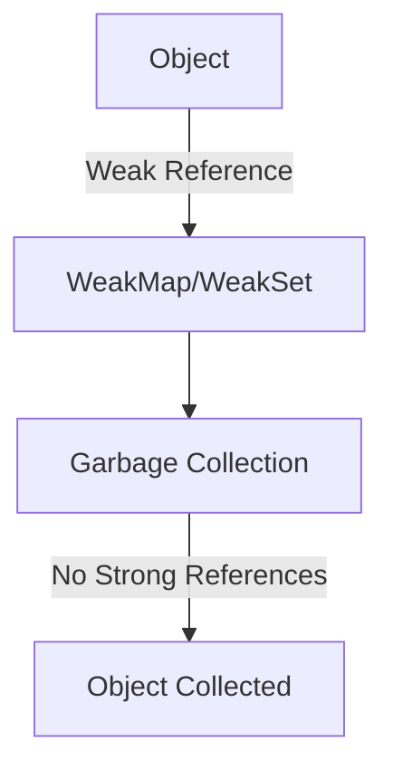

## 9.7 WeakMap and WeakSet

In the world of JavaScript, managing memory efficiently is crucial, especially when dealing with large applications. Two powerful tools that can help in this regard are **WeakMap** and **WeakSet**. These structures allow us to manage collections of objects with weak references, which can be garbage-collected when no longer needed. In this section, we will explore these concepts in detail, understand their differences from `Map` and `Set`, and learn how to use them effectively.

### Understanding WeakMap and WeakSet

Before diving into WeakMap and WeakSet, let's briefly revisit their stronger counterparts, `Map` and `Set`.

- **Map**: A collection of key-value pairs where keys can be of any type.
- **Set**: A collection of unique values, also allowing any type of value.

Both `Map` and `Set` maintain strong references to their keys and values, meaning they prevent garbage collection as long as they hold a reference to an object. This is where WeakMap and WeakSet come into play.

#### What is a WeakMap?

A **WeakMap** is similar to a `Map`, but with a crucial difference: its keys are weakly referenced. This means that if there are no other references to a key object, it can be garbage-collected, even if it is still present in the WeakMap. This property makes WeakMap particularly useful for associating metadata or private data with objects without preventing their garbage collection.

#### What is a WeakSet?

A **WeakSet** is akin to a `Set`, but it only holds weak references to its objects. Like WeakMap, if an object in a WeakSet has no other references, it can be garbage-collected. WeakSet is useful for tracking object uniqueness without affecting their lifecycle.

### Weak References and Garbage Collection

The concept of **weak references** is central to understanding WeakMap and WeakSet. A weak reference does not prevent the referenced object from being collected by the garbage collector. This is beneficial for memory management because it allows for the automatic cleanup of objects that are no longer needed.

#### How Garbage Collection Works

JavaScript engines use garbage collection to automatically manage memory. When an object is no longer reachable, it becomes eligible for garbage collection, freeing up memory. WeakMap and WeakSet leverage this by allowing objects to be collected even if they are still referenced by these structures.

### Using WeakMap in JavaScript

Let's see how we can use WeakMap to manage private data associated with objects.

#### Creating a WeakMap

To create a WeakMap, we use the `WeakMap` constructor:

```javascript
let weakMap = new WeakMap();
```

#### Associating Metadata with Objects

WeakMap is ideal for associating metadata with objects. For example, suppose we have a set of user objects, and we want to associate some private data with each user without preventing their garbage collection:

```javascript
let user1 = { name: 'Alice' };
let user2 = { name: 'Bob' };

let privateData = new WeakMap();

privateData.set(user1, { age: 25, email: 'alice@example.com' });
privateData.set(user2, { age: 30, email: 'bob@example.com' });

console.log(privateData.get(user1)); // { age: 25, email: 'alice@example.com' }
```

In this example, `privateData` holds metadata for each user. If `user1` or `user2` is no longer referenced elsewhere, they can be garbage-collected, and their associated data in the WeakMap will be automatically removed.

#### Limitations of WeakMap

While WeakMap is powerful, it has some limitations:

- **Non-iterable**: You cannot iterate over the keys or values of a WeakMap. This is because the keys can be garbage-collected at any time.
- **No size property**: WeakMap does not have a `size` property because the number of entries can change due to garbage collection.

### Using WeakSet in JavaScript

WeakSet is useful for tracking objects without preventing their garbage collection.

#### Creating a WeakSet

To create a WeakSet, we use the `WeakSet` constructor:

```javascript
let weakSet = new WeakSet();
```

#### Tracking Object Uniqueness

Suppose we want to track a set of objects to ensure uniqueness without affecting their lifecycle:

```javascript
let obj1 = { id: 1 };
let obj2 = { id: 2 };

let weakSet = new WeakSet();

weakSet.add(obj1);
weakSet.add(obj2);

console.log(weakSet.has(obj1)); // true
```

In this example, `weakSet` tracks the uniqueness of `obj1` and `obj2`. If either object is no longer referenced elsewhere, it can be garbage-collected, and the WeakSet will automatically remove it.

#### Limitations of WeakSet

Like WeakMap, WeakSet has limitations:

- **Non-iterable**: You cannot iterate over the elements of a WeakSet.
- **No size property**: WeakSet does not have a `size` property for the same reasons as WeakMap.

### Use Cases for WeakMap and WeakSet

#### WeakMap Use Cases

1. **Private Data Storage**: Use WeakMap to store private data associated with objects, ensuring that data is automatically cleaned up when the object is no longer needed.

2. **Caching**: Implement caching mechanisms where the cache should not prevent objects from being garbage-collected.

3. **DOM Node Metadata**: Store metadata for DOM nodes without affecting their lifecycle.

#### WeakSet Use Cases

1. **Tracking Object Uniqueness**: Use WeakSet to track unique objects without affecting their garbage collection.

2. **Event Listeners**: Manage event listeners associated with objects, ensuring they do not prevent object cleanup.

### When and Why to Use Weak Collections

WeakMap and WeakSet are not always the right choice. They are best used when:

- **Memory Efficiency**: You need to manage memory efficiently, and objects should be garbage-collected when no longer needed.
- **Private Data**: You want to associate private data with objects without affecting their lifecycle.
- **Non-iterable Requirements**: You do not need to iterate over the collection.

### Visualizing WeakMap and WeakSet

To better understand how WeakMap and WeakSet work, let's visualize their behavior with a diagram.



**Diagram Description**: This diagram illustrates how objects are weakly referenced by WeakMap or WeakSet. If there are no strong references to the object, it becomes eligible for garbage collection.

### Try It Yourself

Experiment with the following code to see how WeakMap and WeakSet behave:

```javascript
let user = { name: 'Charlie' };
let weakMap = new WeakMap();
let weakSet = new WeakSet();

weakMap.set(user, { age: 28 });
weakSet.add(user);

console.log(weakMap.get(user)); // { age: 28 }
console.log(weakSet.has(user)); // true

// Try removing references
user = null;

// Check if the data is still accessible
// Note: This may not show immediate results as garbage collection timing is unpredictable
console.log(weakMap.get(user)); // undefined
console.log(weakSet.has(user)); // false
```

### Key Takeaways

- **WeakMap and WeakSet** provide weak references, allowing for garbage collection of unreferenced objects.
- **Use WeakMap** for associating private data with objects without preventing their garbage collection.
- **Use WeakSet** for tracking object uniqueness without affecting garbage collection.
- **Limitations** include non-iterability and lack of a size property.
- **Best used** when memory efficiency and object lifecycle management are priorities.

### References and Further Reading

- [MDN Web Docs: WeakMap](https://developer.mozilla.org/en-US/docs/Web/JavaScript/Reference/Global_Objects/WeakMap)
- [MDN Web Docs: WeakSet](https://developer.mozilla.org/en-US/docs/Web/JavaScript/Reference/Global_Objects/WeakSet)
- [JavaScript.info: WeakMap and WeakSet](https://javascript.info/weakmap-weakset)

## Quiz Time!



### What is a WeakMap?

- [x] A collection of key-value pairs with weakly referenced keys.
- [ ] A collection of unique values with strong references.
- [ ] A collection of key-value pairs with strong references.
- [ ] A collection of unique values with weak references.

> **Explanation:** A WeakMap is a collection of key-value pairs where the keys are weakly referenced, allowing for garbage collection when there are no other references to the key objects.

### What is a key advantage of using WeakMap?

- [x] It allows for garbage collection of unreferenced keys.
- [ ] It allows iteration over keys and values.
- [ ] It provides a size property.
- [ ] It prevents garbage collection of keys.

> **Explanation:** WeakMap allows for garbage collection of keys that are no longer referenced elsewhere, making it memory-efficient.

### What is a limitation of WeakSet?

- [x] It is non-iterable.
- [ ] It allows for strong references.
- [ ] It has a size property.
- [ ] It can store primitive values.

> **Explanation:** WeakSet is non-iterable, meaning you cannot iterate over its elements, and it does not have a size property.

### When should you use WeakMap?

- [x] When you need to associate private data with objects.
- [ ] When you need to iterate over key-value pairs.
- [ ] When you need to store primitive values.
- [ ] When you need a size property.

> **Explanation:** WeakMap is ideal for associating private data with objects without affecting their garbage collection.

### How does WeakSet track object uniqueness?

- [x] By holding weak references to objects.
- [ ] By holding strong references to objects.
- [ ] By allowing iteration over elements.
- [ ] By providing a size property.

> **Explanation:** WeakSet tracks object uniqueness by holding weak references, allowing objects to be garbage-collected when no longer needed.

### What happens to an object in a WeakMap when there are no other references to it?

- [x] It becomes eligible for garbage collection.
- [ ] It remains in the WeakMap indefinitely.
- [ ] It is automatically removed from the WeakMap.
- [ ] It throws an error.

> **Explanation:** When there are no other references to an object in a WeakMap, it becomes eligible for garbage collection, and the WeakMap entry is automatically removed.

### Can you iterate over the contents of a WeakMap?

- [ ] Yes, using a for...of loop.
- [ ] Yes, using a forEach method.
- [x] No, it is non-iterable.
- [ ] Yes, using a for...in loop.

> **Explanation:** WeakMap is non-iterable, meaning you cannot iterate over its keys or values.

### What is a use case for WeakSet?

- [x] Tracking object uniqueness without affecting garbage collection.
- [ ] Storing primitive values.
- [ ] Iterating over elements.
- [ ] Providing a size property.

> **Explanation:** WeakSet is useful for tracking object uniqueness without affecting their lifecycle, as it holds weak references.

### Why might you choose WeakMap over Map?

- [x] To allow for garbage collection of unreferenced keys.
- [ ] To iterate over key-value pairs.
- [ ] To store primitive keys.
- [ ] To have a size property.

> **Explanation:** WeakMap allows for garbage collection of keys that are no longer referenced elsewhere, making it more memory-efficient than Map in certain scenarios.

### True or False: WeakMap and WeakSet can store primitive values.

- [ ] True
- [x] False

> **Explanation:** WeakMap and WeakSet cannot store primitive values; they can only store objects as keys (in WeakMap) or elements (in WeakSet).



Remember, mastering WeakMap and WeakSet is a step towards efficient memory management in JavaScript. Keep experimenting, stay curious, and enjoy the journey!
