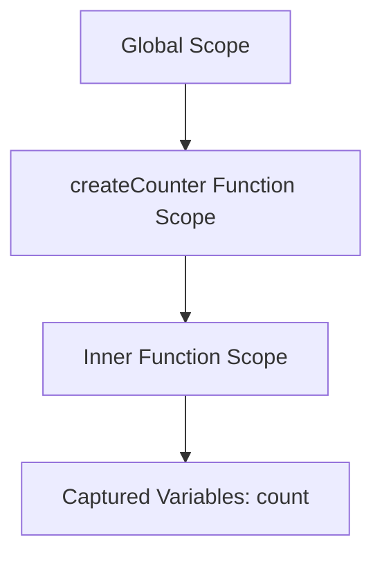

## 9.8 Data Privacy with Closures and Schedules

In this section, we delve into the fascinating world of closures in JavaScript and how they can be leveraged to ensure data privacy, especially in asynchronous and scheduled functions. Closures are a powerful feature of JavaScript that allow functions to retain access to their lexical scope, even when executed outside of their original context. This capability is particularly useful for maintaining state and encapsulating private data in JavaScript applications.

### Understanding Closures

Before we explore how closures can be used for data privacy, let's revisit what closures are and how they work. A closure is a function that captures variables from its surrounding lexical environment. This means that a closure can "remember" and access variables from the scope in which it was created, even after that scope has finished executing.

#### How Closures Capture Variables

When a function is defined, it captures its surrounding variables in its lexical scope. This captured environment is retained by the function, allowing it to access these variables later. Let's look at a simple example to illustrate this concept:

```javascript
function createCounter() {
  let count = 0; // This variable is captured by the closure

  return function() {
    count += 1;
    return count;
  };
}

const counter = createCounter();
console.log(counter()); // Output: 1
console.log(counter()); // Output: 2
```

In this example, the `createCounter` function returns an inner function that increments and returns the `count` variable. The inner function forms a closure, capturing the `count` variable, which allows it to maintain and update the count even after `createCounter` has finished executing.

### Closures in Asynchronous Functions

Closures are especially useful in asynchronous programming, where functions may be executed at a later time. They allow us to preserve state and maintain access to variables across asynchronous operations.

#### Using Closures with `setTimeout`

The `setTimeout` function is a common example of an asynchronous operation in JavaScript. It schedules a function to be executed after a specified delay. Closures enable us to maintain access to variables within these delayed functions:

```javascript
function delayedGreeting(name) {
  setTimeout(function() {
    console.log(`Hello, ${name}!`);
  }, 1000);
}

delayedGreeting('Alice'); // After 1 second, logs: "Hello, Alice!"
```

In this example, the inner function passed to `setTimeout` forms a closure that captures the `name` variable. Even though the function is executed after a delay, it still has access to `name`.

#### Preserving State with Promises

Promises are another asynchronous construct in JavaScript that benefit from closures. They allow us to handle asynchronous operations and chain them together. Closures help us preserve state across promise chains:

```javascript
function fetchData(url) {
  return new Promise((resolve, reject) => {
    setTimeout(() => {
      resolve(`Data from ${url}`);
    }, 1000);
  });
}

function processData(url) {
  fetchData(url).then(data => {
    console.log(`Processing: ${data}`);
  });
}

processData('https://example.com'); // After 1 second, logs: "Processing: Data from https://example.com"
```

In this example, the `then` method receives a function that forms a closure, capturing the `data` variable. This allows us to process the data once it is fetched, maintaining access to it across asynchronous operations.

### Encapsulating Private Data

Closures are a powerful tool for encapsulating private data within modules or objects. By capturing variables in a closure, we can create private data that is inaccessible from the outside, ensuring data privacy.

#### The Module Pattern

The module pattern is a common JavaScript design pattern that utilizes closures to encapsulate private data. It allows us to expose only the necessary parts of a module while keeping other parts private:

```javascript
const counterModule = (function() {
  let count = 0; // Private variable

  return {
    increment: function() {
      count += 1;
      return count;
    },
    reset: function() {
      count = 0;
    }
  };
})();

console.log(counterModule.increment()); // Output: 1
console.log(counterModule.increment()); // Output: 2
counterModule.reset();
console.log(counterModule.increment()); // Output: 1
```

In this example, the `counterModule` is an immediately invoked function expression (IIFE) that returns an object with methods to interact with the `count` variable. The `count` variable is private, accessible only through the methods provided by the module.

#### Closures in Event Handlers and Callback Functions

Closures are also essential in event handlers and callback functions, where they allow us to maintain state and access variables across different parts of an application.

```javascript
function setupButton() {
  let clickCount = 0;

  document.getElementById('myButton').addEventListener('click', function() {
    clickCount += 1;
    console.log(`Button clicked ${clickCount} times`);
  });
}

setupButton();
```

In this example, the event handler function forms a closure, capturing the `clickCount` variable. This allows us to track the number of times the button is clicked, maintaining state across multiple clicks.

### Managing Memory Concerns

While closures are powerful, they can also lead to memory concerns if not managed properly. Since closures retain references to their captured variables, they can prevent these variables from being garbage collected, leading to memory leaks.

#### Avoiding Memory Leaks

To avoid memory leaks, it's important to be mindful of how closures are used. Here are some tips for managing memory concerns:

- **Avoid unnecessary closures**: Only use closures when necessary to maintain state or encapsulate data.
- **Release references**: If a closure is no longer needed, release references to it to allow garbage collection.
- **Use weak references**: In some cases, weak references can be used to prevent memory leaks by allowing garbage collection of unused objects.

### Try It Yourself

Now that we've explored closures and their role in data privacy, let's try some exercises to reinforce these concepts. Modify the following code examples to experiment with closures and data privacy:

1. Create a closure that maintains a private counter and provides methods to increment and retrieve the count.
2. Implement a module pattern that encapsulates private data and exposes methods to interact with it.
3. Use closures in an event handler to maintain state across multiple events.

### Visualizing Closures and Lexical Scope

To better understand how closures capture variables and maintain access to them, let's visualize the lexical scope and closure creation process using a diagram.



**Figure 1: Visualizing the Lexical Scope and Closure Creation Process**

In this diagram, we see the different scopes involved in the closure creation process. The `createCounter` function scope captures the `count` variable, which is then accessible to the inner function scope through the closure.

### References and Further Reading

For more information on closures and data privacy in JavaScript, check out the following resources:

- [MDN Web Docs: Closures](https://developer.mozilla.org/en-US/docs/Web/JavaScript/Closures)
- [JavaScript.info: Closures](https://javascript.info/closure)
- [W3Schools: JavaScript Closures](https://www.w3schools.com/js/js_function_closures.asp)

### Knowledge Check

To reinforce your understanding of closures and data privacy, consider the following questions:

1. What is a closure, and how does it capture variables in its lexical scope?
2. How do closures maintain access to variables in asynchronous functions?
3. What are some common use cases for closures in JavaScript applications?
4. How can closures be used to encapsulate private data in modules or objects?
5. What are some potential memory concerns associated with closures, and how can they be managed?

### Embrace the Journey

Remember, mastering closures and data privacy in JavaScript is a journey. As you continue to explore these concepts, you'll gain a deeper understanding of how to write secure and efficient code. Keep experimenting, stay curious, and enjoy the process of learning!

## Quiz Time!



### What is a closure in JavaScript?

- [x] A function that captures variables from its lexical scope
- [ ] A function that executes immediately
- [ ] A function that returns another function
- [ ] A function that is asynchronous

> **Explanation:** A closure is a function that captures variables from its surrounding lexical environment, allowing it to access these variables even after the outer function has finished executing.

### How do closures maintain access to variables in asynchronous functions?

- [x] By capturing variables in their lexical scope
- [ ] By using global variables
- [ ] By creating new variables
- [ ] By using `setTimeout`

> **Explanation:** Closures capture variables in their lexical scope, allowing them to maintain access to these variables even when executed asynchronously.

### What is the purpose of the module pattern in JavaScript?

- [x] To encapsulate private data and expose only necessary parts
- [ ] To create global variables
- [ ] To execute functions immediately
- [ ] To handle asynchronous operations

> **Explanation:** The module pattern is used to encapsulate private data within a module, exposing only the necessary parts through public methods.

### How can closures lead to memory leaks?

- [x] By retaining references to variables that are no longer needed
- [ ] By creating new variables
- [ ] By using global variables
- [ ] By executing functions immediately

> **Explanation:** Closures can lead to memory leaks by retaining references to variables that are no longer needed, preventing them from being garbage collected.

### What is a common use case for closures in JavaScript?

- [x] Maintaining state in asynchronous functions
- [ ] Creating global variables
- [ ] Executing functions immediately
- [ ] Handling errors

> **Explanation:** Closures are commonly used to maintain state in asynchronous functions, allowing them to access variables across different parts of an application.

### How can closures be used in event handlers?

- [x] By capturing variables and maintaining state across events
- [ ] By creating global variables
- [ ] By executing functions immediately
- [ ] By handling errors

> **Explanation:** Closures can be used in event handlers to capture variables and maintain state across multiple events, allowing for more efficient event handling.

### What is the role of the `setTimeout` function in closures?

- [x] To schedule a function to be executed after a delay
- [ ] To create global variables
- [ ] To execute functions immediately
- [ ] To handle errors

> **Explanation:** The `setTimeout` function is used to schedule a function to be executed after a specified delay, allowing closures to maintain access to variables during this delay.

### How can memory leaks be avoided when using closures?

- [x] By releasing references to closures that are no longer needed
- [ ] By creating new variables
- [ ] By using global variables
- [ ] By executing functions immediately

> **Explanation:** Memory leaks can be avoided by releasing references to closures that are no longer needed, allowing the captured variables to be garbage collected.

### What is the benefit of using closures in asynchronous programming?

- [x] They allow functions to maintain access to variables across asynchronous operations
- [ ] They create global variables
- [ ] They execute functions immediately
- [ ] They handle errors

> **Explanation:** Closures allow functions to maintain access to variables across asynchronous operations, preserving state and enabling more efficient programming.

### Closures are essential for encapsulating private data in JavaScript.

- [x] True
- [ ] False

> **Explanation:** True. Closures are essential for encapsulating private data in JavaScript, allowing for secure and efficient data management.


