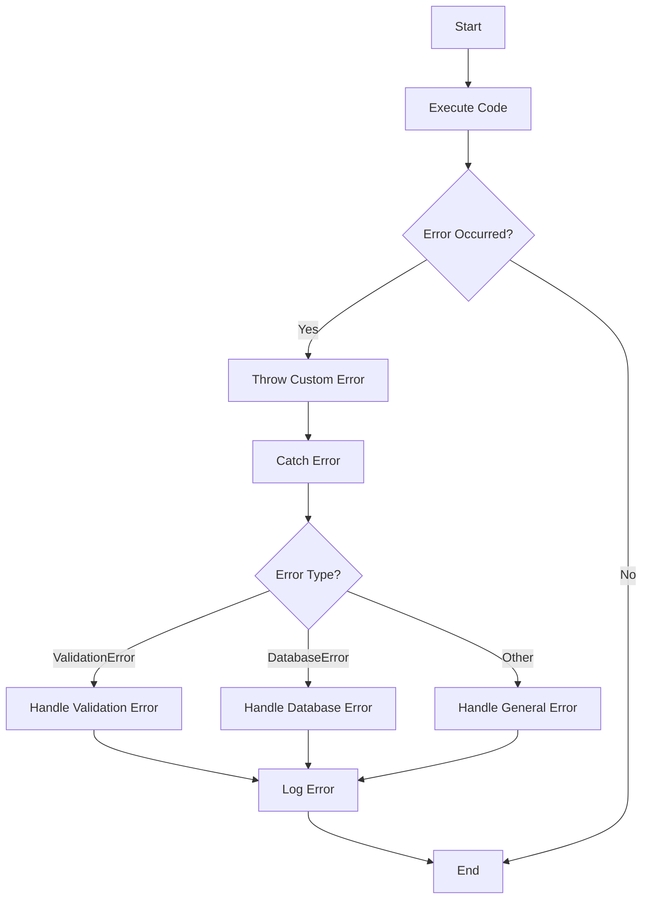

## 9.9 Custom Error Objects

In the world of programming, errors are inevitable. They can arise from unexpected user input, network failures, or even logic mistakes in our code. As developers, our goal is to handle these errors gracefully and provide meaningful feedback that can help in debugging and improving the user experience. JavaScript provides a robust mechanism for error handling through the `Error` object, but sometimes, the built-in error types are not enough. This is where custom error objects come into play.

### Understanding the Built-in Error Class

Before we dive into creating custom error objects, let's briefly revisit the built-in `Error` class in JavaScript. The `Error` class is the foundation for error handling in JavaScript and provides a basic structure for error objects. Here's a simple example of using the `Error` class:

```javascript
try {
    throw new Error("Something went wrong!");
} catch (error) {
    console.error(error.name); // "Error"
    console.error(error.message); // "Something went wrong!"
    console.error(error.stack); // Stack trace
}
```

The `Error` object includes properties such as `name`, `message`, and `stack`, which provide information about the error. However, for more complex applications, we might need additional information or specific error types to handle different scenarios.

### Extending the Error Class to Create Custom Error Types

To create custom error types, we extend the built-in `Error` class. This allows us to define new error classes with additional properties or methods tailored to our application's needs. Let's see how we can create a custom error class:

```javascript
class ValidationError extends Error {
    constructor(message, field) {
        super(message);
        this.name = "ValidationError";
        this.field = field;
    }
}

try {
    throw new ValidationError("Invalid input", "username");
} catch (error) {
    console.error(error.name); // "ValidationError"
    console.error(error.message); // "Invalid input"
    console.error(error.field); // "username"
    console.error(error.stack); // Stack trace
}
```

In this example, we create a `ValidationError` class that extends `Error`. We add a `field` property to specify which field caused the validation error. This additional context can be invaluable when debugging or logging errors.

### Benefits of Using Custom Errors

Custom error objects offer several advantages:

1. **Precision**: By defining specific error types, we can handle different error scenarios more precisely. This allows us to implement more targeted error handling logic.

2. **Clarity**: Custom errors provide clearer stack traces and error messages, making it easier to identify the source of an error.

3. **Maintainability**: With custom error types, we can organize error handling code more effectively, making it easier to maintain and extend.

4. **Integration**: Custom errors can be integrated with logging systems and error tracking services to provide detailed insights into application behavior.

### Throwing and Catching Custom Errors

Throwing and catching custom errors is similar to using the built-in `Error` class. We use the `throw` statement to raise an error and `try-catch` blocks to handle it. Here's an example:

```javascript
class DatabaseError extends Error {
    constructor(message, query) {
        super(message);
        this.name = "DatabaseError";
        this.query = query;
    }
}

function executeQuery(query) {
    // Simulate a database error
    throw new DatabaseError("Failed to execute query", query);
}

try {
    executeQuery("SELECT * FROM users");
} catch (error) {
    if (error instanceof DatabaseError) {
        console.error(`Database Error: ${error.message}`);
        console.error(`Query: ${error.query}`);
    } else {
        console.error("An unexpected error occurred");
    }
}
```

In this example, we define a `DatabaseError` class and use it to throw an error when a database query fails. In the `catch` block, we check if the error is an instance of `DatabaseError` to handle it appropriately.

### Best Practices for Custom Error Messages and Error Codes

When creating custom error objects, it's important to follow best practices for error messages and error codes:

- **Descriptive Messages**: Ensure error messages are clear and descriptive. They should provide enough information to understand the nature of the error without exposing sensitive details.

- **Consistent Naming**: Use consistent naming conventions for custom error classes. This helps in quickly identifying the type of error and its purpose.

- **Error Codes**: Consider using error codes to categorize errors. Error codes can be useful for logging and tracking errors in larger applications.

- **Documentation**: Document custom error classes and their usage. This helps other developers understand how to handle specific error types.

### Integration with Logging Systems and Error Tracking Services

Custom error objects can be integrated with logging systems and error tracking services to provide detailed insights into application behavior. Here's how you can log custom errors using a simple logging function:

```javascript
function logError(error) {
    console.error(`[${new Date().toISOString()}] ${error.name}: ${error.message}`);
    if (error.stack) {
        console.error(error.stack);
    }
    // Additional logging logic (e.g., send to a logging service)
}

try {
    throw new ValidationError("Invalid email address", "email");
} catch (error) {
    logError(error);
}
```

In this example, the `logError` function logs the error name, message, and stack trace. You can extend this function to send error details to a logging service or error tracking platform for further analysis.

### Visualizing Custom Error Handling

To better understand how custom error handling works, let's visualize the process using a flowchart. This diagram illustrates the flow of error handling in a JavaScript application with custom error objects.



This flowchart shows how custom errors are thrown and caught, with different handling logic based on the error type.

### Try It Yourself

Now that we've covered the basics of custom error objects, it's time to try it yourself. Modify the examples above to create your own custom error classes. Experiment with adding additional properties or methods to your custom errors. Consider how you might use custom errors in a real-world application to improve error handling and debugging.

### Knowledge Check

Before we wrap up, let's review some key takeaways:

- Custom error objects extend the built-in `Error` class to provide additional context and specificity.
- They offer benefits such as precision, clarity, maintainability, and integration with logging systems.
- Throwing and catching custom errors is similar to handling built-in errors, with the added benefit of more targeted error handling logic.
- Best practices include using descriptive messages, consistent naming, and error codes.

### Embrace the Journey

Remember, this is just the beginning. As you progress, you'll build more complex applications with robust error handling mechanisms. Keep experimenting, stay curious, and enjoy the journey!

## Quiz Time!



### What is the main advantage of using custom error objects?

- [x] They provide more precise error handling.
- [ ] They make the code run faster.
- [ ] They are easier to write than built-in errors.
- [ ] They automatically fix errors.

> **Explanation:** Custom error objects allow for more precise error handling by providing specific error types and additional context.

### How do you create a custom error class in JavaScript?

- [x] By extending the built-in `Error` class.
- [ ] By creating a new class without extending any other class.
- [ ] By using the `new` keyword with a string.
- [ ] By modifying the `Error` prototype directly.

> **Explanation:** Custom error classes are created by extending the built-in `Error` class to inherit its properties and methods.

### What property can you add to a custom error class for additional context?

- [x] Any custom property like `field` or `query`.
- [ ] Only the `message` property.
- [ ] Only the `name` property.
- [ ] Only the `stack` property.

> **Explanation:** You can add any custom property to a custom error class to provide additional context, such as `field` or `query`.

### How can you check if an error is a specific custom error type?

- [x] Using the `instanceof` operator.
- [ ] Using the `typeof` operator.
- [ ] By checking the `name` property.
- [ ] By checking the `message` property.

> **Explanation:** The `instanceof` operator is used to check if an error is an instance of a specific custom error class.

### What is a best practice for error messages in custom error objects?

- [x] Ensure they are clear and descriptive.
- [ ] Make them as short as possible.
- [ ] Include sensitive information.
- [ ] Use random error codes.

> **Explanation:** Error messages should be clear and descriptive to provide enough information about the error without exposing sensitive details.

### How can custom errors be integrated with logging systems?

- [x] By using a logging function to log error details.
- [ ] By modifying the `console` object.
- [ ] By using only `alert` statements.
- [ ] By ignoring the error details.

> **Explanation:** Custom errors can be logged using a logging function that logs error details and sends them to a logging service.

### What is the purpose of using error codes in custom error objects?

- [x] To categorize errors for logging and tracking.
- [ ] To make error messages longer.
- [ ] To replace error messages.
- [ ] To make the code run faster.

> **Explanation:** Error codes are used to categorize errors, making it easier to log and track them in larger applications.

### What should you do if a custom error is not caught by a specific error type?

- [x] Handle it as a general error.
- [ ] Ignore it completely.
- [ ] Modify the error type.
- [ ] Use `alert` to display the error.

> **Explanation:** If a custom error is not caught by a specific error type, it should be handled as a general error to ensure it is not ignored.

### True or False: Custom error objects can only be used in server-side JavaScript.

- [ ] True
- [x] False

> **Explanation:** Custom error objects can be used in both client-side and server-side JavaScript applications.

### What is the first step in creating a custom error class?

- [x] Extend the built-in `Error` class.
- [ ] Define a new function.
- [ ] Modify the `Error` prototype.
- [ ] Use the `new` keyword with a string.

> **Explanation:** The first step in creating a custom error class is to extend the built-in `Error` class to inherit its properties and methods.


